# Chapter 9.

  
 Lecture 9 | Object Oriented Database Stuff
  

  ---

  # Chapter 10.

  

  
 Lecture 10. | Disk Storage, Buffering & Hardware Techniques
  

*Types of Storage, with Memory, Access Time and Pricing*

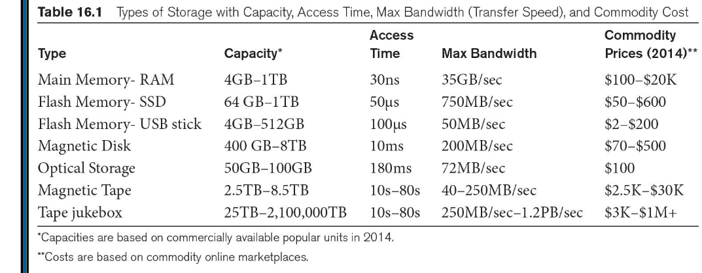

Table 16.1 summarizes the current state of these devices and systems and shows the range of capacities, average access times, bandwidths *(transfer speeds)*, and costs on the open commodity market.

### **There are several primary file organizations:**
- Determine how the file records are physically placed on the disk,
- Determine how the records can be accessed.

* **A heap file** *(or unordered file)* places the records on disk in no particular order by appending new records at the end of the file.
* **A sorted file** *(or sequential file)* keeps the records ordered by the value of a particular field (called the sort key).
* **A hashed file** uses a hash function applied to a particular field (called the hash key) to determine a record’s placement on disk.
* **B-trees**, use tree structures.

---

## Secondary Storage Devices

---
### Disk Storage:

Whole blocks are transferred between disk and main memory for processing.

1. **Logical Block Addressing (LBA)**: In disk drives, each block of data is identified by a unique number called the Logical Block Address (LBA). For example, if a disk has 1,000 blocks, they are numbered from 0 to 999. This system allows the disk drive controller to locate any block efficiently.

2. **Disk Storage Device Mechanics**:
   - **Read-Write Head Movement**: To access data, a read-write head moves to the track containing the desired block. For instance, if data is stored in block 500, the read-write head shifts to the track holding this block.
   - **Disk Rotation and Data Access**: Once the head is positioned, the disk rotates, aligning the block under the read-write head for reading or writing. Imagine a vinyl record player where the needle *(read-write head)* must align with a specific track (block) on the record (disk).

3. **Disk Controller**: This component controls the disk drive and interfaces it with the computer. The disk controller acts as a mediator between the computer and the disk drive, managing data transfers. 
   Common interfaces include: 
- SCSI (Small Computer System Interface),
- SATA (Serial ATA) 
- SAS (Serial Attached SCSI) 

4. **Performance Factors**:
   - **Seek Time**: This is the time taken to position the read/write head over the correct track. It usually ranges from 5 to 10 milliseconds. For instance, moving the head to access data at the start of the disk versus the end can take this amount of time.
   - **Rotational Delay**: This delay occurs while waiting for the disk to rotate the desired block under the read/write head. In a 15,000 RPM (rotations per minute) hard drive, this delay is about 4 milliseconds.

5. **Data Organization and Access Optimization**:
   - **Placing Related Information on Contiguous Blocks**: To speed up access, related data is stored in adjacent blocks. For example, a document might be stored in blocks 100, 101, and 102, so reading it requires minimal movement of the read-write head.
   - **Minimizing Block Transfers**: The goal is to reduce the number of transfers needed to move data between the disk and main memory. This is achieved through efficient data placement and retrieval strategies.
   - **Double Buffering**: This technique can speed up the transfer of contiguous blocks. It involves pre-loading the next expected block into a buffer while the current block is being processed, thus reducing wait time for subsequent data.
  - **Use of Flash & SSD Memory**: Write the blocks first to the SSD then to the HDD during the idle time. Or In applications where updates occur with high frequency, updates can be lost from main memory if the system crashes. A preventive measure would be to increase the speed of updates/writes to disk.
  - **Use of log disks to temporarily hold writes**: A single disk is assigned to log the write commands. Then all blocks to be written can go to that disk sequentially, thus eliminating any seek time.  This works much faster than doing the writes to a file at random locations, which requires a seek for each write. The log disk can order these writes in *(cylinder, track)* ordering to minimize arm movement when writing.

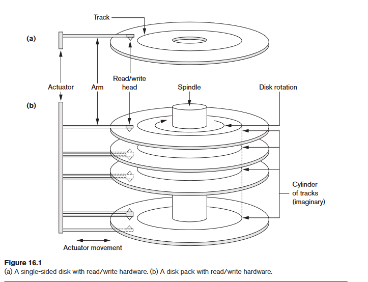

Each circle on DISC is called a **Track** is divided into blocks *(sectors)*
- The block size B is fixed for each system.
- Typical block sizes range from B=512 bytes to B=8192 bytes.
- **Block**s reside within Tracks *(Blocks are unique identified by Block Number also)*
- The *(Actuator & Needle)* **Read/write head** shifts arround to different *Tracks* containing different *Blocks* for Read/Write
- Disk units with an *actuator* are called **movable-head disks** 

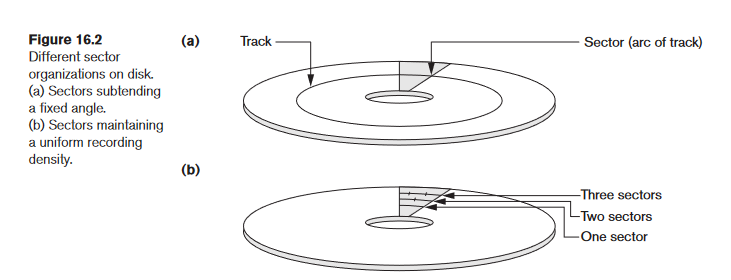

The number of **tracks on a disk ranges** from a few thousand to 152,000 on the disk drives shown above, and the capacity of each track typically ranges from tens of kilobytes to 150 Kbytes. 
* Often measured as *Bytes per Surface* for 1 Surface of the Disk! (usually about 152k BYTE) Whereas Bytes per track is closer to *1,000 BYTE*
* Because a track usually contains a large amount of information, it is divided into smaller blocks or sectors.

---

#### TL:DR Disc Elaborations:

1. **Platters**: A hard disk contains one or more flat, circular disks called platters, which are coated with a magnetic material. These platters spin around a central axis.

2. **Tracks**: Each platter's surface is divided into concentric circles called tracks. These tracks are the paths along which data is magnetically recorded and read.

3. **Sectors**: Each track is further divided into segments known as sectors. A sector is the smallest unit of storage on a disk and typically holds a fixed amount of data (for example, 512 bytes).

4. **Read/Write Heads**: These are positioned above and below each platter and move in and out to access data on different tracks.

Now, onto the concept of a cylinder:

- **Cylinder Definition**: A cylinder in disk storage is a set of tracks that are in the same position on different platters. Imagine the disk's read/write heads aligned at a specific track number across all platters. The collection of these aligned tracks forms a cylinder.

- **Example**: 
- Imagine a stack of vinyl records on a spindle, where each record represents a platter in the hard disk.
- Each record (platter) has its own set of concentric circles (tracks) where data is stored.
- Now, if you were to select one circle (track) from a record and then choose the same circle from all the other records in the stack, you'd have a set of circles all aligned on top of each other. This stack of aligned circles, spanning across all the platters, is what we call a "cylinder" in hard disk terminology.
---
### Solid State Device (SSD) Storage:
- Known as Enterprise Flash Device *(EFD)* as it's basically a bunch of inter-connected FLASH memory cards. *(Known as Flash Memory)*
- Data is less likely to be fragmented because it is addressed as RAM.
- Flash-based SSD's aren't Volatile Storage!

- DRAM-Based SSD's are faster, but are volatile storage

---
## Buffering of Blocks

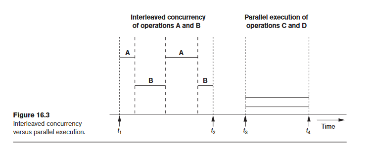

Your understanding is correct. The concepts of interleaved and parallel buffering are methods used to optimize the process of transferring data between a disk and main memory, particularly when handling multiple processes or tasks. Let's elaborate on these concepts:

### Interleaved Fashion of Buffering

In interleaved buffering, multiple processes (like A and B in your example) are handled in an alternating, sequential manner. This is especially relevant when you have a single CPU managing multiple tasks. Here's how it works:

- **Sequential Execution**: The CPU switches back and forth between tasks, executing a bit of one before switching to the other. This creates the appearance of simultaneous execution, but in reality, the CPU is rapidly alternating between tasks.
- **Application in Disk I/O**: When applied to disk I/O, while one block of data is being read from or written to the disk, the CPU can process another block of data that has already been loaded into a different buffer in memory.
- **Example**: Think of it like a chef (CPU) cooking two dishes (processes A and B). The chef starts cooking dish A, then while it's simmering, they start preparing dish B. They keep switching between the two, doing a bit at a time.

### Parallel Fashion of Buffering

Parallel buffering involves simultaneous processing, made possible by having multiple processors or a separate disk I/O processor.

- **Simultaneous Execution**: Different processors handle different tasks concurrently. Unlike interleaving, where a single processor juggles multiple tasks, parallel processing literally processes multiple tasks at the same time.
- **Application in Disk I/O**: While the main CPU processes data in one buffer, the disk I/O processor can independently handle data transfer to or from another buffer. This genuinely parallel approach increases efficiency.
- **Example**: Using the cooking analogy, imagine two chefs (CPU and disk I/O processor) working in the same kitchen, each preparing a different dish (processes C and D) at the same time.

In summary, interleaved buffering is like a single performer juggling multiple tasks in a sequence, while parallel buffering is like a team working on different tasks simultaneously. Double buffering enhances both methods by ensuring that data is always ready for processing, thus reducing waiting times.

---

### Understanding Buffer Management

1. **Buffer and Buffer Pool**: 
   - **Concept**: A buffer is a part of main memory designated to temporarily hold data *(pages or blocks)* read from the disk. The **buffer pool** is a collection of such buffers.
   - **Application Example**: Imagine a database of a large online retailer with millions of product records. Not all records can be loaded into main memory at once due to its limited size. Buffers allow parts of this data to be loaded as needed.

2. **Buffer Manager** *(Akin to Cache Management at a larger Scale)*:
   - **Role**: It decides which buffers to use and what pages to replace when new data is requested.
   - **Example**: In our online retailer's database, when a user queries for products in a specific category, the buffer manager decides which data to load into the buffer pool from disk.

3. **Replacement Strategies**:
   - **Purpose**: To decide which data to keep in the buffer and which to replace.
   - **Example**: Common strategies like Least Recently Used (LRU) might be employed. If product details of 'electronics' were least recently accessed and now 'clothing' details are needed, the 'electronics' data might be replaced.
      - Clock policy: a round-robin variant of the LRU policy
      -  First-in-first-out (FIFO)

### Double Buffering Technique

1. **Concept**: Uses two buffers (A and B) to enhance I/O efficiency. While one buffer is used for reading data from the disk, the other is used for processing data.
2. **Application Example**: Buffer A is loading new product prices from the disk, while Buffer B is being used to update the current prices in the main memory.

### Types of Buffer Managers

1. **Direct Main Memory Control**:
   - **Example**: Traditional RDBMS where the buffer manager directly controls which data resides in the main memory.
2. **Virtual Memory Allocation**:
   - **Example**: Some object-oriented DBMSs where buffers are allocated in virtual memory, and the operating system decides which buffers stay in main memory.

### Buffer Manager Operations

1. **Pin-Count and Dirty Bit**:
   - **Pin-Count**: Number of requests or users for a page. A page with zero pin-count can be replaced.
   - **Dirty Bit**: Indicates if a page has been modified.
   - **Example**: A product description page being edited has a high pin-count and a set dirty bit, indicating it's actively used and modified.

2. **Handling Page Requests**:
   - **Scenario**: A query for product reviews is made.
   - **Buffer Manager Actions**: Checks if the page is in the buffer pool and either increments its pin-count or loads it into a buffer, replacing another page based on the replacement policy.

  
 Lecture 10. | Placing of File Records (On "Disk")

### "Disk" Refers to: 
*magnetic disks with rotational memory or solid-state disks with electronic access and no mechanical delays.*

---

**In General** Databases store *records* which are Table Entities (Tuple)

In some database applications, the need may arise for storing data items that consist of large unstructured objects, which represent images, digitized video or audio streams, or free text. These are referred to as BLOBs *(binary large objects).*

Each record consists of a collection of related data **values** or **items** (attributes)
Each **value** is formed of one or more bytes and corresponds to a particular **field** of the record.

In summary, in a database:
- A **record** is a complete set of related data (like a row in a table).
- A **field** is a specific part of a record, defined to hold a certain type of data (like a column in a table).
- A **value** is the actual data stored in a field of a record (like the data in each cell of a table).

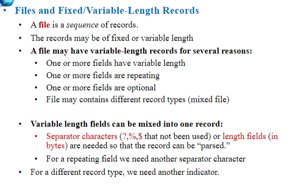

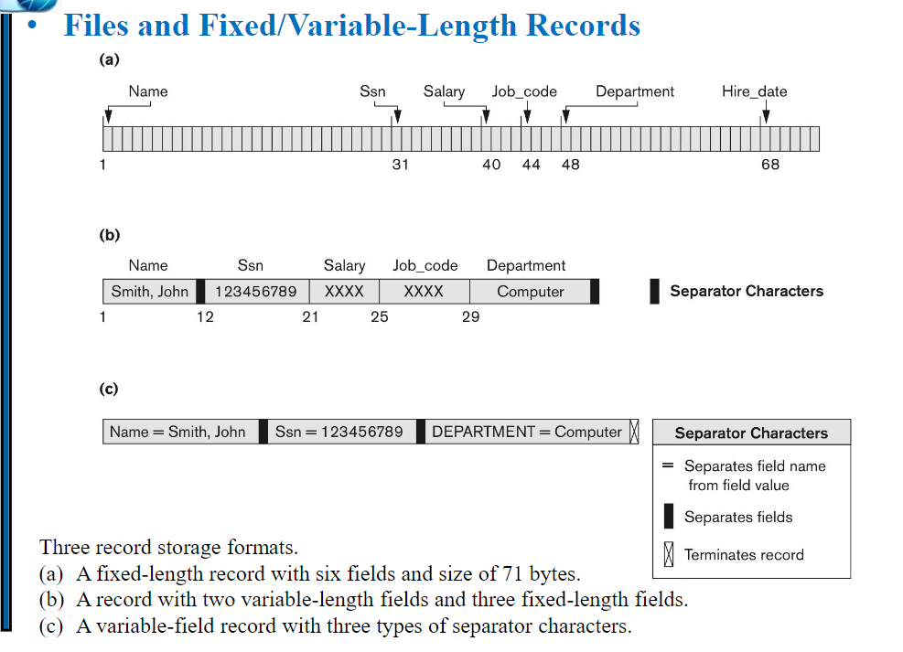

**In Example B)** 'Name' and 'Department' Fields are Variable Length, that's why they need a seperation field in between.

---

# Record Blocking | Spanned VS. Unspanned Records

A file can have fixed-length records or variable-length records.

#### *File records can be unspanned or spanned*
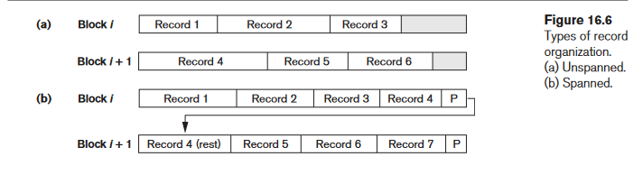

- **Unspanned:** Records not allowed to cross block boundaries! *(It's fine for smaller record sizes, as multiple records can still be bunched up on a block!)* 
- **Spanned:** a record can be stored in more than one block. A *pointer* at the end of the first block points to the block containing the remainder of the record in case it is not the next consecutive block on disk. This organization is called spanned because records can span more than one block.
  
The physical disk blocks that are allocated to hold the file records can be:

1. Contiguous: the file blocks are allocated to consecutive disk blocks
2. Linked: each file block contains a pointer to the next file block
3. Indexed: one or more index blocks contain pointers to the actual file blocks

* It is also common to use combinations of these techniques.

## Blocking Factor
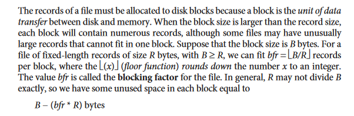

The blocking factor **bfr** represents the average number of records per block for the file. We can use **bfr** to calculate the number of blocks **b** needed for a file of **r** records: `Math.Ceiling( r / bfr) * blocks`

---

## Allocation Methods

1. **Contiguous Allocation**
   - Contiguous: the file blocks are allocated to consecutive disk blocks
   - **Example**: Imagine a bookshelf where books (file blocks) are placed side by side in order (consecutive disk blocks). This arrangement makes it easy to find and read a whole book (file) quickly. However, if you want to add pages (expand the file), it's challenging unless there's free space right next to it.
   - **Advantages**: Fast reading of entire files.
   - **Disadvantages**: Difficult to expand files.

2. **Linked Allocation**
   -  Linked: each file block contains a pointer to the next file block
   - **Example**: Think of a scavenger hunt where each clue (file block) points to the location of the next clue (next file block). This setup allows easy addition of new clues (expanding the file), but finding and reading all the clues (the whole file) takes time.
   - **Advantages**: Easy file expansion.
   - **Disadvantages**: Slow to read the entire file. *(Slower File Reading)*

3. **Combination of Contiguous and Linked (Clustered Allocation)**
   - **Example**: Imagine a hybrid of the bookshelf and scavenger hunt. Books (clusters of file blocks) are placed side by side, and each book has a note indicating where to find the next book (linked clusters). This balances the ease of reading a set of pages (clusters) and the flexibility of adding more pages (clusters).
   - **Advantages**: Balances read speed and file expansion.

4. **Indexed Allocation**
   - Indexed: one or more index blocks contain pointers to the actual file blocks
   - Uses index blocks for direct access to file blocks, optimizing individual block access at the cost of additional index space.
   - **Example**: Consider a library catalog where the catalog (index block) lists the locations of all pages (file blocks). This allows direct access to any page without needing to go through the entire book.
   - **Advantages**: Efficient access to individual blocks.
   - **Disadvantages**: Requires additional space for index blocks.

### File Headers
- **def**: Contain crucial file information for system programs, aiding in efficient record management and retrieval.
- **Description**: File headers contain essential metadata about a file, *(field names, order, data types, addresses of blocks)* like the disk addresses of file blocks and record formats. This information is used to locate and manage records on disk efficiently.
- **Example**: It's akin to a table of contents in a book, providing quick reference to the exact location of chapters (records).
- The goal of a good file organization is to avoid linear search or full scan of the file and to locate the block that contains a desired record with a minimal number of block transfers

  
 Lecture 10 | Operations on Files, Heap & Sorted Records (Unordered & Ordered)
  

The Following Operations *(except for Open and Close)* are called **record-at-a-time** operations because each operation applies to a single record!

#### Operations on Files:
1. **Open**: Prepares the file for access, allocates buffers, retrieves file header, and sets the pointer to the file's beginning.
2. **Reset**: Resets the file pointer to the start of the file.
3. **Find/Locate**: Searches for and locates the first record matching a search condition, making it the current record.
4. **Read/Get**: Copies the current record to a program variable; may advance to the next record.
5. **FindNext**: Finds the next record satisfying the search condition, updating the current record.
6. **Delete**: Removes the current record and updates the file.
7. **Modify**: Changes field values of the current record and updates the file.
8. **Insert**: Adds a new record in the appropriate place in the file.
9. **Close**: Finalizes file access, releases buffers, and performs cleanup.

#### Sequential Nature of Records:
- In sequential record handling, records are processed in the physical order they appear in the file. 
- For example, if searching for records where `department = "Software"`, the first matching record becomes the "current record".
- Subsequent operations (like `FindNext`, `Modify`, or `Delete`) then act on this current record.
- The process continues sequentially, with each found record becoming the new current record for the next operation.

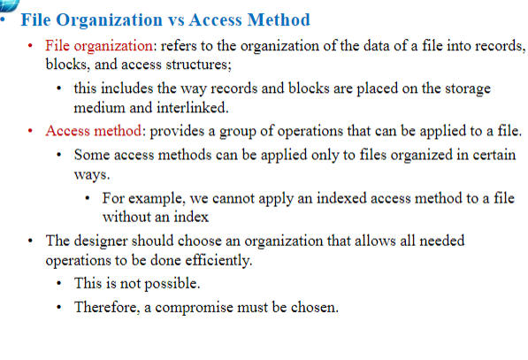

---

## Unordered Records (Heap File)

In this simplest and most basic type of organization, records are placed in the file in the order in which they are inserted, so new records are inserted at the end of the file. Such an organization is called a **heap** or **pile file**.

- Inserting a new record is very efficient. 
- The last disk **block** of the file is copied into a buffer, the new record is added.
- Then the **block** is then rewritten back to disk

#### Searching:
- For a file of **b** blocks, this requires *searching (b/2)* blocks, on Average. If no records or several records satisfy the search condition, the program must read and search all **b** blocks in the file.
- Requires **Linear Search** (usually b/2 to b complexity)

#### Deletion:
*The deletion of records in a heap file can be done in two main ways:*
  1. **Direct Deletion**: Involves finding the block where the record is located, copying it to a buffer, deleting the record from the buffer, and rewriting the block back to the disk. This method, however, leaves unused space in the disk block. Deleting many records like this can lead to significant wasted storage space.
  2. **Deletion with Marker**: An alternative method uses a deletion marker (an extra byte or bit) with each record. To delete a record, the marker is set to a specified value, differentiating it from valid (non-deleted) records. During searches, only records without this deletion marker are considered valid. This method still requires periodic reorganization of the file to reclaim space from deleted records.

##### Reorganization:
- Periodic reorganization is essential to reclaim space from deleted records. During reorganization, file blocks are accessed sequentially, and records are packed by removing the deleted ones, refilling the blocks to capacity.

##### Spanned vs Unspanned Organization:
- A heap file can use either spanned or unspanned organization, applicable to both fixed-length and variable-length records. 
- For variable-length records, modification might require deleting the old record and inserting a new one, especially if the modified record cannot fit in the original space.

##### Sorted File Copy:
- To read records in a sorted order based on a field, a sorted copy of the file is created. Sorting a large disk file is costly, and special external sorting techniques are used.

##### Direct Access in Unordered Fixed-Length Records:
- For unordered fixed-length records using unspanned blocks and contiguous allocation, direct access by position is straightforward. 
- Records are accessed directly by their relative positions in the file. This method doesn't assist in locating records based on search conditions but is useful for constructing access paths, like indexes.

**TLDR**: In summary, a heap file organization, while simple and efficient for insertions, poses challenges in terms of deletion and reorganization. It is suitable for scenarios where efficient insertion is prioritized, and search or deletion operations are infrequent or less critical.

---

## Ordered Records (Sorted Files)

- Orders the records of file based on: **values** of a field *(Ordering Field)
   - Leads to an *Ordered* File
- If the Ordering Field is also a **Key** then we know it's a unique ordered file!

**Visual Example**
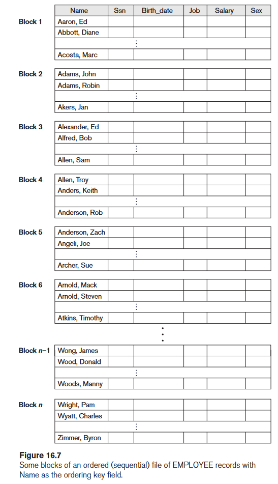
Shows an ordered file with Name as the ordering key field *(assuming that employees have distinct names)*.

## Ordered Records (Sorted Files)

Ordered records, also known as sorted files, are organized based on the values of a specific field, often referred to as the **Ordering Field**. If this ordering field is also a key, it guarantees the uniqueness of each record, resulting in a uniquely ordered file. 

**Visual Example**

This example demonstrates an ordered file where the 'Name' field serves as the ordering key, assuming distinct names for each employee.

### Advantages of Ordered Records:
1. **Efficient Ordered Reading**: Reading records in the order of the ordering key values is highly efficient as it requires no additional sorting. 
2. **Efficient Searching**: 
   - For specific value searches (`key = value`) or range conditions (`value1 < key < value2`), ordered files offer faster access, especially when using binary search techniques. This is a significant improvement over linear searches.
   - Binary search on disk files typically accesses `log2(b)` blocks (where `b` is the number of blocks), whether the record is found or not. This is more efficient compared to the average linear search accessing `b/2` blocks. *(For Unordered)*
3. **Contiguous Record Access**: Finding the next record in order of the ordering key usually doesn't require additional block accesses, as it's likely in the same block as the current record (unless it's the last record in the block).

### Search and Deletion in Ordered Records:
1. **Search Efficiency**: 
   - Conditions involving `>, <, ≥, ≤` on the ordering field are efficient because the physical ordering of records ensures that all records satisfying the condition are contiguous in the file.
   - Example: For a search condition like `Name > ‘G’` (alphabetically), all relevant records are located continuously from the start of the file up to the first record with 'Name' starting with 'G'.
2. **Deletion**: 
   - Deletion in ordered files can use deletion markers and periodic reorganization, similar to heap files. 
   - However, keeping the order intact makes insertion and deletion more complex and time-consuming. 

### Insertion and Modification:
- **Insertion**: To insert a record, its correct position based on the ordering field value must be identified, requiring potentially significant movement of existing records to create space. This can be particularly time-consuming for large files.
- **Modification**: 
  - If a non-ordering field is modified, the record can be rewritten in the same location for fixed-length records. 
  - Modifying the ordering field requires deleting the old record and inserting a modified one in the correct position.

### Managing Overflow:
- An overflow or transaction file can be used to make insertion more efficient. New records are temporarily stored in this unordered file and periodically merged with the main file during reorganization. 
- This approach simplifies insertion but complicates the search process, as both the main and overflow files might need to be searched.

### Reading and Reorganizing:
- Reading records in order, including overflow, requires merging overflow records into their correct positions during file reorganization. 
- Reorganization involves sorting overflow records and merging them with the master file, simultaneously removing records marked for deletion.

In conclusion, ordered records offer significant advantages in terms of efficient ordered reading, searching, and contiguous record access. However, these benefits come with the trade-offs of more complex insertion, deletion, and reorganization processes. These characteristics make ordered files particularly suitable for applications where read and search operations are prioritized over frequent insertions or modifications.

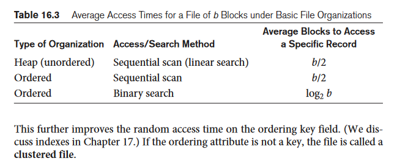

### Refferenced: Binary Search Algorithm:

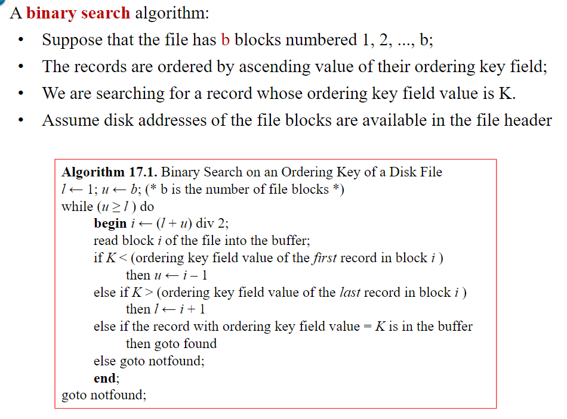

  
 Lecture 10 | Hashing Techniques
  

**Hashing:** provides very fast access to records under certain search conditions.
- The search condition must be an **equality condition** on a single field, called the *hash field (hash key)*
- For Hash Slots **M**, and elements **N** if we've got Uniform information, in which all slots roughly **N/M** entries, then it's a good hashing fn.
- Hashing functions map a large hash field space *(the range of possible hash values)* to a smaller address space *(available addresses for records)*. This can lead to **collisions**, where distinct values hash to the same address.

# Internal Hashing
- Implemented as a Hash Table containing **M** slots. *(0, M-1)*
- Common Hashing function is **H(k) = K mod M**
   - Which returns the remainder of an integer hash field value K after division by M; this value is then used for the record address.
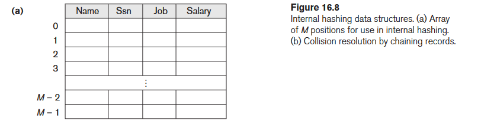

**Non-Integer** field values are transformed into Integers!
- ASCII characters, are just their Integer Representation, etc...

---

# Hashing Algorithm

### What makes a good Hashing Function.

- **Uniform Distribution**: A good hashing function should evenly distribute records across the address space to minimize collisions, enabling single-access record retrieval.
- **Optimal Space Utilization**: Achieving a balance between minimizing collisions and fully utilizing the available space (buckets) without leaving many unused locations.
- **Ideal Fill Ratio**: Studies suggest maintaining a hash file that is 70-90% full to reduce collisions and avoid wasting space.
- **Size Selection for Address Space (M)**: Choose the number of locations (M) such that the ratio of records (r) to M falls between 0.7 and 0.9.
- **Choosing M as a Prime Number**: For mod hashing functions, using a prime number for M can improve the distribution of hash addresses.
- **Adapting M to the Hash Function**: Depending on the hash function, M might need to be a power of 2.

---

### Collision Resolution Methods:

1. **Open Addressing**: When a collision occurs, the method searches for the next empty position from the occupied hash address. This process continues until an unused position is found.
   - **Deletion** algorithms for open addressing are rather tricky. Data structures textbooks discuss internal hashing algorithms in more detail

2. **Chaining**: This method handles collisions by using overflow locations, often created by extending the array with additional positions. Each record location includes a pointer field. When a collision occurs, the new record is placed in an unused overflow location, and the pointer at the occupied hash address points to this new location. This creates a linked list of overflow records for each hash address. *(Linked-List chaining in a Slot)*

3. **Multiple Hashing**: If the first hash function leads to a collision, a second hash function is applied. If this also results in a collision, the process either uses open addressing or applies a third hash function, followed by open addressing if needed. The series of hash functions are consistently used for both storage and retrieval. *(Pass thru N. Hash.FNS for Example)*

---

- Algorithm **(a)** can be used to calculate the hash address.
- Algorithm **(b)** Collision resolution by open addressing.

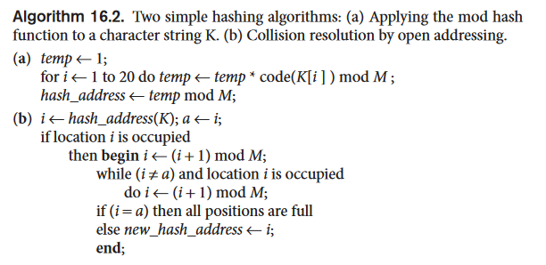

*Collision Resolution via. Chaining*
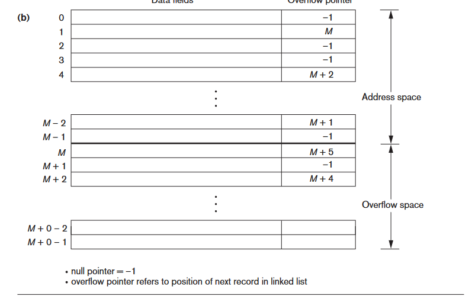

---

# External Hashing

*Hashing for disk files is called **external hashing***

- **Buckets**: Comprise the address space, holding multiple records. A bucket is either one disk block or a cluster of contiguous blocks.

**Handling Collisions:**
- **Less Severe in Buckets**: Multiple records can hash to the same bucket without issues until it reaches capacity. *(As bucket is like a folder, of storage)*
- **Overflow Handling**: Uses chaining variant. Each bucket has a pointer to a linked list of overflow records. Each pointer in the list includes a block address and a relative record position.

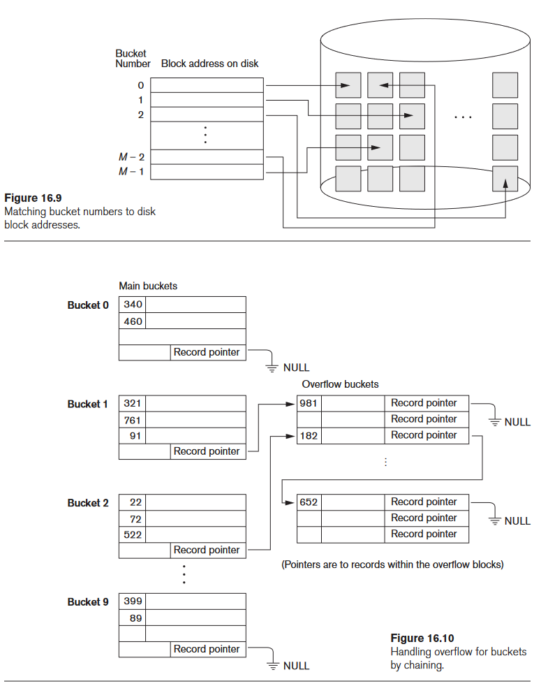
- *A) Matching bucket numbers to disk block addresses.*
- *B) The pointers in the linked list should be record pointers, which include both a block address and a relative record position within that block. Record Pointers are also used to handle OVERFLOW of buckets!*

**Order-Preserving Functions:**
- **Example 1**: Use leftmost digits of an invoice number as the bucket address, maintaining records sorted by invoice number in each bucket.
- **Example 2**: Direct use of an integer hash key as an index in a relative file, effective if hash keys occupy a specific interval *(e.g., consecutive employee numbers).*

**Static vs. Dynamic Hashing:**
- **Static Hashing**: Fixed number of buckets (M), limitations in handling dynamic files.
- **Dynamic Hashing**: Allows varying bucket numbers, facilitating localized reorganization.

**Record Operations:**
- **Search**: Similar cost to *Unordered* file when searching by non-hash fields.
- **Deletion**: Remove the record from its bucket. If in overflow, remove from the linked list and track empty overflow positions.

**Challenges:**
- **Space Utilization**: Risk of unused space or overflow depending on records count.
- **Reorganization Needs**: Changing the number of buckets and redistributing records can be time-consuming.
- **Dynamic File Organization**: Addresses these challenges by allowing flexible bucket numbers. *(Static Hashing Issue)*

---

## Dynamic Hashing Algorithms (Analysis)

### **Extendible Hashing:**
- **Functionality**: Splits a full bucket into two, redistributing records based on updated hash values, and adjusts the directory accordingly.
- **Directory**: Dynamic, stored on disk, grows or shrinks as needed. Points to disk blocks containing records.
- **Handling Overflows**: No need for a separate overflow area. Overflows lead to bucket splitting and directory updates.
- **Example Case**: A bucket starting with hash value '01' overflows, leading to the creation of two new buckets for records starting with '010' and '011'.

**Pros:**
- Efficiently handles dynamic file sizes.
- Direct access to buckets through the directory minimizes search time.
- Reduces overflow issues without needing additional overflow areas.

**Cons:**
- Directory size can grow significantly, especially with large datasets.
- Reorganization of directory and buckets can be complex during splits.

### **Dynamic Hashing (Larson's Model):**
- **Structure**: Tree-structured directory with internal nodes (having two pointers based on hash address bits) and leaf nodes (pointing to actual buckets).
- **Bucket Addressing**: Uses high-order bits, adjusting based on the total number of keys for a bucket.

**Pros:**
- Adapts well to changing file sizes.
- Efficient in distributing records across buckets.
- Directory structure aids in fast record retrieval.

**Cons:**
- More complex directory structure compared to extendible hashing.
- Bucket splitting and tree restructuring can be computationally intensive.

### **Linear Hashing:**
- **Operation**: Allows file to expand and shrink dynamically without a directory. Splits buckets linearly as file expands.
- **Hash Functions**: Utilizes a sequence of hash functions for redistribution during expansion.

**Pros:**
- Eliminates the need for a directory, simplifying structure.
- Good control over file load factor.
- Balances load across buckets effectively.

**Cons:**
- Bucket splitting is sequential, which can be less efficient.
- Handling of overflows and reorganizations can be more challenging without a directory.

  
 Lecture 10 | RAID Technology
  

# Major Advantages of RAID Over Traditional Disk Storage

### **Data striping**: 
- Distributes data transparently over multiple disks to make them appear as a single large, fast disk.
-  Accomplishes load balancing & "Redundancy" among disks.
   -  by storing redundant information on disks using parity or some other error-correction code, reliability can be improved.

In **bit-level striping**, a byte is split and individual bits are stored on independent disks. *Figure 16.13(a)*
- **Disk 0:** bits *0-3* , **Disk: 1** bits *4-7*

  

**Block-level striping** stripes blocks across disks. It treats the array of disks as if it is one disk. Blocks are logically numbered from 0 in sequence. Disks in an **m-disk array** are numbered `0 to m – 1`. With striping, block **j** goes to disk `(j mod m)`.
- *Figure 16.13(b) illustrates block striping with four disks (m = 4).*

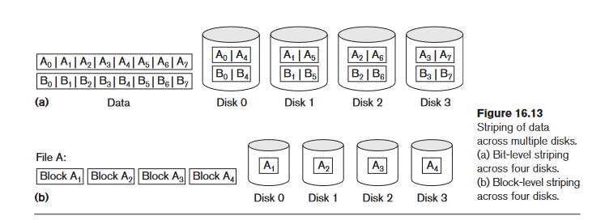

## Reliability with RAID

### Mirroring / Shadowing

In Raid 1. for example, we see that there are 2 copies of each "block", so if 1 drive fails, the other has the exact same data.
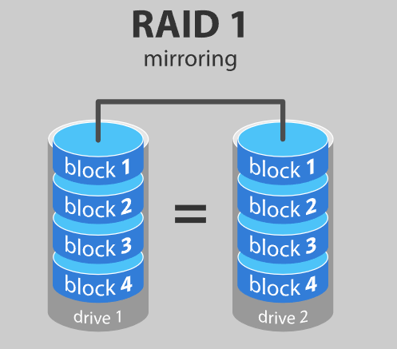
- Data is written redundantly to two identical physical disks that are treated as one logical disk.
- When data is read, it can be retrieved from the disk with shorter queuing, seek, and rotational delays.
- **Disk mirroring also doubles** the rate at which read requests are handled, since a read can go to either disk. However, The transfer rate of each *READ* remains the same as that for a single disk.

### Parity Information

The parity method in **RAID** is a fundamental technique used to provide fault tolerance and enhance data reliability in disk storage systems. It involves the use of additional bits, known as parity bits, to store redundant information that can be used to reconstruct data in the event of a disk failure.

##### **How Parity Works:**
**Parity Bit Calculation**:

- In a simple form, parity bits are calculated by performing an XOR (exclusive OR) operation on corresponding bits from a set of data.
For example, in a RAID system with three data disks, a parity bit for a particular position is generated by XORing the bits from the same position in each of the three data disks.

**Storage of Parity Bits:**

- Parity bits are stored on a separate disk dedicated to redundancy. *(Dedicated Parity Disk, Like RAID 4)*
- 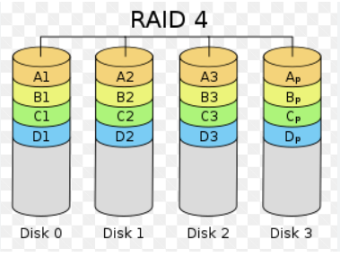
- In some RAID configurations, parity information is distributed across all disks for better load balancing. *(RAID 5, is Distributed Parity)*
- 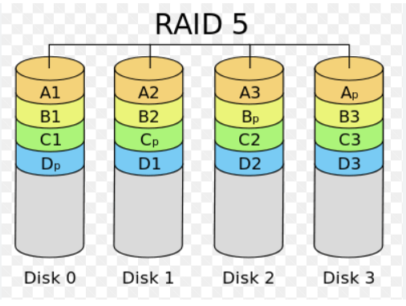

**Reconstruction of Lost Data:**

If a disk fails, the data it contained can be reconstructed using the parity bits along with the remaining data disks.
This is done by performing the same XOR operation on the available data and the parity information.

### Practical Insights from RAID Technology Usage

1. **RAID Level 1 (Mirroring) for Critical Data:**
   - Easiest to rebuild in case of disk failure.
   - Ideal for storing critical data like transaction logs due to its simplicity and reliability.

2. **RAID Levels 3 and 5 for Large Volume Storage:**
   - RAID 3 offers higher transfer rates, suitable for large files needing sequential access.
   - RAID 5 is more popular for general large volume storage, balancing performance, capacity, and fault tolerance.

3. **Common RAID Configurations:**
   - **RAID 0 (Striping):** For improved performance but no redundancy.
   - **RAID 1 (Mirroring):** For redundancy but higher cost per GB of storage.
   - **RAID 5 (Striping with Parity):** A common choice for balancing performance, storage efficiency, and data protection.
   - **RAID 6** (Double Parity) !!!
   - 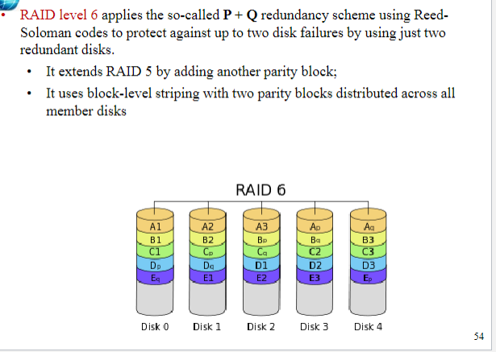

4. **Combining RAID Levels:**
   - **RAID 0 + 1:** Offers the benefits of both striping and mirroring, requiring a minimum of four disks.
   - 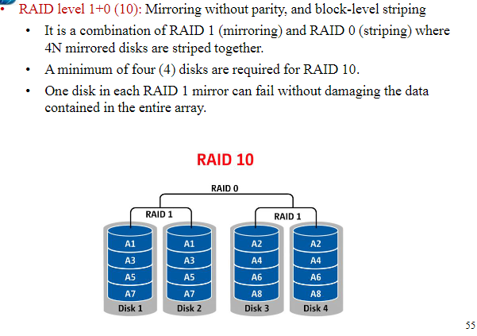
   - 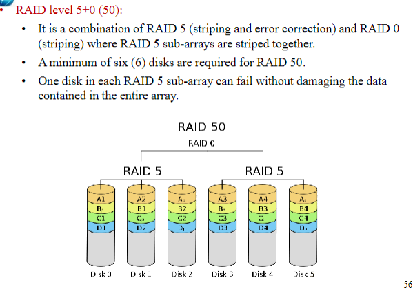

5. **Design Considerations:**
   - Choosing the RAID level based on application needs.
   - Deciding the number of disks for optimal performance and redundancy.
   - Selecting appropriate parity schemes and disk groupings for block-level striping.

6. **Performance Implications:**
   - Performance varies based on the size of I/O requests.
   - Small reads/writes (one striping unit) and large reads/writes (one stripe unit from each disk) should be considered for optimal RAID configuration.

In summary, the choice of RAID level and configuration depends heavily on the specific needs of the application, balancing factors such as performance, redundancy, storage capacity, and cost. RAID 1 is simplest for rebuilds and critical data, while RAID 3 and 5 cater to large volume storage with differing performance characteristics. Combining RAID levels can offer the advantages of different configurations for more complex needs.

  
 Lecture 10 | Modern Storage Architectures
  

# Storage Area Network (SAN)
 A Storage Area Network (SAN) is a high-speed network specifically designed for making storage devices accessible to multiple servers. It is a dedicated network that provides access to consolidated, block-level data storage. SANs are primarily used to enhance storage devices, such as disk arrays and tape libraries, accessible to servers so that the devices appear to the operating system as locally attached devices.

**Key Characteristics and Benefits:**
- *High-Speed Network:* Utilizes Fiber Channel technology, known for its high data transfer rates and reliability.

- *Flexible Connectivity:* Offers many-to-many connections between servers and storage devices. This is facilitated through Fiber Channel hubs and switches.

- *Distance Capabilities:* Allows for physical separation (up to 10 km) between servers and storage systems using fiber optic cables, which is beneficial for disaster recovery setups.

- *Scalability:* Enables organizations to scale their storage infrastructure by adding more storage devices and servers as needed.

- *Isolation and Non-Disruptive Expansion*: New peripherals and servers can be added without disrupting the existing setup, thanks to better isolation capabilities.

- *Data Replication:* Supports high-speed data replication across multiple storage systems, employing both synchronous (for local replication) and asynchronous (for disaster recovery) methods.

Unlike traditional server-attached storage, SANs decouple storage resources from specific servers, allowing for more efficient utilization and management of these resources across an organization.

**Challenges:**
*Integration with Multiple Vendors:* Combining storage options from different vendors can be complex due to varying standards and compatibility issues.

*Evolving Standards:* The rapid evolution of storage management software and hardware standards poses a challenge in keeping up with the latest technologies.

---

# Network-Attached Storage ( NAS )

These devices are, in fact, servers that do not provide any of the common server services, but simply allow the addition of storage for file sharing. *(Single Responsibility of Sharing Data)*
- Include Built-ins like
   * Secure Auth
   * Automatic Email Alerts & Triggers
   * High Degree of Scalability & Reliability *(Software Level)*
   * Support **RAID** Setups!!
   * Runs on LAN *(Local Area Network)*

- A single hardware device, often called the **NAS box** or **NAS head**, acts as the interface between the NAS system and network clients.
   - Clients connect thru NAS Head, Not in an individual Storage device

--- 

## Other Modern Storage Tech. & Protocols

1. **iSCSI (Internet SCSI):**
   - **Functionality:** Transfers SCSI commands over IP networks, enabling data management over LANs, WANs, or the Internet.
   - **Advantages:** Utilizes existing network infrastructure, avoiding the need for specialized Fibre Channel cabling. Ideal for small to medium businesses familiar with IP and Ethernet.
   - **Example:** A database management system sends a data request. The operating system generates SCSI commands, which are encapsulated and sent over Ethernet. The receiving storage device then executes these commands.
   - **Impact:** Slow adoption in large enterprises due to previous investments in Fibre Channel-based SANs.

2. **Fibre Channel over IP (FCIP):**
   - **Function:** Translates Fibre Channel commands into IP packets for long-distance transmission between SANs.
   - **Use Case:** Primarily used in conjunction with existing Fibre Channel setups, not as a standalone solution like iSCSI.

3. **Fibre Channel over Ethernet (FCoE):**
   - **Description:** Combines elements of SCSI and Fibre Channel but excludes TCP/IP components, running over Ethernet instead.
   - **Advantages:** Offers high performance, especially with 10GbE, by using reliable Ethernet technology to avoid packet loss.
   - **Example:** CISCO's “Data Center Ethernet” product uses FCoE to enhance data transfer rates in storage networks.

4. **Automated Storage Tiering (AST):**
   - **Functionality:** Moves data between different storage types (SATA, SAS, SSDs) based on usage frequency.
   - **Benefits:** Improves database performance by keeping frequently used data on faster storage mediums.
   - **Example:** EMC's FAST technology monitors data activity and automatically moves data between tiers based on predefined policies.

5. **Object-Based Storage:**
   - **Concept:** Manages data as objects instead of traditional file-based blocks.
   - **Features:** Objects contain metadata for easier management and carry unique identifiers for location tracking.
   - **Advantages:** Eliminates the need for lower-level storage operations like capacity management or RAID configuration.
   - **Origins:** Inspired by research projects like CMU's network attached storage scaling and UC Berkeley's Oceanstore system.

Each of these technologies addresses specific needs in the evolving landscape of enterprise storage, offering solutions ranging from simplified network-based storage protocols to advanced automated data management systems. Their adoption depends on the specific requirements and existing infrastructure of an organization.

  
 Lecture 10 | Q1
  

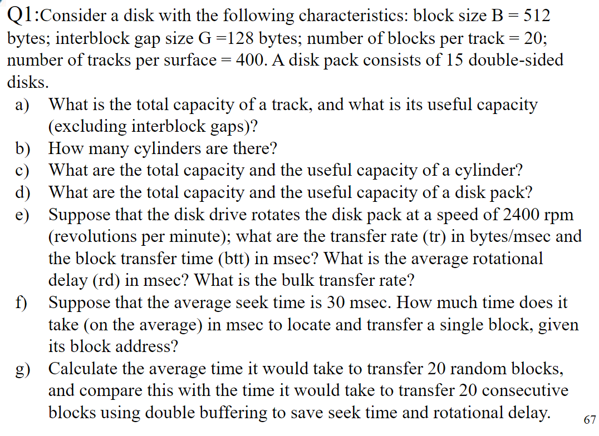

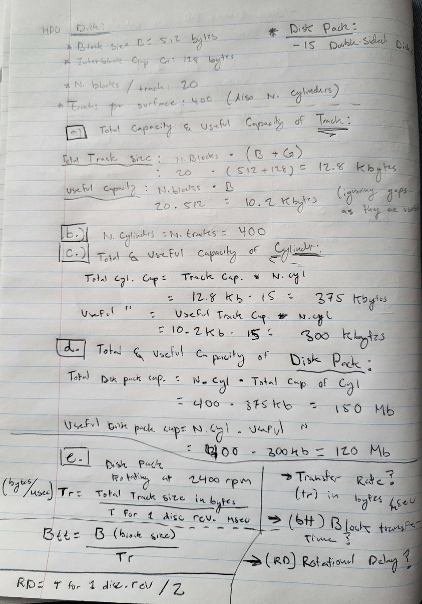

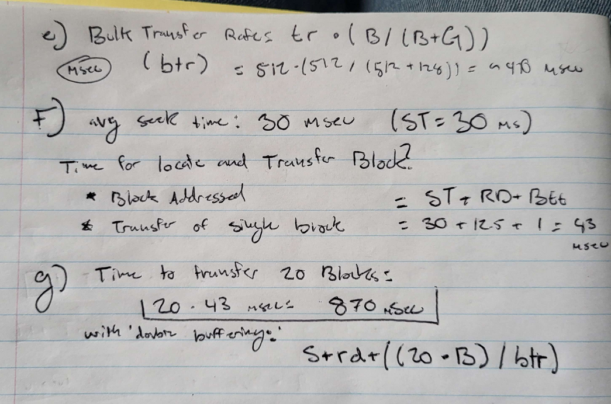

  
 Lecture 10 | Q2
  

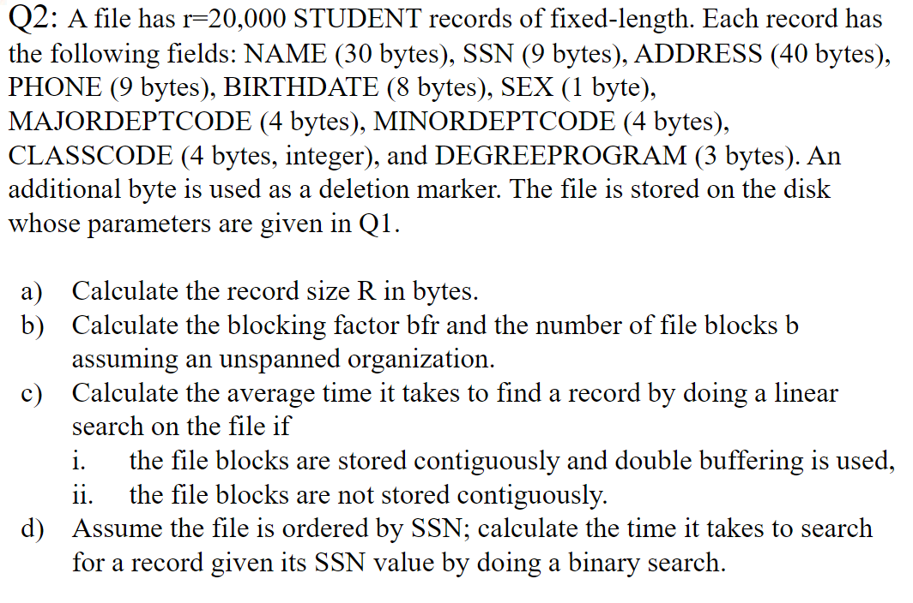

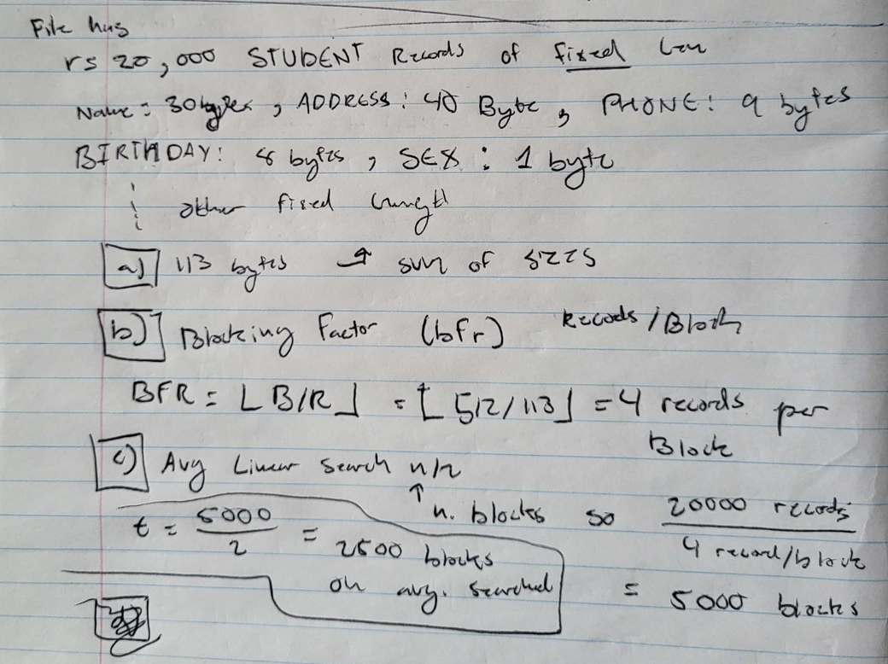

  
 Lecture 10 | Q2.2
  

---

# Chapter 11

  
 Lecture 11. | Distributed Databases (Conceptual)
  

  

Distributed computing systems and distributed database (DDB) concepts form the cornerstone of modern big data and database management technologies. Let's dive deep into these concepts, providing technical details and examples.

### Distributed Computing System

1. **Definition & Structure**: A distributed computing system is an assembly of interconnected nodes (or processing sites) through a computer network. These nodes work together to perform tasks.

2. **Task Partitioning**: It involves breaking down a large task into smaller subtasks, which are then distributed among different nodes. This approach enhances efficiency and speed, as tasks are processed in parallel.

3. **Technological Roots**: Distributed Database (DDB) technology is the MIX of database technology and distributed systems technology. 
   - This fusion is essential in handling big data challenges.

4. **Example**: Consider a scenario where a large dataset needs to be processed for insights. The dataset is partitioned and distributed across multiple servers (nodes). Each server processes its portion of data, and the results are combined to form the final output.

### Big Data Technologies

1. **Origins**: Arising from distributed systems and database systems, big data technologies integrate data mining and machine learning algorithms. These technologies handle and analyze vast amounts of data to extract valuable knowledge.

2. **Practical Example**: In a big data scenario, such as analyzing social media trends, data is collected from various sources, distributed across multiple nodes for processing, and machine learning algorithms are applied to identify patterns or trends.

### Distributed Database (DDB) Concepts

1. **Distributed Database**: It is a collection of logically interrelated databases distributed over a network.

   - **Key Characteristics**:
     - Databases are connected over a network.
     - There's a logical interrelation among the connected databases.
     - Nodes may not be homogeneous, implying different systems or software could be in use at different nodes.

2. **Distributed Database Management System (DDBMS)**: This software manages the distributed database and makes the distribution transparent to the user.

   - **General Example**: Oracle and IBM offer DDBMS solutions. In these systems, the user queries the database as if it were a single entity, but the DDBMS manages the complexities of distributed data storage and retrieval.

    - **Technical Example**: In a banking system using a DDBMS, customer data might be distributed across different servers located in various regions. When a user accesses their account information, the DDBMS retrieves data from these distributed nodes and presents it seamlessly.

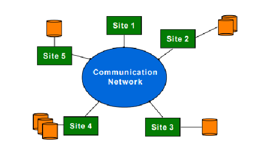

### Combining Concepts for Efficiency

In practice, these concepts are often combined. **For example**, a large online retailer might use a distributed computing system to manage its inventory across various warehouses (nodes). Each warehouse database might hold inventory data relevant to its location, and the central system might use a DDBMS to manage this distributed data. Queries about stock levels or product locations are processed by the DDBMS, which retrieves and consolidates information from these distributed nodes.

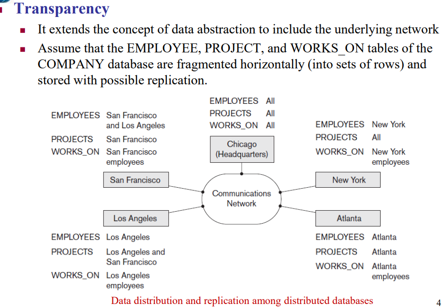

The concept of transparency in distributed database systems is crucial as it masks the complexity of the underlying network and database from the user, simplifying interaction and usage. Let's delve into the types of transparency and then focus in detail on horizontal and vertical fragmentation.

### Types of Transparency in Distributed Databases

1. **Data Organization Transparency (Distribution or Network Transparency)**: This type involves hiding the details of the data's storage location from the user. It includes:
   - **Location Transparency**: Users can issue commands without needing to know the location of the data.
   - **Naming Transparency**: Data objects can be accessed by name, regardless of their physical location.

2. **Replication Transparency**: This makes the user unaware of the replication of data across different sites, which is often done for better performance and reliability.

3. **Fragmentation Transparency**: Users remain oblivious to the existence of data fragmentation. This category can be further broken down into:
   - **Horizontal Fragmentation (Sharding)**
      - Example, Subsets for US, Canada, Mexico...
   - **Vertical Fragmentation**
      - Example, Splitting Rows, 1 Shard is Name Field, 1 Shard is Address *(Vertical Columns stored seperate, much stupider)*

4. **Design Transparency**: Users are not burdened with understanding the design intricacies of the distributed database.

5. **Execution Transparency**: This hides where a command or transaction is actually being executed within the distributed system.

## The main advantages of DDB are:
**Availability**
- Probability that the system is continuously available during a time interval
**Reliability**
- Probability that the system is running (not down) at a certain time point
* Both (availability and reliability) are directly related to faults, errors, and failures

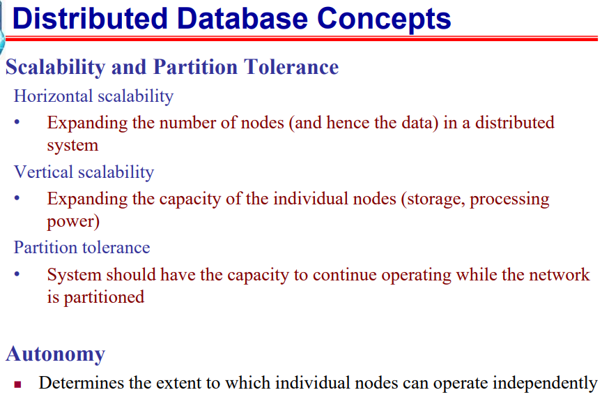
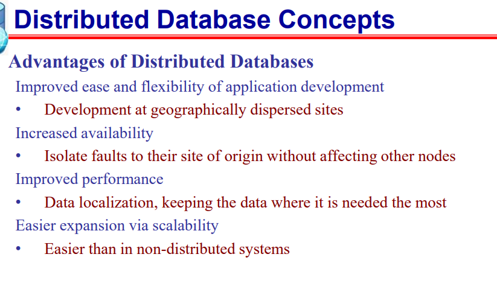

  
 Lecture 11. | Data Fragmentation, Replication, & Allocation
  

**Logical Units** Must be chosen for Sharding!

A special case of partial replication is occurring heavily in applications where mobile workers—such as sales forces, financial planners, and claims adjustors—carry partially replicated databases with them on laptops and PDAs and synchronize them periodically with the server database. A description of the replication of fragments is sometimes called a replication schema.

  
 Lecture 11. | NOSQL Databases and Big Data Storage Systems
  

Slides 19-35

---

# Big Data Technologies:

Slides 36-38

  
 Lecture 11. | Data Mining Concepts
  

Slides 41 - 58

Slides 76 & 77 are commerical data mining tools

