<details>
  <summary style="font-size: 30px; font-weight: 500; cursor: pointer;"> Company Example | SQL
  </summary>

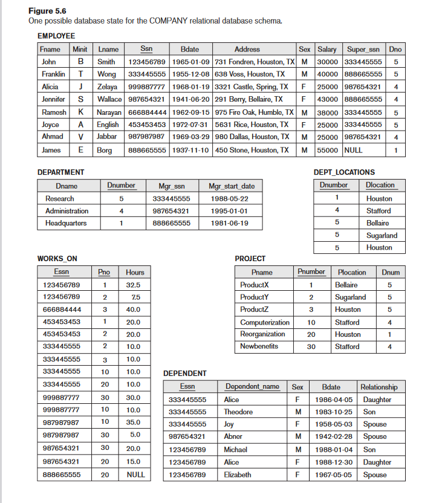
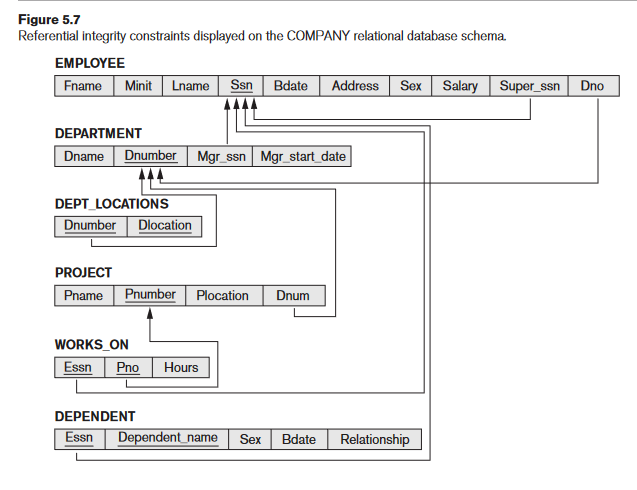

## All Creation Queries for `Company` Tables:

```sql
CREATE TABLE EMPLOYEE (
    Fname VARCHAR(50),
    Minit CHAR,
    Lname VARCHAR(50),
    Ssn CHAR(9) PRIMARY KEY,
    Bdate DATE,
    Address VARCHAR(100),
    Sex CHAR(1),
    Salary DECIMAL(10, 2),
    Super_ssn CHAR(9),
    Dno INT,

    -- Foreign keys, on different attributes of same tbl
    FOREIGN KEY (Super_ssn) REFERENCES EMPLOYEE(Ssn), 
    FOREIGN KEY (Dno) REFERENCES Department(Dnumber)
);

CREATE TABLE DEPARTMENT (
    Dname VARCHAR(50),
    Dnumber INT PRIMARY KEY,
    Mgr_ssn CHAR(9),
    Mgr_start_date DATE,

    FOREIGN KEY (Mgr_ssn) REFERENCES Employee(Ssn)
);

CREATE TABLE DEPT_LOCATIONS (
    Dnumber INT,
    Dlocation VARCHAR(50),
    
    FOREIGN KEY (Dnumber) REFERENCES Department(Dnumber)
);

CREATE TABLE WORKS_ON (
    Essn CHAR(9),
    Pno INT,
    Hours DECIMAL(5,2),

    FOREIGN KEY (Essn) REFERENCES EMPLOYEE(Ssn),
    FOREIGN KEY (Pno) REFERENCES PROJECT(Pnumber)
);

CREATE TABLE PROJECT (
    Pname VARCHAR(50),
    Pnumber INT PRIMARY KEY,
    Plocation VARCHAR(50),
    Dnum INT,
    
    FOREIGN KEY (Dnum) REFERENCES Department(Dnumber)
);

CREATE TABLE DEPENDENT (
    Essn CHAR(9),
    Dependent_name VARCHAR(50),
    Sex CHAR(1),
    Bdate DATE,
    Relationship VARCHAR(50),
    FOREIGN KEY (Essn) REFERENCES EMPLOYEE(Ssn)
);
```

---

### Generation Script: (Thank you GPT 4)

```sql
-- Step 1: Create EMPLOYEE without the foreign key constraints
CREATE TABLE EMPLOYEE (
    Fname VARCHAR(50),
    Minit CHAR,
    Lname VARCHAR(50),
    Ssn CHAR(9) PRIMARY KEY,
    Bdate DATE,
    Address VARCHAR(100),
    Sex CHAR(1),
    Salary DECIMAL(10, 2),
    Super_ssn CHAR(9),
    Dno INT
);

-- Step 2: Create DEPARTMENT
CREATE TABLE DEPARTMENT (
    Dname VARCHAR(50),
    Dnumber INT PRIMARY KEY,
    Mgr_ssn CHAR(9),
    Mgr_start_date DATE,
    FOREIGN KEY (Mgr_ssn) REFERENCES EMPLOYEE(Ssn)
);

-- Step 3: Alter EMPLOYEE to add the foreign key constraints
ALTER TABLE EMPLOYEE
ADD FOREIGN KEY (Super_ssn) REFERENCES EMPLOYEE(Ssn),
ADD FOREIGN KEY (Dno) REFERENCES DEPARTMENT(Dnumber);

-- Step 4: Create DEPT_LOCATIONS
CREATE TABLE DEPT_LOCATIONS (
    Dnumber INT,
    Dlocation VARCHAR(50),
    FOREIGN KEY (Dnumber) REFERENCES DEPARTMENT(Dnumber)
);

-- Step 5: Create PROJECT
CREATE TABLE PROJECT (
    Pname VARCHAR(50),
    Pnumber INT PRIMARY KEY,
    Plocation VARCHAR(50),
    Dnum INT,
    FOREIGN KEY (Dnum) REFERENCES DEPARTMENT(Dnumber)
);

-- Step 6: Create WORKS_ON
CREATE TABLE WORKS_ON (
    Essn CHAR(9),
    Pno INT,
    Hours DECIMAL(5,2),
    FOREIGN KEY (Essn) REFERENCES EMPLOYEE(Ssn),
    FOREIGN KEY (Pno) REFERENCES PROJECT(Pnumber)
);

-- Step 7: Create DEPENDENT
CREATE TABLE DEPENDENT (
    Essn CHAR(9),
    Dependent_name VARCHAR(50),
    Sex CHAR(1),
    Bdate DATE,
    Relationship VARCHAR(50),
    FOREIGN KEY (Essn) REFERENCES EMPLOYEE(Ssn)
);
```

## Populating DB:

```sql

USE Company;

SET FOREIGN_KEY_CHECKS = 0;

INSERT INTO EMPLOYEE(Fname, Minit, Lname, Ssn, Bdate, Address, Sex, Salary, Super_ssn, Dno) VALUES 
('John', 'B', 'Smith', '123456789', '1965-01-09', '731 Fondren, Houston, TX', 'M', 30000, '333445555', 5),
('Franklin', 'T', 'Wong', '333445555', '1955-12-08', '638 Voss, Houston, TX', 'M', 40000, '888665555', 5),
('Alicia', 'J', 'Zelaya', '999887777', '1968-01-19', '3321 Castle, Spring, TX', 'F', 25000, '987654321', 4),
('Jennifer', 'S', 'Wallace', '987654321', '1941-06-20', '291 Berry, Bellaire, TX', 'F', 43000, '888665555', 4),
('Ramesh', 'K', 'Narayan', '666884444', '1962-09-15', '975 Fire Oak, Humble, TX', 'M', 38000, '333445555', 5),
('Joyce', 'A', 'English', '453453453', '1972-07-31', '5631 Rice, Houston, TX', 'F', 25000, '333445555', 5),
('Ahmad', 'V', 'Jabbar', '987987987', '1969-03-29', '980 Dallas, Houston, TX', 'M', 25000, '987654321', 4),
('James', 'E', 'Borg', '888665555', '1937-11-10', '450 Stone, Houston, TX', 'M', 55000, NULL, 1);

INSERT INTO DEPARTMENT(Dname, Dnumber, Mgr_ssn, Mgr_start_date) VALUES 
('Research', 5, '333445555', '1988-05-22'),
('Administration', 4, '987654321', '1995-01-01'),
('Headquarters', 1, '888665555', '1981-06-19');

INSERT INTO DEPT_LOCATIONS(Dnumber, Dlocation) VALUES 
(1, 'Houston'),
(4, 'Stafford'),
(5, 'Bellaire'),
(5, 'Sugarland'),
(4, 'Houston');

INSERT INTO PROJECT(Pname, Pnumber, Plocation, Dnum) VALUES 
('ProductX', 1, 'Bellaire', 5),
('ProductY', 2, 'Sugarland', 5),
('ProductZ', 3, 'Houston', 5),
('Computerization', 10, 'Stafford', 4),
('Reorganization', 20, 'Houston', 1),
('Newbenefits', 30, 'Stafford', 4);


INSERT INTO WORKS_ON(Essn, Pno, Hours) VALUES 
('123456789', 1, 32.5),
('123456789', 2, 7.5),
('668884444', 3, 40.0),
('453453453', 1, 20.0),
('453453453', 2, 20.0),
('333445555', 2, 10.0),
('333445555', 3, 10.0),
('333445555', 10, 10.0),
('333445555', 20, 10.0),
('999887777', 30, 30.0),
('999887777', 10, 10.0),
('987987987', 10, 35.0),
('987987987', 30, 5.0),
('987654321', 30, 20.0),
('987654321', 20, 15.0),
('888665555', 20, NULL);

INSERT INTO DEPENDENT(Essn, Dependent_name, Sex, Bdate, Relationship) VALUES 
('333445555', 'Alice', 'F', '1986-04-05', 'Daughter'),
('333445555', 'Theodore', 'M', '1983-10-25', 'Son'),
('333445555', 'Joy', 'F', '1958-05-03', 'Spouse'),
('987654321', 'Abner', 'M', '1942-02-28', 'Spouse'),
('123456789', 'Michal', 'M', '1988-01-04', 'Son'),
('123456789', 'Alice', 'F', '1988-12-30', 'Daughter'),
('123456789', 'Elizabeth', 'F', '1967-05-05', 'Spouse');


SET FOREIGN_KEY_CHECKS = 1;
```


</details>


<details>
  <summary style="font-size: 30px; font-weight: 500; cursor: pointer;"> Section 6 | Focus on Nesting & Corrolation of Queries
  </summary>

*In Lecture for when I was there*

## Nested Queries:

Get all Employees with the same salary as an Employee named Alicia.

```sql
SELECT * FROM EMPLOYEE e WHERE e.Salary = (SELECT e2.Salary FROM EMPLOYEE e2 WHERE e2.fname = 'Alicia')
```

Evaluating = to the nested query...

A WHERE clause of a query may contain one or more subqueries combined using operators **AND** or **OR**

Get all Employees with the same salary as an Employee named Alicia, or Employees with salaries lesser or equal to John

```sql
SELECT * FROM EMPLOYEE e 
	WHERE e.Salary = (SELECT e2.Salary FROM EMPLOYEE e2 WHERE e2.fname = 'Alicia')
	OR Salary <= (SELECT e2.Salary FROM EMPLOYEE e2 WHERE e2.fname = 'John')
```
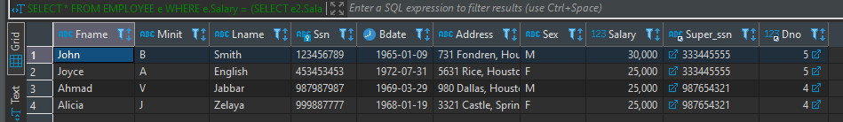


Retrieve the name of each employee that:
    - Has a Dependent of the same firstname & same sex 

```sql
SELECT e.Fname, e.Lname FROM EMPLOYEE e 
	WHERE e.Ssn IN (
		SELECT d.Essn FROM DEPENDENT d WHERE e.Fname = d.Dependent_name AND e.Sex = d.Sex
	);
```


---

## Correlated Nested Query

Whenever a condition in the WHERE clause of a nested query references some attribute of a relation declared in the outer query, the two queries are said to be correlated.

- A correlated nested query is evaluated once for each row in the outer query
- Queries that are nested using the = or IN comparison operator can be collapsed into one single block

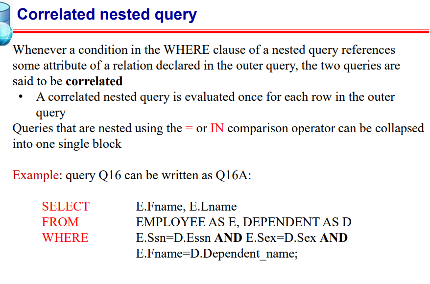

```sql
SELECT * FROM EMPLOYEE e 
	WHERE e.Ssn IN (
		SELECT d.Essn FROM DEPENDENT d WHERE e.Fname = d.Dependent_name AND e.Sex = d.Sex
	);
```

</details>

<details> 
<summary style="font-size: 30px; font-weight: 500; cursor: pointer;"> Section 6 | Joins, Exists, Unique and more Keywords
  </summary>
**Actual Study**
- SQL uses a three-valued logic:
*TRUE, FALSE, and UNKNOWN*

### General Null Syntax for SQL

## SQL Comparison Conditions and Logical Connectives

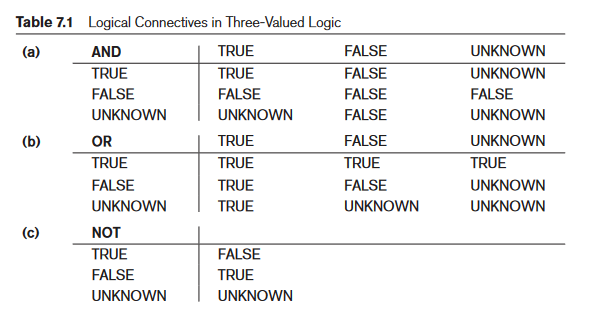

#### Table 7.1(a): AND Logical Connective
- Describes the result of combining two values using the `AND` logical connective.
- Example: `(FALSE AND UNKNOWN)` results in `FALSE`.

#### Table 7.1(b): OR Logical Connective
- Shows the result of using the `OR` logical connective.
- Example: `(FALSE OR UNKNOWN)` results in `UNKNOWN`.

#### Table 7.1(c): NOT Logical Operation
- Details the result of the `NOT` logical operation.
- In standard Boolean logic, only `TRUE` or `FALSE` are used, without an `UNKNOWN` value.

#### Select-Project-Join Queries
- General rule: Only tuples that evaluate the logical expression in the `WHERE` clause to `TRUE` are selected.
- Tuples evaluating to `FALSE` or `UNKNOWN` are not selected.
- Exceptions exist, e.g., in outer joins (see Section 7.1.6).

### SQL Null Value Handling
- SQL uses `IS` or `IS NOT` instead of `=` or `<>` for NULL comparison.
- Each NULL value is considered distinct; equality comparison is not used.
- In join conditions, tuples with NULL values in join attributes are usually excluded, except in OUTER JOINs (see Section 7.1.6).
- Example: Query 18 retrieves employees without a supervisor, demonstrating NULL comparison.

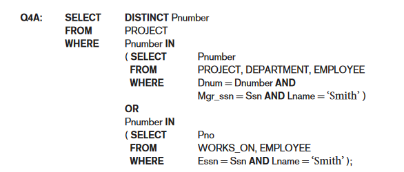

## SQL Query Explanation

The SQL query in question performs the following operations:

1. **Selection of Distinct `Pnumber`:**
   - The `SELECT DISTINCT Pnumber` statement is used to retrieve unique `Pnumber` values from the `PROJECT` table to avoid duplicates in the result set.

2. **Subquery for Department Projects:**
   - The first subquery `(SELECT Pnumber FROM PROJECT, DEPARTMENT, EMPLOYEE WHERE Dnum = Dnumber AND Mgr_ssn = Ssn AND Lname = 'Smith')` looks for `Pnumber` values in projects that are managed by an employee with the last name 'Smith' in a specific department.

3. **Subquery for Work Assignments:**
   - The second subquery `(SELECT Pno FROM WORKS_ON, EMPLOYEE WHERE Essn = Ssn AND Lname = 'Smith')` identifies `Pnumber` values (labeled as `Pno` here) from the `WORKS_ON` table where there are work assignments involving an employee with the last name 'Smith'.

4. **Combining Results with OR:**
   - The query selects `Pnumber` values that are found in either the first or the second subquery or in both. The `OR` operator ensures that if a `Pnumber` meets either condition, it will be included in the result set.

In essence, this query retrieves the project numbers (`Pnumber`) for all projects that either:
- Belong to a department managed by an employee with the last name 'Smith'.
- Have work assignments associated with an employee with the last name 'Smith'.

The use of `OR` broadens the selection criteria, ensuring that all unique project numbers meeting either condition are retrieved.

Here IN or = would've worked equally fine, as we're searching for exact 1 element, however for a query with a WHERE (tuple0, tuple1), it's gotta be with *IN*

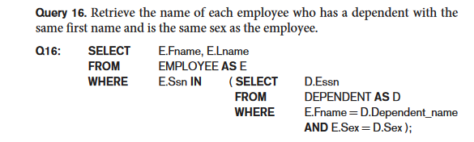

When you have a nested query in SQL, and both the outer and inner queries refer to tables that have columns with the same name, you need to be careful to specify which column you're referring to. This is similar to how in programming languages with nested functions, you have to be clear about which variable you're referring to if the same variable name is used in different scopes.

In the example given *(Query 16)*, E and D are aliases for the EMPLOYEE and DEPENDENT tables, respectively. In the nested query, they specifically qualify E.Sex to refer to the Sex column in the EMPLOYEE table because DEPENDENT also has a Sex column. If you didn't qualify E.Sex, the query would automatically refer to Sex from DEPENDENT in the nested query because that's the inner scope.

**Example that is NOT Ambiguis**
```sql
SELECT E.Name
FROM Employees AS E, Departments AS D
WHERE E.DepartmentID = D.ID;
```

**Example that needs qualification**
```sql
SELECT E.Name, D.Name
FROM Employees AS E, Departments AS D
WHERE E.DepartmentID = D.ID;
```

**Nested Query Example:**
```sql
SELECT E.Name
FROM Employees AS E
WHERE E.ID IN (SELECT D.ManagerID FROM Departments AS D);
```

### Lecture Nested Query Examples:

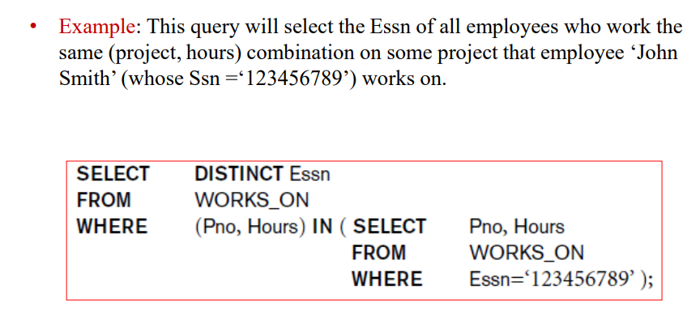
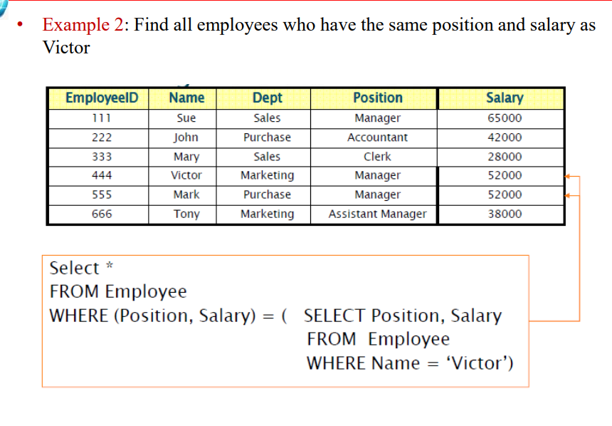

### Using `ALL` Keyword in Nested Queries

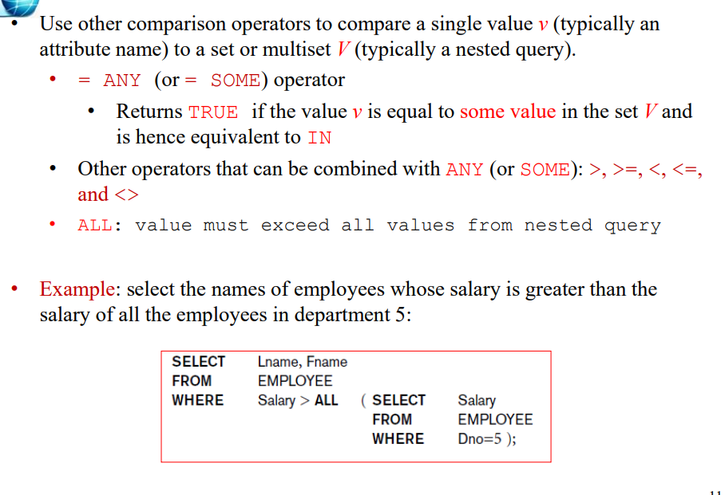

---
## The EXISTS and UNIQUE Functions in SQL
The query provided (Q6) is using the NOT EXISTS function to find employees who do not have any dependents.

**SQL EXISTS and NOT EXISTS:**

**EXISTS** is a Boolean function that checks if there are any rows resulting from a subquery.
**NOT EXISTS** is the opposite; it checks if a subquery returns no rows.

```sql
SELECT Fname, Lname
FROM EMPLOYEE
WHERE NOT EXISTS (
    SELECT *
    FROM DEPENDENT
    WHERE Ssn = Essn
);
```

1. It looks at each row in the EMPLOYEE table.
2. For each employee, it then runs the subquery to check in the DEPENDENT table for any dependents linked to the employee's Social Security Number (Ssn).
3. If the subquery finds no dependents that match the employee's Ssn (meaning the DEPENDENT table has no rows with Essn equal to the employee's Ssn), then the NOT EXISTS condition is true.
4. For every EMPLOYEE row where the NOT EXISTS condition is true (meaning they have no dependents), that employee's first and last name (Fname, Lname) are selected.

The **EXCEPT** keyword in SQL is used to return all the rows from the first query that are not in the second query. It's a way to subtract one set of data from another.

**Q3A breakdown**
Retrieve the name of each employee who works on all the projects controlled by department number 5
```
SELECT Fname, Lname
FROM EMPLOYEE
WHERE NOT EXISTS (
    (SELECT Pnumber
     FROM PROJECT
     WHERE Dnum = 5)
    EXCEPT
    (SELECT Pno
     FROM WORKS_ON
     WHERE Ssn = Essn)
);
```

1. The subquery `(SELECT Pnumber FROM PROJECT WHERE Dnum = 5)` selects all project numbers (`Pnumber`) that are controlled by department number 5.
2. The subquery `(SELECT Pno FROM WORKS_ON WHERE Ssn = Essn)` selects all project numbers (`Pno`) on which an employee works. This is a correlated subquery because it uses Essn from the outer query's `EMPLOYEE` table.
3. The **EXCEPT** operation then takes the set of all projects controlled by department 5 and subtracts the set of projects that the employee works on.
4. The **NOT EXISTS** clause checks if the resulting set from the **EXCEPT** operation is empty. If it is empty, it means the employee works on all projects controlled by department 5 because there are no projects *(controlled by department 5)* that the employee does not work on.
5. Finally, the main query SELECT Fname, Lname FROM EMPLOYEE retrieves the names of the employees for whom the NOT EXISTS condition holds true.

**Set 1**: All project numbers from PROJECT where Dnum (department number) is 5.
**Set 2:** All project numbers from WORKS_ON where the employee is working (Ssn = Essn).
The *EXCEPT* subtracts Set 2 from Set 1. If there are any projects in Set 1 not covered by Set 2, the result will not be empty.


#### Explicit Sets & Renaming in SQL

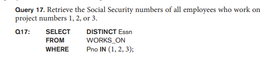
Here we're selecting an distinct ESSEN from WORKS ON where Pno is in an **Explicitly Defined Set**

*Renaming is also possible like so*


---

## Joined Tables & Outer Joins in SQL
For example, consider query Q1, which retrieves the name and address of every employee who works for the ‘Research’ department. 

**JOIN**
```sql
SELECT Fname, Lname, Address
FROM (EMPLOYEE JOIN DEPARTMENT ON Dno = Dnumber)
WHERE Dname = ‘Research’;
```
This query selects the first name, last name, and address of all employees who work in the 'Research' department.

- The **JOIN** here is an inner join which combines rows from **EMPLOYEE** and **DEPARTMENT** tables where the condition `Dno = Dnumber` is met. `Dno` is a column in **EMPLOYEE** indicating the department number the employee belongs to, and `Dnumber` is the corresponding department number in **DEPARTMENT**.
- When these tables are joined, each row from **EMPLOYEE** that has a matching Dno in **DEPARTMENT** (Dnumber) is combined into a single row in the result set. The resulting row has all the columns from both tables.

<br/><br/>

**NATURAL JOIN**
```sql
SELECT Fname, Lname, Address
FROM (EMPLOYEE NATURAL JOIN
 (DEPARTMENT AS DEPT (Dname, Dno, Mssn, Msdate)))
WHERE Dname = ‘Research’;
```
This query also selects the first name, last name, and address of all employees who work in the 'Research' department.
- A **NATURAL JOIN** automatically joins two tables based on columns with the same name and compatible data types.
- In this example, before the **NATURAL JOIN** is performed, the **DEPARTMENT** table is being renamed to **DEPT** and its columns are also being renamed so that they match exactly with the columns in **EMPLOYEE**. This is done using the `AS` clause.
- Specifically, `Dnumber` is renamed to `Dno` to match the **EMPLOYEE** table's column for department number. Because `Dno` is now the same in both tables, **NATURAL JOIN** will join the tables on this column without explicitly specifying a condition.
- After the **NATURAL JOIN**, the joined table will only include the `Dno` column once. The values in this column come from the matching rows in the original tables.

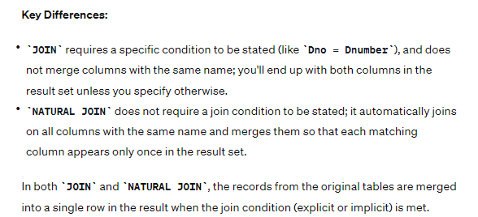

## OUTER JOINS *(Left, Right, FULL)*

**Left Join**
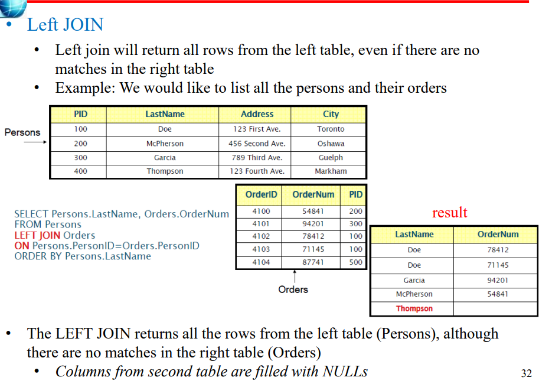

<br></br>

**Right Join**
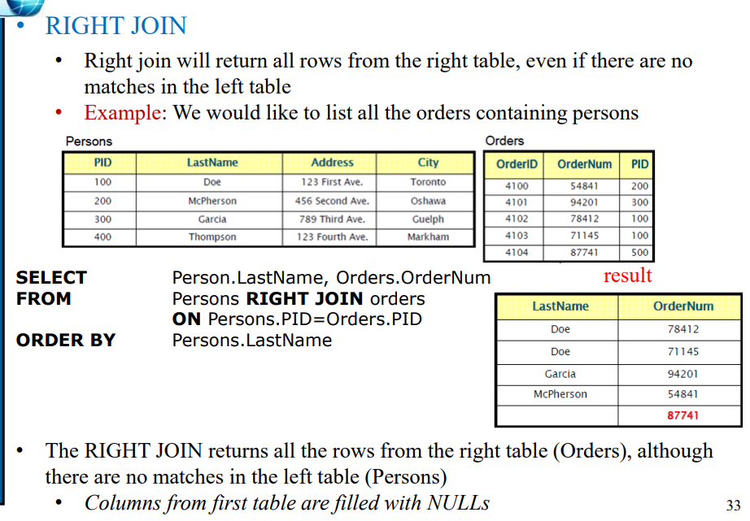

**FULL Join**
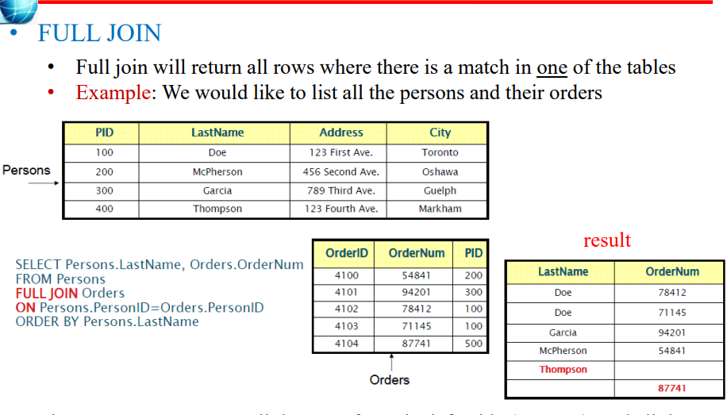


It is also possible to nest join specifications, called a **Multiway Join**
  </details>

<details>
  <summary style="font-size: 30px; font-weight: 500; cursor: pointer;"> Section 6 | GROUP BY, Assertions & Triggers, Views
</summary>

# Aggregate Functions: *Trivial*

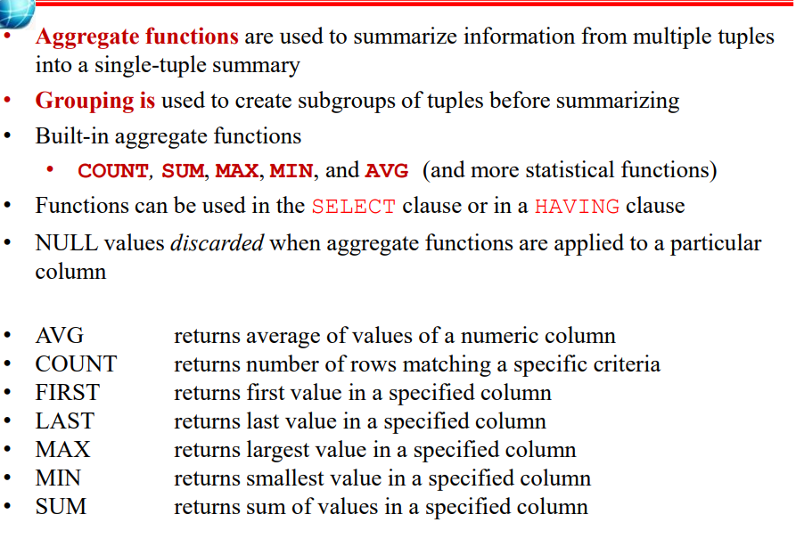
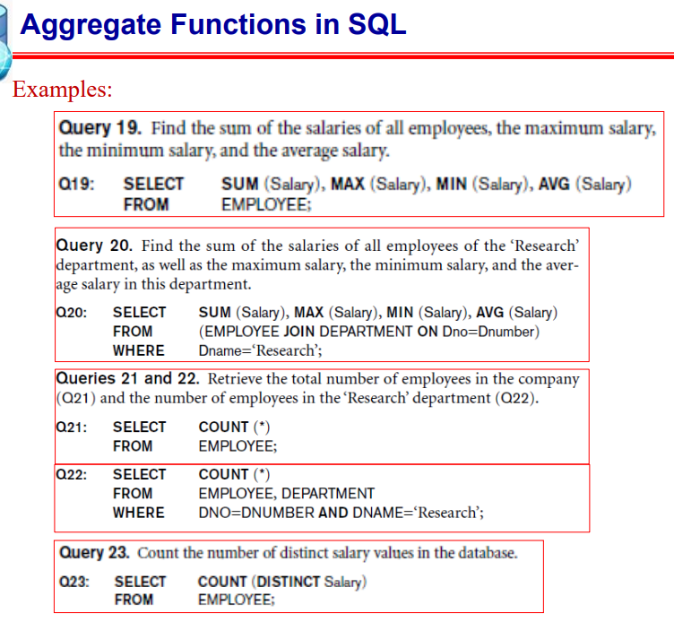

---

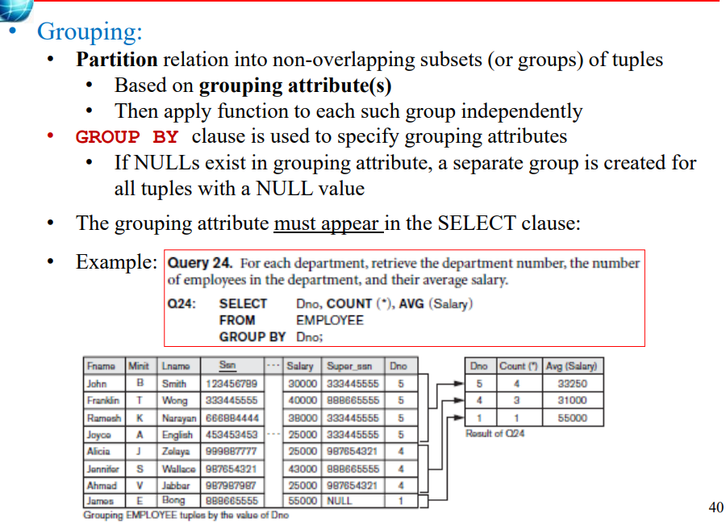

**Another Example**

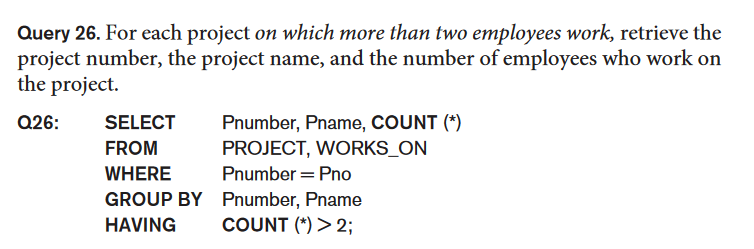
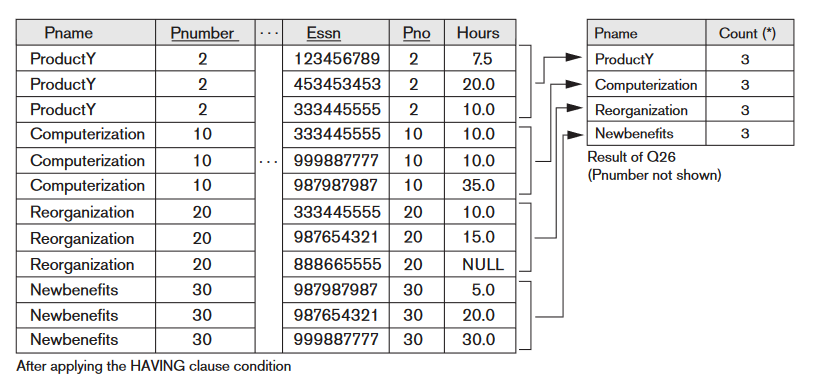

---

## WITH and CASE

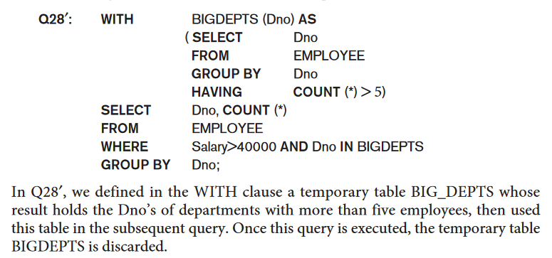

**Case, Like switch case equiv. in SQL**

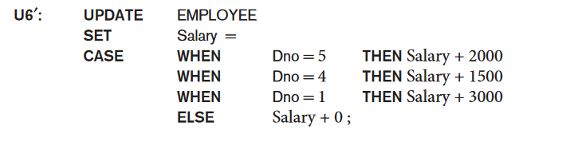

Giving some employees a raise based on their DEPT, some departments getting a higher raise than others.

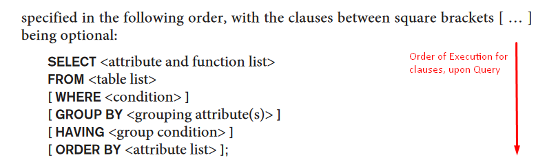


### SQL Query Structure and Clauses

#### Clause Descriptions
- **SELECT**: Lists attributes or functions to be retrieved.
- **FROM**: Specifies relations (tables) required, including joined but excluding nested query relations.
- **WHERE**: Conditions for selecting tuples, including join conditions.
- **GROUP BY**: Specifies grouping attributes.
- **HAVING**: Condition on the groups rather than individual tuples.
- **ORDER BY**: Orders the result of the query.

#### Evaluation Order
1. **FROM**: Identify or materialize joined tables.
2. **WHERE**: Select and join tuples.
3. **GROUP BY** and **HAVING**: Applied next if present.
4. **ORDER BY**: Sorts the query result.

#### Aggregate Functions
- Functions like COUNT, SUM, MIN, MAX, AVG can be used with or without a GROUP BY clause.

#### Query Execution
- Conceptually, queries evaluate each tuple combination in the FROM clause, selecting those where the WHERE clause is TRUE, placing their SELECT attributes in the result.
- Real DBMS uses query optimization for efficient execution.

#### Flexibility and Optimization
- SQL allows various ways to specify the same query, affecting comfort and efficiency.
- It's preferable to write queries with minimal nesting and implied ordering for optimization.
- Users need to be aware of more expensive constructs for efficient query processing.

---

## Specifying Constraints as Assertions and Actions as Triggers

The salary of an employee must not be greater than the salary of the manager of the department that the employee works for in SQL, we can write the following assertion:

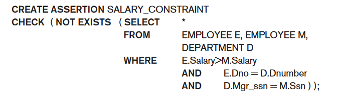

The `CREATE ASSERTION` statement in SQL is used to define general database constraints that are more complex or broad than those that can be specified at the column or table level. These assertions can enforce rules across multiple tables or complex conditions that are not easily represented by standard column constraints.

Regarding your specific question about when the assertion is checked:

1. **Triggering of Assertions**: The assertion defined by `CREATE ASSERTION` is checked by the database management system (DBMS) whenever an operation (such as `INSERT`, `UPDATE`, or `DELETE`) could potentially violate the constraint. In your example, the assertion `SALARY_CONSTRAINT` is designed to ensure that no employee has a salary greater than their manager's. This means the DBMS will need to check this constraint whenever there is an `INSERT` or `UPDATE` operation on the `EMPLOYEE` table, or potentially on the `DEPARTMENT` table, as changes in these tables could affect the validity of the constraint.

2. **Scope of Assertion Checks**: The scope of checking an assertion like this is typically broader than checks performed on individual column constraints. This is because the assertion is not tied to a specific column or table, but rather to a condition that spans across potentially multiple tables. In your case, any change to the `EMPLOYEE` or `DEPARTMENT` table might necessitate a check against the `SALARY_CONSTRAINT` assertion.

## Understanding SQL Triggers

1. **Purpose of Triggers**: 
   - Triggers are used to specify actions that the database should automatically perform when certain events occur and specific conditions are met. 
   - They are useful for tasks like maintaining database consistency, monitoring updates, or implementing complex business rules.

2. **Trigger Components (ECA Rule)**:
   - **Event**: This is what initiates the trigger. In SQL, these are usually database update operations (INSERT, UPDATE, DELETE). For example, inserting a new employee record or changing an employee's salary.
   - **Condition**: This optional element is evaluated after the event. If the condition is met (evaluates to true), the trigger action is executed. If there's no condition, the action is executed immediately after the event.
   - **Action**: The response or task that the trigger performs. It could be a series of SQL statements, a database transaction, or an external program.

### Example: Salary Violation Trigger

- **Scenario**: Monitoring employee salaries to ensure they do not exceed their supervisor's salary.
- **Trigger Name**: `SALARY_VIOLATION`.
- **Triggered Events**: Inserting a new employee record, changing an employee's salary, or changing their supervisor.
- **Trigger Condition**: The trigger checks if an employee's new salary exceeds that of their supervisor.
- **Trigger Action**: If the condition is met, it calls an external stored procedure, `INFORM_SUPERVISOR`, which presumably notifies the supervisor of the violation.

### SQL Trigger Syntax (Oracle):

```sql
CREATE TRIGGER SALARY_VIOLATION
BEFORE INSERT OR UPDATE OF SALARY, SUPERVISOR_SSN
ON EMPLOYEE
FOR EACH ROW
WHEN ( NEW.SALARY > ( SELECT SALARY FROM EMPLOYEE WHERE SSN = NEW.SUPERVISOR_SSN ) )
INFORM_SUPERVISOR(NEW.Supervisor_ssn, NEW.Ssn);
```

- **Explanation**:
  - This trigger is set to activate `BEFORE` either an `INSERT` or `UPDATE` operation related to `SALARY` or `SUPERVISOR_SSN` on the `EMPLOYEE` table.
  - It applies to each affected row individually.
  - The condition checks if the `NEW.SALARY` of an employee is greater than the salary of the employee identified by `NEW.SUPERVISOR_SSN`.
  - If the condition is true, the `INFORM_SUPERVISOR` procedure is executed with the supervisor's SSN and the employee's SSN as parameters.

### Key Takeaways

- Triggers are powerful for automating reactions to data changes in a database.
- They help in ensuring data integrity and implementing complex business rules.
- However, they should be used judiciously as they can add complexity and potentially impact performance.

This example illustrates how triggers function in a real-world scenario, ensuring adherence to business rules (like salary caps relative to supervisors) and automating responses to data changes.

---
**Views** : TODO
</details>