

  
Lecture 11. | Hash Tables

**Search Times**
Theoretical *Worst Case* : O(n)
In practice | *Average Case* : O(1)

### Direct-Address Tables (not a hash!)
U = {0,1, ..., m-1} *where m isn't too large, reasonable size*
let T be the ***direct-address table*** T[0 ... m-1]

Figure 11.1 illustrates the approach; slot k points to an element in the set with key k. If the set contains no element with key k, then T[k] is NIL. The dictionary operations are trivial to implement:

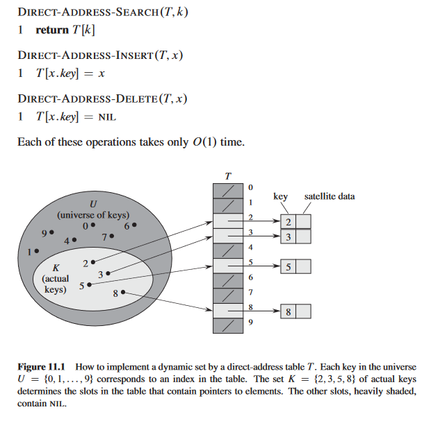

*Satellite data refers to unique data a Key is pointing to.*

For certain applications, the direct-address table can directly hold elements in the dynamic set. Instead of storing key and satellite data externally with a pointer, the object is stored in the table slot itself, saving space. An object's special key denotes an empty slot. In some cases, storing the key may be unnecessary as the index implies it. However, without stored keys, a mechanism is needed to identify empty slots.

---

## Hash Tables | Chaining

In Direct-Address Tables:
- **k** maps to element in **U**
In Hash Tables:
- **k** maps to **h(k)**

- A hash function h must be deterministic in that a given input k should always produce the same output h(k)
- Ideally we want to minimizee Hash Collisions

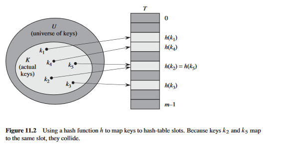

Two keys may hash to the same slot. We call this situation a collision. *(Hash Collision)*
*Resolution to Hash Collisions,* : **CHAINING**

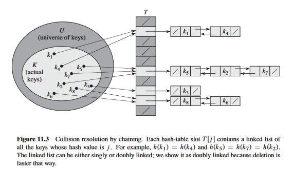

Chains same *h(k)* values in a Doubly **Linked-List**, so you kind access a *Hash Bucket* at O(1), then find your element in a much smaller sub-set.

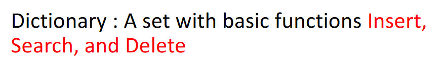

Chain Hash Insert Pseudo-Code for Dict. Like behavior

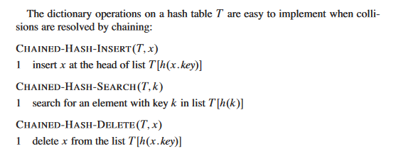

Insertion & Deletion Runtimes *(Worst case)* : O(1)
Search Runtime *(Worst case)* : O(n)

**LOAD FACTOR**
Given a hash table *T* with **m** slots that stores **n** elements, we define the load factor ˛ for T as n/m, that is, the average number of elements stored in a chain. Our analysis will be in terms of **ALPHA**, which can be less than, equal to, or greater than 1.

The **worst-case** behavior of hashing with chaining is terrible: all n keys hash to the same slot, creating a list of length **n**.
The worst-case time for searching is thus **n** plus the time to compute the hash function—no better than if we used one linked list for all the elements.

For Avg. Case case we can assume **simple uniform hashing** *(assume all keys have a unique hash, and no collisions)*
- Under the assumption of simple uniform hashing, any key k not already stored in the table is equally likely to hash to any of the m slots.

In successful search case: 
- The probability that a list is searched is proportional to the number of elements it contains.

#### Theorem 1.1
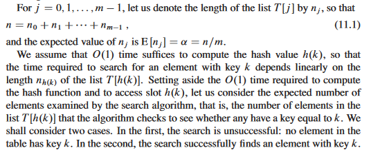
**ALPHA** is that character
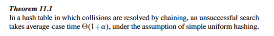
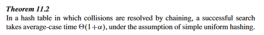

---

### Hash Functions

*Divison & Multiplication* Hashing are Heuristic by Nature
*Universal Hashing* uses *Randomization* so it's performant

**What makes a good hashing function?**

- **Uniformity:** A good hash function should map the expected inputs as evenly as possible over its output range. We usually dont know the distirbution, but Occasionally we do know the distribution. For example, if we know that the keys are random real numbers **k** independently and uniformly distributed in the range `0 <= k < 1`, then the hash function `h(k) = Floor.Function(k*m)`

- **Determinism:** hash procedure must be deterministic — meaning that for a given input value it must always generate the same hash value.

- **Low cost:** The cost of computing a hash function must be small enough to make a hashing-based solution more efficient than alternative approaches.

- **Continuity:** A hash function that is used to search for similar data must be as continuous as possible; two inputs that differ by a little should be mapped to equal or nearly equal hash values.

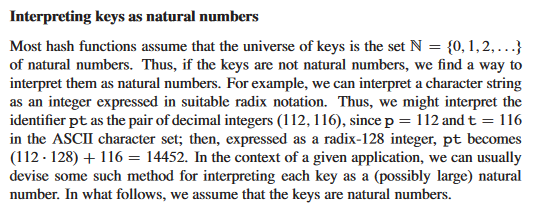
**Interpreting Keys Example**
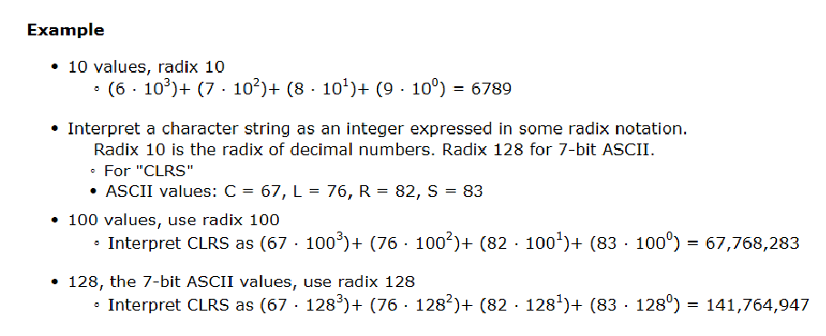

---

# The Division Method
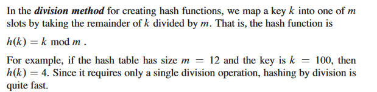
So, the key 100 would be placed in slot 4 of the hash table.

When using the division method, we usually avoid certain values of m. For example, **m** should not be a power of *2*, since if `m = 2^p` , then `h(k)` is just the **p** lowest-order bits of **k**.

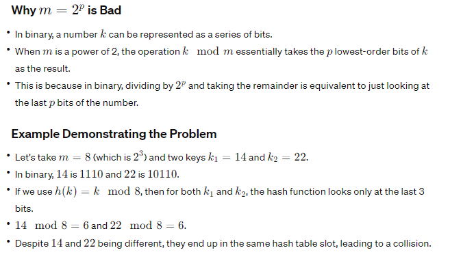

*note*: both 14 and 22 ended with `110` which is 6, and since `p = 3` it just takes those last 3 binary digits, which is NOT ideal!

**A prime not too close to an exact power of 2 is often a good choice for m**

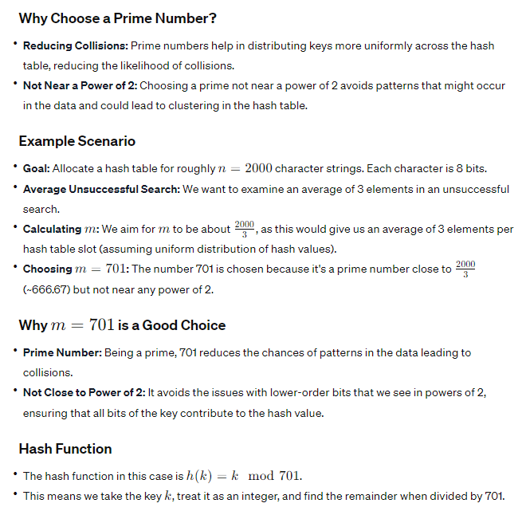

### Lecture Example
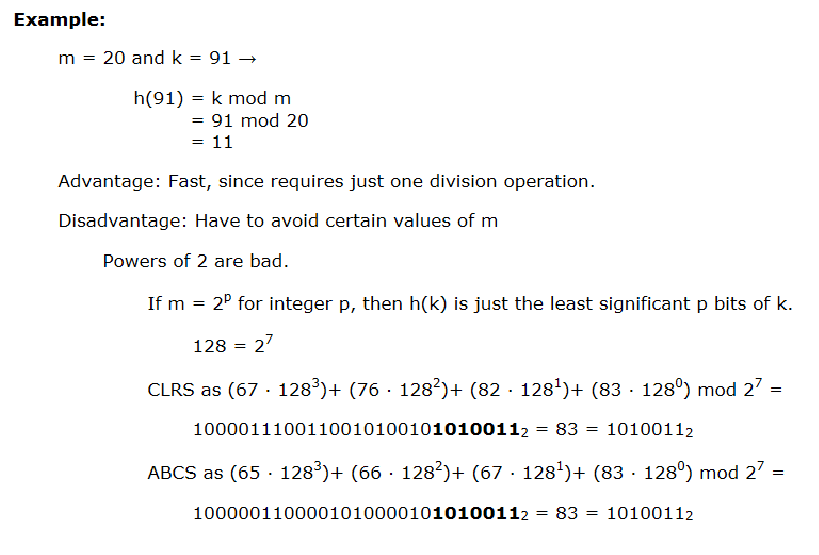

---
# The Multiplication Method
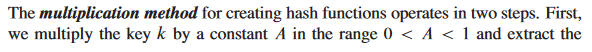
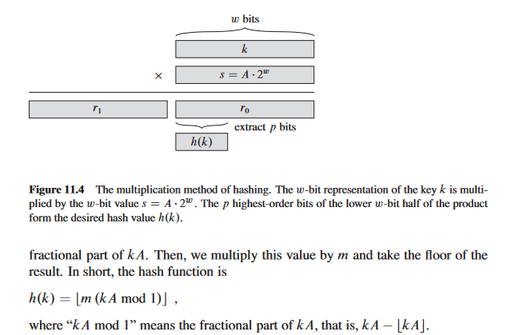

When you multiple 2 bytes *(8 bits) * (8 bits)*
We need to reserve 2 bytes *(16 bit)*, for a Carry Over, else it will be overflow

Here it's `word k` * `s = A * 2^w` *(const S, A is constant & 2^w multipiled, where and w is size of word in bits)* where **A <= 1**

X mod 1 => *Only keep fractional parts*

## **INTUITION & Examples**

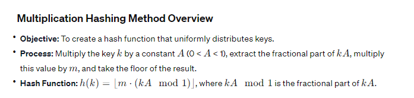

**Important**: An advantage of the multiplication method is that the value of **m** is not critical. We typically choose it to be a power of 2 (`m = 2^p` for some integer `p`), since we can then easily implement the function on most computers.

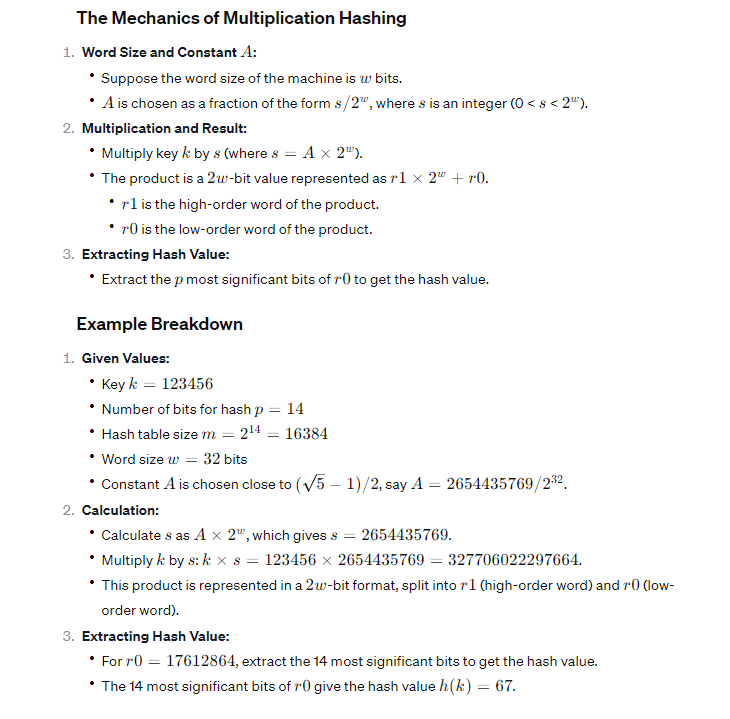

---

**Hash Function** Mapping from Keys to Index

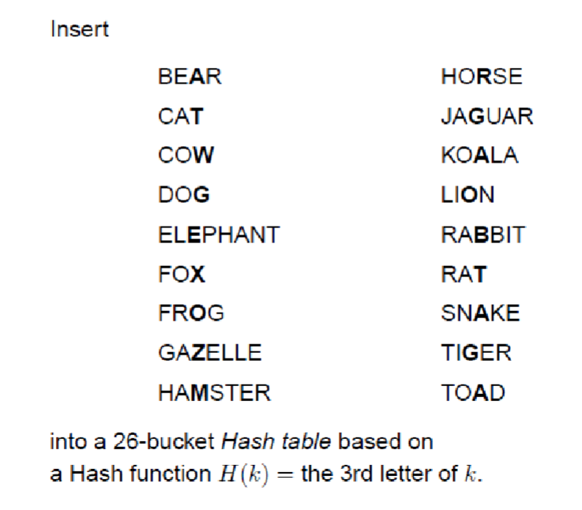

- Bunch of Character Streams, and the Hash function can be: *" Look at the 3rd letter in String, and Map it in Hash Table*

Universal Hashing ?
Open Addressing ?
Perfect Hashing ? 
Linear Probing ?

  

  
Lecture 12. | Binary Search Trees

- Provides Data Structure that supports Dictionary Operations   
  - *(SEARCH, DELETE, INSERT)*
  - **PREDECESSOR, SUCESSOR**
  - *Minimum, Maximum*

* Isn't necessarily a complete tree *(It can be skewed/unbalanced)*
* Every parent has at most: *2 Children, Left Child is Smaller, Right Child is Greater*
  - We can "Bisect" the tree, having the Left side being Smaller, and Right side elements being Larger

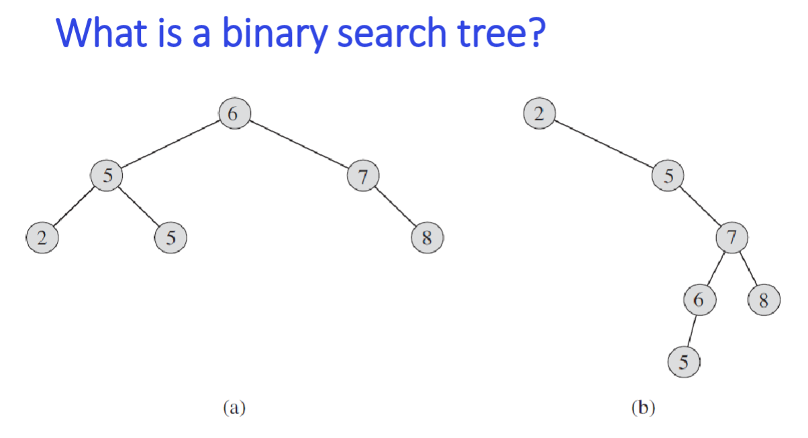

**FIND MAX**
To find the maximum of the Binary Search Tree, Recursively Retrieve the "Right Side" until it has **NO RIGHT CHILD**, *it doesn't need to be a leaf node*

**FIND MIN**
To find the maximum of the Binary Search Tree, Recursively Retrieve the "Left Side" until it has **NO LEFT CHILD**, *it doesn't need to be a leaf node*

---

**Binary-Search-Tree Operations**
- Insertion, Deletion, Search, Predecessor, Successor, Minimum, Maximum

**T.root** is a pointer to the ROOT of the BST
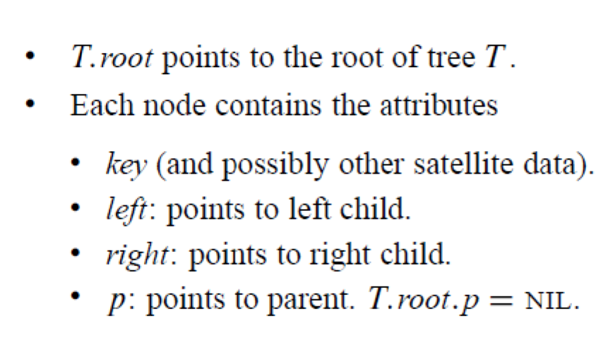

*We usually get a Binary Search Tree in this Chapter, and want to know how we Do **Operations** on them*

  
Lecture 12. | Inorder, Preorder & Postorder Tree Walks

# In-Order: `INL*R`
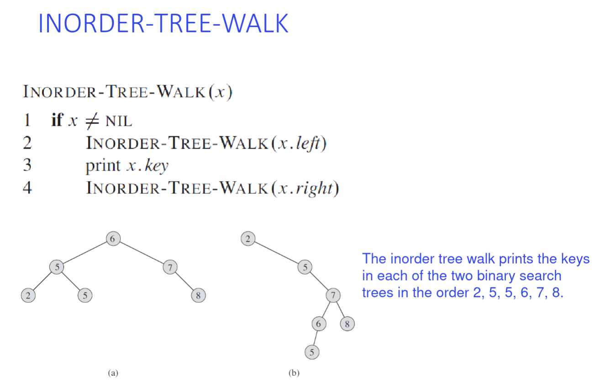
#### A)

**Complexity**
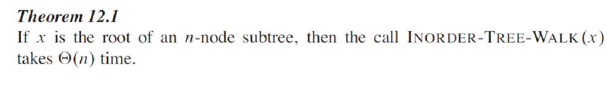

It's case is always *O(n)* as we **need** to visit all nodes!

#### B)
- 2 (root) doesn't have any left sub-tree (NIL) so get it: 2
... todo

# Pre-Order `PR*LR`
TODO: 

# Post-Order `POLR*`
TODO:

