## Chapter 4 : Software

<details>
  <summary style="font-size: 30px; font-weight: 500; cursor: pointer;"> October 25th </summary>
  


*High Level Languages build constructs* For loops, If statements, look at Python, lots of High Level Abstraction

*In Assembly you need to trace, it's harder*

**Compiler** : Program that takes High Level Constructs and converts into Assembly
- Optimizations are done at the Compiler level

**Assembly** : Takes Assembly Files, and turns it into Machine Code
- No optimizations are done, only directly translations here

Object files aren't Executable !!!

**Linker** : Link all the functions together, so that the program can be executed. *(Since the program goes Instruction by Instruction, and so everything needs to be together, including source files, library files which are already compiled object files)*

-  For EX: if I use `cos()` and don't include `<cmath>` I'll get **Linker** Error.
Now the **Executable File** from the Linker, is able to Execute

**Loader** : You can use Origins, in Assembly, which the Loader will take into account (Put labels at origin: **0x1000**, and Instructions at **0x400**)

#### Loader Header
- Loader reads the "Header" of the File for origin info, how to load it in...
- Hey Loader, we've got some libraries that might not be resolved yet... `cos()` for ex: pls know where this fn is in memory, and use it

- It's stored in memory once, and All programs using the `cos()` knows where it is, and Calls it. *(Loader Only Knows where it is)*

---

### Assembler Process

We know we've got 3 formats **J Type**, **R Type**, **I Type**

##### Two-Pass Assembler

#### First Pass

In the first pass, the assembler goes through the source code to generate all machine instructions and populate the symbol table with addresses of labels.

**Example:**
```assembly
LOOP:  ADD R1, R2
       SUB R3, R4
       JMP END
       MUL R1, R2
END:   HLT
```

In the first pass, the symbol table might look like: *(Pass 1 builds the symbol table)*

```
| Label | Address |
|-------|---------|
| LOOP  | 0000    |
| END   | 0011    |

```

#### Second Pass

During the second pass, the assembler uses the symbol table to resolve unknown branch offsets or addresses.

**Example:**
From the previous code, JMP END can now be resolved to jump to address 0011.

After the second pass, the machine code might look like:

```assembly
ADD R1, R2
SUB R3, R4
JMP 0011
MUL R1, R2
HLT
```

---


</details>


---

## Chapter 5: Basic Processing Unit

<details>
<summary style="font-size: 30px; font-weight: 500; cursor: pointer;"> Addressing Modes Review </summary>

  Addressing modes in computer architecture dictate how the instructions in a machine language program identify the data they operate upon or the destinations where they deposit results. Different addressing modes offer various ways to specify this data.

  **Immediate Mode:**

  The operand is a constant value and is present within the instruction itself. *(operand is IMMED16 here)*
  For example, in the instruction `ADD R1, 5`, the value "5" is an immediate operand.

  **Register Mode:**

  The operand is a register; the name or number of the register is given in the instruction.

  *Example:* `ADD R1, R2` adds the contents of register R2 to register R1.

  **Absolute or Direct Mode:**

  The address of the operand is given directly in the instruction.
  Example: `LOAD R1, 1000` loads the content of **memory location 1000** into register R1.

  **Indirect Mode:**

  The **address of the operand** is held in a register or memory location. The instruction specifies this register or memory location, and the actual operand is fetched from the resulting address. *(Here the operand holds an address)*

  *Example:* If R2 contains the address 2000, `LOAD R1, (R2)` loads the content of memory location 2000 into R1.

  **Indexed Mode:**

  This mode uses the sum of a base address and an index register to find the effective address.
  *Example:* If the instruction is `LOAD R1, 100(R2)` and R2 contains the value 50, then the data is loaded into R1 from memory location 150 (100 + 50).

  **Auto-increment and Auto-decrement Mode:**

  In auto-increment, after fetching the operand, the content of the register *(usually an address)* is automatically incremented. This is useful for accessing consecutive memory locations.
  In auto-decrement, the content of the register is decremented before fetching the operand.

  <br>

  *Example AUTO-INCR*: If R2 contains the address 1000, `LOAD R1, (R2)+` loads the content of memory location 1000 into R1 and then increments R2 to 1001. 

  <br>

  *EXAMPLE AUTO-DECR*
  If it was `LOAD R1, -(R2)`, R2 would first decrement to 999, then its content would be loaded into R1.

  ---

  ### Bringing it back to this Chapter:

  Every instruction cycle begins with fetching the next instruction from memory. Once fetched, the CPU decodes the instruction to determine which operation to perform and which addressing mode is used. The addressing mode will then dictate how the CPU retrieves or identifies the operands for the operation.

  **Operand Fetches**
  Based on the addressing mode, the data path will be set up differently to fetch operands!


  **Immediate Mode:** The operand data might be fetched as part of the instruction itself. Thus, the operand would be directly routed from the instruction register.

  **Direct or Absolute Mode:** The operand's address is directly specified. The CPU uses this address to fetch the operand from memory.

  **Register Mode:** The operand is in a CPU register, so no memory access is required. The data path will route data from the specified register.

  **Indexed Mode:** The CPU must add the base and index values to get the effective address. This involves the ALU in the data path to calculate the sum, and then memory is accessed using the effective address.

  **Indirect Mode:** The data path will first fetch an address from a register or memory location and then use that address to fetch the operand from memory.

  **Auto-increment/Auto-decrement Mode:** The data path fetches data from the memory address specified in a register. Then, the ALU increments (or decrements) the register's value.
</details>


  <details>
    <summary style="font-size: 30px; font-weight: 500; cursor: pointer;"> Fundementals, Pipelining & Instruction Execution</summary>

  

  proc. = processor

  **Processing Unit**
  - Executions of instructions, by the proc.
  - Functional Units of proc. how they are connected
  - Hardware for control signals (Control Unit)
  - Micro-programmed control

  ### SLOW
  One Logic Circuit taking a long time, and it's quite sequential *(NOT CONCURRENT)*

  

  ### Much Faster *(Pipelining)*
  Way more Thruput, and in a pipeline, the "Station" *(Smaller logic circuit)* is able to process a portion of the Compute!

  **Example:** Report writing *(Abstract, Intro, Body, Conclusion)* at every stage in pipeline, one paragraph is added, and once the *Intro* Writer finishes Intro for Report #1, next cylce he can do Report #2's Intro. **THRU-PUT is 5x!!!**

  
  
  
  **Notes**
  - In Pipeline, Stages should do equal amount of work, in a timeframe *(As our clock cycle is designed to support a whole stage/operation to preform within the single cycle)*
  - Design stages to keep clock cycle short *(Therefore, Frequency *(GHz)* gets faster, as `f = 1/l` , where `l` is clock cycle length)
  ---

  ### Instruction Executions

  We can have `n` stages, but due to Hardware limitations we usually have **5** with RISC and NIOS 2
  The **5** Steps we define, need to be as generic as possible to support the ut-most variety of instructions

  That's why some steps aren't use for certain Instructions, as that generic step isn't needed for a specific operation

  

  

  Generics:
  

</details>

<details>
  <summary style="font-size: 30px; font-weight: 500; cursor: pointer;"> Hardware Components </summary>

## Register File

"Access Circuitry" Enables 2 registers to be read in at the same time, for their contents to be available at 2 seperate outputs
- RA, and RB
- Register File has Data Input C *(Aswell as an indication to which Register File to Write in)*
- Connected with **IR** instruction register

- **Registers**: Super fast CPU memory spots.
- **Types**:
  - **Memory Access Registers**: MDR, MAR
  - **Instruction / Fetching Registers**: PC, IR
  - **Condition Registers**: Carry, Overflow, etc.
  - **Special**: Index, Stack Pointer
- **Implementation**: Registers often come in a 'register file' - a quick memory block allowing data read/write.

  

#### **Dual-ported Mem Block**

- **Concurrency**: Allows for simultaneous Read/Write
- **Complexity**: More complex hardware design to manage both ports
- **Size and Cost**: Larger / Costly
- **Applications** that require lots of simultaneous Read/Write want a **Dual-ported** mem block.

#### **Two Single-Ported Mem Blocks**

- **Synchronization**: Two single-ported may require additional synchronization.
- **Flexibility**: Two separate blocks can offer design flexibility.
- **Applications**: Dual-ported for high-speed access; two single-ported for cost-effectiveness or simpler systems.

## ALU (Arithmetic Logic Unit)

- **ALU's Role**: Processes data (both arithmetic and logical operations).
- **Hardware View**: Shows components needed for computational instructions.
- **Data Source & Destination**: Both come from the register file.
- **Notation**:
  - **[RA]** and **[RB]**: Values from registers at addresses A and B.
  - **new [RC]**: Result stored to the register at address C.
- **Immediate Values**: If a source operand is an immediate value, it's directly provided to the ALU without coming from a register.
      - Discussed in datapath, refer to *MUX B*

  

## Datapath

  #### Generic 5 Stages of Organization:

  

  #### Datapath *(From textbook)*

  

#### Mux B
This MUX selects wether it uses the Immediate Value, or RB *(Inter-state register, as output for Stage 2)* for the ALU operation.
This MUX will determine the value going into **InB** in ALU.

**Examples:**
`ADD R2, R3, R4` , the ALU's InA will be RA (R3) , InB wil be RB (R4)
`ADD R2, R3, #2` , the ALU's InA will be RA (R3) , InB wil be Immediate Value (`#2`)

#### Mux Y
This is the multiplexer situated at the bottom of the diagram. It has three input choices *(indexed 0, 1, and 2)* and decides which of these inputs will pass through to the RY output based on the control input it receives:

**0** - ALU output (RZ): The output from the ALU (Arithmetic Logic Unit) after a computation is completed.

**1** - Memory data: This is the data retrieved from the memory. This would be used in operations where data is being loaded from memory.

**2** - Return address: This is typically used in subroutine calls in assembly or machine code. When a subroutine is called, the address of the next instruction *(i.e., the one to be executed after the subroutine finishes)* is saved so that the program can return to it. This is the "return address."

# More Elaborations:

Based on the text you've provided, let's address your questions regarding the RM register and the RY register along with MuxY.

**RM Register:**
- The RM register acts as an intermediary holding spot for data that is to be written into memory during a Store operation. In a Store instruction, the value that needs to be stored in memory is first moved into the RM register.
- The value that is stored into RM typically comes from one of the general-purpose registers (for example, RB as per your text), which holds the data that the instruction intends to store in memory.
- When the processor reaches the memory access stage (stage 4 in the five-stage datapath), the data in RM is written to the memory location whose address is specified by the RZ register.
- Therefore, RM does not directly propagate the value of RB; instead, it holds this value temporarily until the processor is ready to perform the memory write operation.

**RZ Register:**
- The RZ register is used to hold the computed memory address during Load and Store operations.
- During the execution of a Store instruction, the effective address where the data is to be stored is computed by the ALU (perhaps by adding an immediate value to a base register address) and then placed in RZ.
- This address is then used by the memory subsystem to determine where to store the data contained in the RM register.

**RY Register and MuxY:**
- The RY register serves as a holding area for data that is going to be written back to the register file or used in further operations, like the result of an ALU operation or data loaded from memory.
- MuxY is responsible for selecting the appropriate data to be sent to RY. The `Y_select` control line determines which of the inputs to MuxY is selected.

Here are potential scenarios for MuxY's operation based on different `Y_select` values:
- **`Y_select` set to 0**: MuxY might select the output from the ALU. This is typical when the operation involves computation, and the result needs to be written back to a destination register.
- **`Y_select` set to 1**: MuxY could select the data coming from memory (such as the output of RM during a Load instruction), which will then be written to the RY register.
- **`Y_select` set to 2 or another value**: MuxY might select a third input, which could be a return address from a subroutine call or an immediate value depending on the instruction being executed.

The specific control logic and the role of the `Y_select` line will depend on the type of instruction being executed and the design of the processor's control unit. The text outlines a typical RISC processor's behavior, where the control unit dynamically determines the data flow through the datapath based on the instruction type, using control signals to configure the multiplexers and registers accordingly.

---

#### Data Path Examples
*With Various Addressing Modes and instructions*

TODO:

</details>

<details>
  <summary style="font-size: 30px; font-weight: 500; cursor: pointer;"> Control Signals </summary>

  **Control Signals**
  - Selects MUX inputs to guide data flow (for MuxB, MuxY)
  
  - Determines when data is written into **PC**, **IR**, 
  Register File and the memory

  - Tells the ALU, the OpCode, so ALU knows which circuit to use *(Add, Substract, Shift)*

  - Handles incoming data on *C*

  **MuxC**
  Selects IR, or LINK to be taken from Register

  ---

  **Memory Interface Control Signals**

  

  - What address to send to mem.
  - If Load/Store, **RZ** is used
  - If we need to store from **RM** ...

  TODO: understand this

  ---

  **Instruction Address Generation**

  

  Branch (with offset)? or goto next instruction +4

  If Instruction is a Call; 

  ---

  ### Hardwired Control

  **Hardwired** : Hardwired to support every instruction *(Derived from Truth Tables, and physical circuits)*

  

  - Clock here is the Processor Clock, and the Step counter just counts... and resets

  - Step Counter *(goes from steps 1-5)* and repeats
  - External Inputs *(Interrupts)*

  Control Signal Gen: Takes in the Inputs & Signals, and generates *Control Signals*, to be sent to *Datapath*


  ---

  ## CISC STYLE processors

  

  *Microprocessor* Is the control Circuit

  Bus can only have **1 driver**

  If want to read from bus, *Rin* = 1, Reading in (MUX = 1) to store into FlipFlop

  If want to write to bus, *Rout* = 1, Write to mux from FlipFlop

  **Think about it, high level**

  

  Done in 7 Cycles, instead of 5 for risc

  **MICROPROGRAMMED** control: Software based approach to generation of signals. Easier phyiscal implementation, over hardware. *(Stores Control Words, and gives the right word to right instruction)* It's like stored in a **ROM** chip.

  
  
  Sends the control signals per clock cycle from *Control Store*

  ---

  ### Examples:

  **Q1**

  1- GHz Clock

  Load & Store is 20% Percent of the Dynamic Instruction Count in a program

  5- Clock Cycles *(Every clock cycle, there is a fetch)*

  **Whats the frequency of Memory Access?**

  Stage 1. Fetch Instruction *(Mem Access, 1 access)*
  ...
  Stage 4. on average uses the memory by 20% *(Mem Access, 2 access for Load & Store)*

  (1 + 1 + 1 + 2 + 1) = 6 / 5 = 1.2

  On Average... 1.2 memory accesses

  *(Mem Access / Stages) * Frequency of Clock*

  (1.2 / 5) * 10^9 = 240 million memory accesses a second

  ---

  **Q2**

  ...

  Goes into program counter circuit from **RA**


  ---

  **Q3**

  Load R6, 1000(R9)

  Let's say R6 has value 4200
  R9 has value 85320

  Mem.loc: 86320 has value 75900

  R9 goes to Addr. A *RA=85320*
  R6 goes to Addr. B *RB=4200*

  **Link register** Address 31

  **ALU** will add *1000* + *RA=85320*

  **RZ** how has 86320

  Beginning of stage 4:

  **RM** has whatever is in **RB**

  RZ get's looked up, and MuxY gets back the value (75900)

  Will send it thru MuxY thru stage 4; 

  End of Stage 4, RY has 75900 *Access of Data*

---

**Q4**

```
ADD R5, R2, R3
ADD R6, R3, #20
```


R2 = 15
R3 = 25
R6 = 50


Step RA RB RZ RM RY
1. * * * * *
2. * * * * *
3. 15 25 * * * 
4. 25 50 40 25 *
5. * * 40 50 40  
6. * * 45 * * 
7. * * 45 * 45


---

Step 
</details>


<details>
  <summary style="font-size: 30px; font-weight: 500; cursor: pointer;"> Pipelining *(Intro)*</summary>

**Pipelining** Increases thru-put:


With Pipelining, 1 Instruction is finished **EVERY** Clock Cycle

*Some Problems*
Lets say something is stored in Instruction Register,
Well on the next *TICK*, it can be over-written by new instruction being loaded in

Not good...


**Clear Stage** so the next Instruction can use a fresh stage, Interstage Buffers become important. *All nessarcy info, should be passed along with the buffer*

TLDR: Datapath has buffers in between, for Stage Clearance and stuff

---

## Data Dependency


We need R1 and R2 to have loaded in the Immediate values, before being added into R3 !

So the `Add R3, R2, R1` should stall, Until R1 & R2 have been loaded in and are "available"

Then it can do the Compute, Memory and Write.

**How do we Determine a Dependency?**

Control Circuit will compare between the Interstage Buffers, and will recognize Data Dependencies and *"stall"* when necessary.

We call it a "bubble", effectively wasting 3 clock cycles


## STALLING IS BAD !!111!

Execution Time grows, much more than you think with this...

**Sollution**:

### Data Forwarding (Solution 1.) Hardware

Mitigation technique of Bubbling, wasting clock cycles

Here we "Skip" going into RY from RZ, into Register files... 

We can directly put RZ into MuxA Immediately instead!


Here the RZ goes into Input A & Input B, as we don't know which spot the Data is used in... *Into 1 and 2* so Let's do BOTH!

And the Control Circuit will choose which to use (IMMED values forwarded from RZ)

**Saves wasted clock cycles**

### Compiler NO Operations & Optimization (Solution 2.) Software


Compilers also handle this *(Software Approach)*
And put's NOP *No Operation* Signals 

Compiler checks if it can put some Uncorrolated stuff in the NOP, so the Operation isn't wasted... *Example: Loading something random into R10*

**Most of the time** Instructions can be filled into the NOP's thus reducing execution time.

### Memory Delays (Solution 3.) Hardware & Software

**PROBLEM** Data isn't in the Cache! *cache miss*

Sometimes when Data isn't cache, it needs to fetch from Memory which is quite slow, so everything in the pipeline is effectively waiting on this Memory Fetch.


---

Another Issue... Branching lmfao

## Branch Delays

After the branch, sometimes the PC still does #4, then #4 for the pipelining, and so in the 3rd cycle it's like OFFSET + #8 which **isn't good**


We need to discard the work of adding #4 to PC, twice let's say... so this is a **Branch Penalty** aka "Bubbling" so we can put NO-Operations instead.

Can we calculate the Branch Offset earlier? so we don't waste cycles??

Another *ADDER* added in Decode Stage


So in the **Decode Stage Adder** add comparator, for the Conditional Branch Comparison *Reduces Branch Penalty*

#### Branch Delay Slot

- Can put a No. Operation
- Put an un-corrolated *(data InDependent)* Instruction in the Branch Delay Slot for Optimization
  - **NEEDS TO BE an Instruction that is supposed to be executed BEFORE THE BRANCH INSTRUCTION!*

**Example**:


Compiler might also "Unroll" the loop, if the loop is simple enough, so we don't need to do all this Branch Instruction stuff, just go sequentially over an "Unrolled" loop.

---

### Branch Prediction


I'm trying to predict..

If it's unconditional, we "Predict" in the Fetch phase that it will Branch forsure...

```
A = 100

Loop Till A is 0 {
  A--
}
```

here the prediction will be correct 100 times, and in the last time it be will wrong *(Accidentally branch, when A is 0, but that's only 1 branch delay instead of like.. 101 delays)*

*First Run of the Loop* Will Predict wrong **ONCE** at the end (0 -> 1)

*Second Run of the Loop* Will Predict wrong **TWICE** 1 at the beginning & 1 at the end
(1 -> 0) then (0 -> 1)

**Build Branch Buffer Table**

Every Entry in this table (Row) is another Branch, with it's Respective Prediction and Offset.

---

### Dynamic Branch Prediciton


*Here there is more State involved, and this reduces the Wrong Predictions that waste clock cycles!, shortening Branch Delay*

---

### Resource Limitations

- Limited Number of Registers *(Nios 2 has like 30)*
  - We get more Data Dependency aswell if we use Less Registers...

- Cache Memory
  - Stage 1: Read from Cache  
  - Stage 4: Also want's to use the Memory at the same time! *(LOAD & STORE)*

  - **Cache** is divided in 2 Halfs:
    - 1/2 Instructions (Stage 1)
    - 2/2 Data (Stage 4)

---

**For: Non-pipelined Processors**

N. Instructions
R. Clock Rate *(1 GHz)*
S. Average Number of Cycles for Fetch & Execute *(N STAGES)*

`T = ( N*S ) / R`
T. Is Time

`Pnp = R / S`
Pnp. Amount of Instructions executed within a Cycle *(INSTRUCTION THROUGHPUT)*


### Preformance Evaluation


*ALU* Stage is usually the slowest, so we need to design our Clock Rate, with this slowest stage!

*Every Stage* needs to do a substantial amount of work!


**Some companies**:

- Since ALU takes lots of time, Some Companies will Actually Pipeline the ALU itself! *Intel can do like 14 stages, but this includes ALU sub-stages*

</details>

---

## Chapter 6: Pipelining & Data Dependencies

<details>
  <summary style="font-size: 30px; font-weight: 500; cursor: pointer;"> Pipelining | Issues & Data Dependencies</summary>

Pipelining IN CISC:

- Core 2, Core i7 go up to 17 Stages

#### Summary

- Pipelining increases Through-Put

TODO: show pipelining issues
</details>

---

## Chapter 7: The Memory System 

<details>
  <summary style="font-size: 30px; font-weight: 500; cursor: pointer;"> Concepts & Static RAM</summary>

  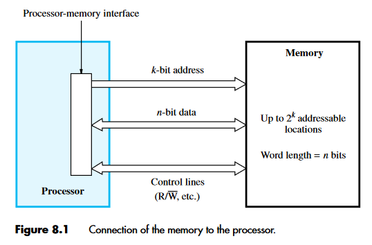

  ## Key Points on Computer Memory and Addressing

### Addressing Scheme and Memory Size
- **16-bit addresses:** Can address up to \(2^{16} = 64K\) memory locations.
- **32-bit addresses:** Capable of utilizing up to \(2^{32} = 4G\) locations.
- **64-bit addresses:** Access up to \(2^{64} = 16E \approx 16 \times 10^{18}\) locations.

### Memory Operation
- Memory stores and retrieves data in word-length quantities.
- In a 32-bit address system:
  - High-order 30 bits specify the word to be accessed.
  - Low-order 2 bits determine the byte location for byte quantities.

### Processor-Memory Interface
- Consists of address, data, and control lines.
- **Address lines:** Specify the memory location for data transfer.
- **Data lines:** Transfer the data.
- **Control lines:** Indicate Read/Write operations, byte/word transfer, and provide timing information.
- Memory responds with MFC signal, signaling completion of the operation.

### Memory Speed Measures
- **Memory access time:** Time from the start to the completion of a data transfer operation *(per word or byte)*.
- **Memory cycle time:** Minimum delay between two successive memory operations, typically longer than access time.

### Memory Types
- **Random-Access Memory (RAM):** Access time is the same for any location, independent of its address.
- Contrasts with serial or partly serial access storage devices *(e.g., magnetic/optical disks)*, where access time depends on data position.
- Computer memories are implemented using semiconductor integrated circuits.

---

  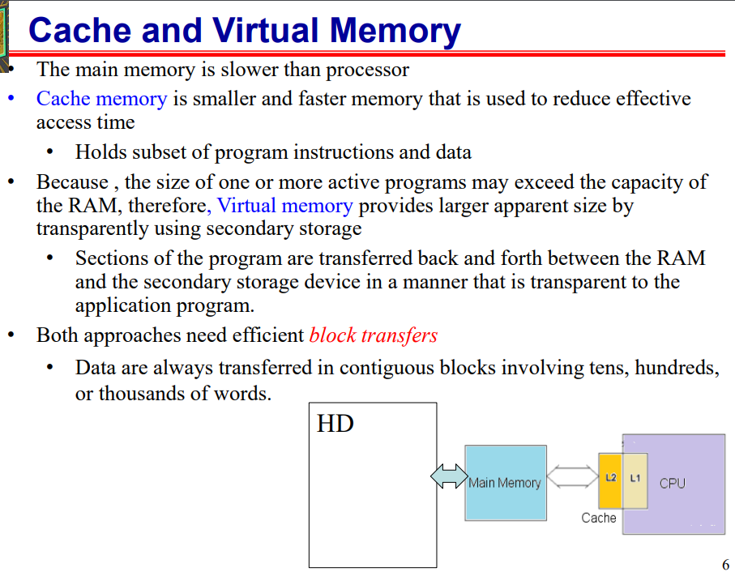

  ## Cache & Virtual Memory

#### Memory Access Bottleneck
- Processor processes data faster than it can be fetched from main memory.
- Therefore, *Memory access time* is the system bottleneck.

#### Cache Memory
- A small, fast memory placed between the main memory and the processor. *(L2, and L1)*
- Holds currently active portions of a program and their data.

#### Virtual Memory
- Only active parts of a program are kept in main memory; the rest is on secondary storage.
- Involves transparent transfer of program sections between main memory and secondary storage.
- Allows the application program to perceive a memory size larger than physical main memory.

#### Block Transfers
- Data are transferred in blocks (not one word at a time) between:
  - Main memory and cache.
  - Main memory and disk.
  - Main memory and high-speed devices *(e.g., graphics display, Ethernet interface)*.
- Block transfers involve tens, hundreds, or thousands of words.
- The speed of reading/writing blocks of data is critical for main memory performance.

---

## Semiconductor RAM Memories
- Cycle times range from 100 ns to less than 10 ns.

### Internal Organization
- **Memory Cells:** Organized in an array, each cell holds a single bit.
- **Words:** Formed by rows of cells, connected to word lines.
- **Columns:** Connect cells to bit lines.
- **Sense/Write Circuits:** Act as interfaces between internal bit lines and chip's data I/O pins.

### Control Pin Connections
- **Read/Write (R/W) Input:** Specifies the operation (Read or Write).
- **Chip Select (CS) Input:** Selects a specific chip in a multi-chip memory system.

### Memory Operations
- **Read Operation:** Sense/Write circuits sense data from selected cells and output them.
- **Write Operation:** Sense/Write circuits store input data in selected cells.

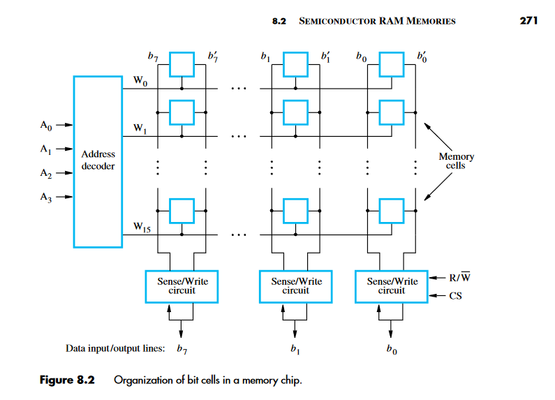

**Figure 8.2** is an example of a very small memory circuit consisting of 16 words of 8 bits each. This is referred to as a `16 × 8 organization`. The data input and the data output of each Sense/Write circuit are connected to a single bidirectional data line that can be connected to the data lines of a computer. Two control lines, **R/W** and **CS**, are provided. The R/W
*(Read/Write)* input specifies the required operation, and the CS *(Chip Select)* input selects
a given chip in a multichip memory system.

#### Additional Info. Fig 8.2

- **Stores** 128 bit! *(16 x 8)*

- **Address Decoder (AD)** Selects a word from the Memory, in this example each word is uniquely represented by 4 bits, for 16 different words that can be selected.

- **Word Line(s)** Every word has a line,it's the horizontal lines that are connected to the Address Decoder. The AD activates, once that Word is in question *(R/W)*

- **Bit Line(s)** Are the vertical lines from every Sense/Write Circuit. they are connected to every cell in a row, and upon *Word Line* Activation, the control signals know to send data up to the selected word for *Read/Write* ops.

- *Word Line Activation:* The signal from the address decoder causes the transistors along **W1** for ex. to turn on, which effectively connects the cells in that word to their respective bit lines.

-- **Power!** A 5V power input *(usually low Amperage)* along with a Ground (GND) is necessary for this kind of Static Memory to persist, and once the power is out, so does any bits stored in RAM.

---

## Static Memories (SRAM)

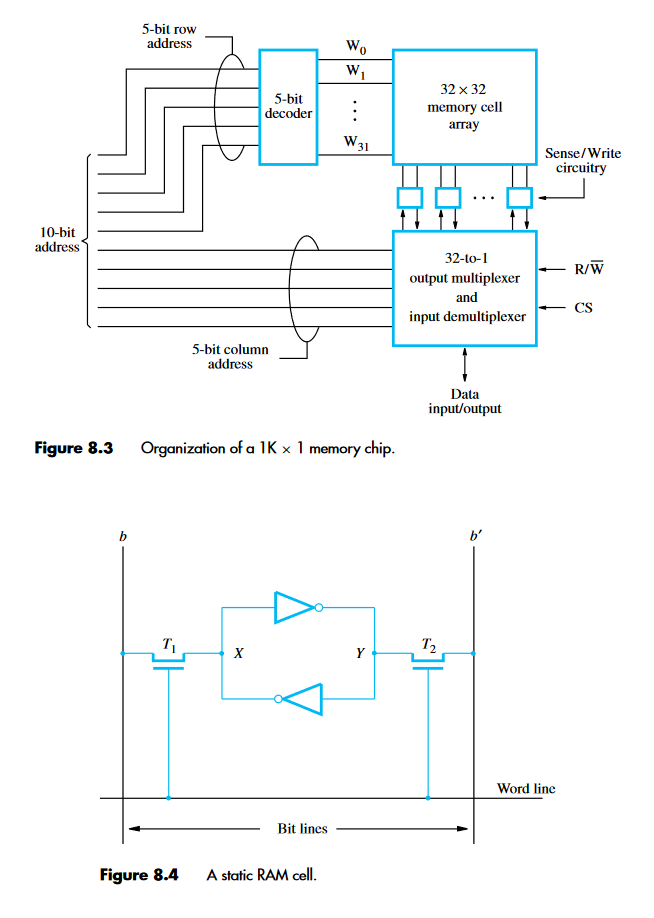

Figure 8.4 illustrates how a static RAM (SRAM) cell may be implemented. Two inverters are cross-connected to form a latch. The latch is connected to two bit lines by transistors **T1** and **T2**.

These transistors act as switches that can be opened or closed under control of the word line. 
When the word line is at ground level, the transistors are turned off and the latch retains its state.

For example, if the logic value at **point X is 1** and at **point Y is 0**, this state is maintained as long as the signal on the word line is at ground level. Assume that this state represents the value **1**.

## SRAM Cell Read and Write Operations

### Read Operation Steps
- Activate the word line to close switches T1 and T2.
- If the cell is in **state 1**:
  - Bit line \( b \) is high.
  - Bit line \( b' \) is low.
- If the cell is in **state 0**:
  - Bit line \( b \) is low.
  - Bit line \( b' \) is high.
- Sense/Write circuit monitors the state of \( b \) and \( b' \) and sets the output.

### Write Operation Steps
- Sense/Write circuit drives bit lines \( b \) and \( b' \).
- Place the desired value on bit line \( b \) and its complement on \( b' \).
- Activate the word line to force the cell into the desired state.
- The cell retains the state after the word line is deactivated.


- Chip implementation typically uses CMOS *(complementary metal oxide semiconductor)* cell whose advantage is low power consumption

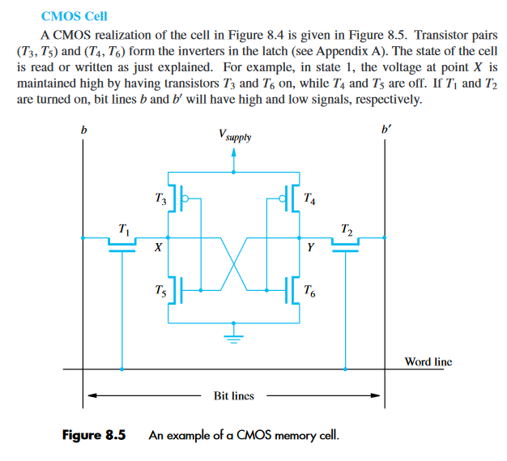

## Characteristics of SRAM (Static RAM)

### Volatility
- SRAM cells require continuous power to retain data.
- Contents are lost if power is interrupted—SRAMs are volatile memories.

### Power Consumption
- CMOS SRAMs have low power consumption.
- Current flows only during access; otherwise, transistors T1, T2, and one transistor in each inverter are off.
- No continuous path between Vsupply and ground when not accessed.

### Speed
- SRAMs offer quick access times, with commercial chips featuring access times of a few nanoseconds.
- They are favored in applications where speed is crucial.

---
*TODO*: More on Static Ram?
</details>

<details>
  <summary style="font-size: 30px; font-weight: 500; cursor: pointer;"> Dynamic RAM</summary>
  
## Comparison of SRAM and DRAM

### SRAM (Static RAM)
- Short access times due to several transistors per cell.
- Lower density because of complex cell structure.
- Used in applications where speed is critical.

### DRAM (Dynamic RAM)
- Simpler cell design with one transistor and one capacitor, leading to higher density and lower cost.
- Longer access times compared to SRAM.
- Contents are volatile and need periodic refreshing as the charge in the capacitor leaks.
- Widely used in computers for main memory.

### DRAM Cell Operation
- **Storing Data**: Transistor \( T \) turns on to charge the capacitor \( C \) to a known value.
- **Retention**: After \( T \) turns off, the charge remains but starts to leak due to small current conduction by \( T \).
- **Refreshing**: Contents are refreshed during read operations or by explicitly restoring the capacitor charge.
- **Reading Data**: Transistor \( T \) turns on, and a sense amplifier detects the charge level, interpreting it as a logic value.
  - If charge > threshold: Amplifier recharges capacitor to logic value 1.
  - If charge < threshold: Amplifier discharges capacitor fully.

### Memory Refresh
- All cells in a row are refreshed simultaneously due to the common word line.
- Refreshing is critical for maintaining data integrity over time.
---

# Dynamic RAM
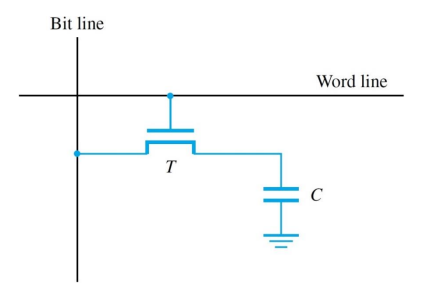

## DRAM Example:
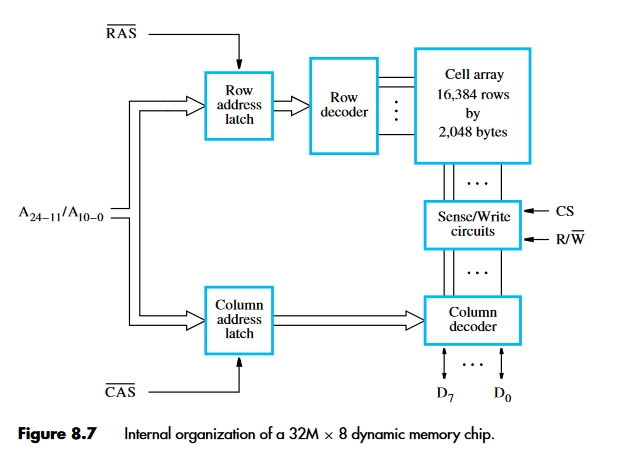

- 32M x 8 bytes Dynamic Memory Chip

- *cell organization:* 16K x 16K array.

  - The 16,384 cells in each row are divided into 2,048 groups of 8, forming **2,048 bytes** of data.

- 14 Address Bits are needed to Select Row, and 11 bits, to specify group of 8, in selected row. *(Total: 25-bit Addresses to access each unique byte)*

## DRAM Operation and Timing Controlled by RAS and CAS

### RAS (Row Address Strobe) Process
- A signal pulse on the RAS line loads the row address into the row address latch.
- Initiates a Read operation where all cells in the selected row are read and refreshed.

### CAS (Column Address Strobe) Process
- After the row address is set, the column address is applied to the address pins.
- The column address is loaded into the column address latch via the CAS line.
- Decodes the column address and selects a group of 8 Sense/Write circuits.

### Read Operation
- If R/W indicates a Read, the data from the selected Sense/Write circuits are transferred to the data lines \( D_7−0 \).

### Write Operation
- If R/W indicates a Write, data on \( D_7−0 \) lines overwrite contents of the selected cells in the 8 columns.

### Active Low Signals
- In commercial DRAM chips, RAS and CAS are active when low.
- Addresses are latched with a high-to-low signal transition, indicated as \(\overline{\text{RAS}}\) and \(\overline{\text{CAS}}\).

---

**Issue with DRAM...**

In a typical DRAM, when you need to access a byte of data, you provide a row and column address. The DRAM fetches the entire row of data *(thousands of bits)*, but only the specific byte (8 bits) you asked for is sent back. To access another byte, even if it's in the same row, you need to repeat the whole process, which is slow.


## Fast Page Mode:
- Large block of data is often called a "page"
With FPM, this process is optimized. Imagine you're reading a book and need to reference multiple sentences on the same page. Instead of flipping to the page for each sentence, you keep the page open and simply move your eyes to each sentence. FPM does something similar with DRAM data.
- **Initial Access:** When you first access a row in the DRAM, all the data in that row is read and stored temporarily (like opening a page in the book).

- **Subsequent Accesses:** If you need to access another byte in the same row, FPM allows you to do so without having to 're-open' the row. You just change the column address (like moving your eyes to a different sentence). This is much faster because you skip the step of selecting the row again.

**Example:** Suppose you need to access three bytes of data, all located in the same row but at different columns. In standard mode, you would activate the row and read the first byte, then repeat this process for the next two bytes. With FPM, you activate the row once, read the first byte, and for the next two bytes, you only change the column address, making the process quicker.

**Sidenote: FPM nowadays is deprecated LOL!**
FPM was a significant improvement in its time because it sped up the data transfer for blocks of data located in the same row. However, modern systems use more advanced methods that are faster and more efficient than FPM. Despite its historical importance, FPM is now considered outdated for most modern applications.

---

## Synchronous DRAM figure:

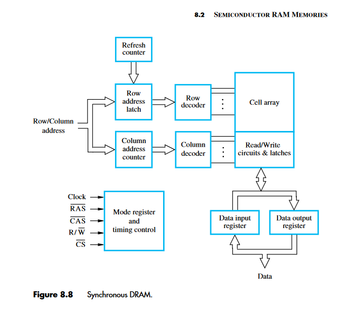

**Cell Array** is still the exact same as Async DRAM *(Async is the Older style)*

**Buffer Registers** are useful when transferring large blocks of data at very high speed

**Processor:** I want 0xDEADBEEF !, **Async Dram:** K I promise ill give it to u at some point...
**Processor:** I want 0xDEADBEEF and will be back in 3 cycles !, **Sync Dram:** It will be there in 3 cycles!

**Sync DRAM** wastes less time, as it schedules Memory Getting and writing more efficiently.

- Sense amplifiers still have latching capability
- Additional benefits from internal buffering and availability of synchronizing clock signal
- Internal row counter enables built-in refresh instead of relying on external controller Synchronous DRAMs

The distinguishing feature of an SDRAM is the use of a clock signal, the availability of which makes it possible to incorporate control circuitry on the chip that provides many useful features. For example, SDRAMs have built-in refresh circuitry, with a refresh counter to provide the addresses of the rows to be selected for refreshing. 

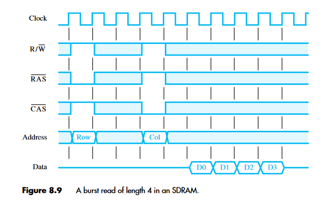

# SDRAM Burst Read Operation (Length 4)

1. **Row Address Latching**
   - **Action**: Latch the row address under control of the RAS (Row Address Strobe) signal.
   - **Explanation**: This step involves selecting the row from where the data will be read. The RAS signal is used to lock in this row address.

2. **Row Activation**
   - **Action**: The memory takes a few clock cycles (typically 5 or 6, but simplified to 2 in the figure) to activate the selected row.
   - **Explanation**: During this time, the SDRAM is preparing the row of data to be read. Think of it as opening the correct page in a book.

3. **Column Address Latching**
   - **Action**: Latch the column address under control of the CAS (Column Address Strobe) signal.
   - **Explanation**: After the row is activated, the specific column (or the starting column for a burst read) is selected. The CAS signal locks in this column address.

4. **Data Transfer Delay**
   - **Action**: Wait for a delay of one clock cycle.
   - **Explanation**: This brief pause allows the SDRAM to get the first set of data bits ready for transfer.

5. **First Data Set Transfer**
   - **Action**: Transfer the first set of data bits onto the data lines.
   - **Explanation**: The SDRAM puts the data from the selected row and column on the output pins. This is the first piece of data in your burst sequence.

6. **Automatic Column Increment**
   - **Action**: Automatically increment the column address to access the next sets of bits in the selected row.
   - **Explanation**: After reading the first set of data, the SDRAM automatically moves to the next column in the same row.

7. **Sequential Data Transfer**
   - **Action**: Transfer the next three sets of data bits in the following 3 clock cycles.
   - **Explanation**: The SDRAM continues to read data from the next columns, transferring each set in each subsequent clock cycle. This completes the burst of four data transfers.

**Note about Bandwidth**

The first word of data is transferred five clock cycles later. Thus, the latency is five clock cycles. If the clock rate is 500 MHz, then the
latency is 10 ns. The remaining three words are transferred in consecutive clock cycles, at the rate of one word every 2 ns.
<br><br/>
The example above illustrates that we need a parameter other than memory latency to describe the memory’s performance during block transfers. A useful performance measure is the number of bits or bytes that can be transferred in one second.

- Bandwidth also depends on number of parallel access that can occur and rate of transfer of data

---

*EXHERT:*

The SDRAM automatically increments the column address to access the next three sets of bits in the selected row, which are placed on the data lines in the next 3 clock cycles. Synchronous DRAMs can deliver data at a very high rate, because all the control signals needed are generated inside the chip. The initial commercial SDRAMs in the 1990s were designed for clock speeds of up to 133 MHz. As technology evolved, much faster SDRAM chips were developed. Today’s SDRAMs operate with clock speeds that can exceed 1 GHz.

---

## Double-Data-Rate SDRAM (DDR, Synchronous Dynamic RAM)

- DDR symbolizes that data are transferred externally on both the rising and falling edges of the clock. For this reason, memories that use this technique are called double-data-rate SDRAMs *(DDR SDRAMs)*.

Several versions of DDR chips have been developed. The earliest version is known as DDR. Later versions, called DDR2, DDR3, and DDR4, have enhanced capabilities. They offer increased storage capacity, lower power, and faster clock speeds. For example, DDR2 and DDR3 can operate at clock frequencies of 400 and 800 MHz, respectively. Therefore, they transfer data using the effective clock speeds of 800 and 1600 MHz, respectively.

**DDR4** operates at 1.2V and up to 3200 MT/s
**DDR5** operates at 1.1V and up to 7200 MT/s
---

## Structure of "BIG-BOI" Memories, we're talkings alot of WORDS!
- Larger memories combine multiple chips *(memory chips may be connected to form a much larger memory)*

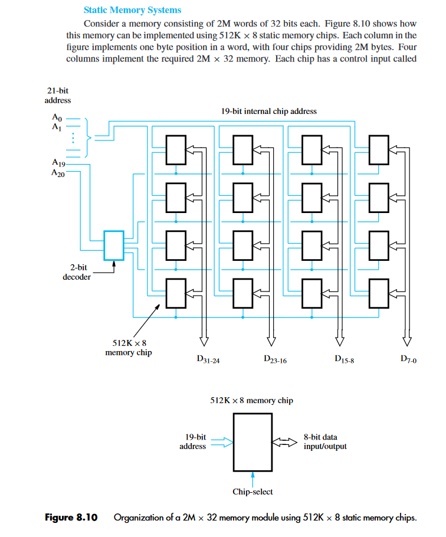

**Notes**
- 2M word-addressable memory needs **21 bits**
- Each chip has only 19 address bits (2^19 = 512K)
- Address bits *A20* and *A19* select one of 4 groups *( 2-bit decoder drive chip-select pins )*
- Only selected chips respond to a request

- Implement with 512K x 8 static memory chips
- 4 chips for 32 bits, 4 groups of 4 chips for 2M
- Shared data connections need tri-state circuits
  - When a chip is not selected (i.e., CS input is 0), its I/O pins are electrically disconnected Synchronous DRAMs


*I got no clue what tri-state is, review that*???
The data output for each chip is of the tri-state type described in Section 7.2.3. 

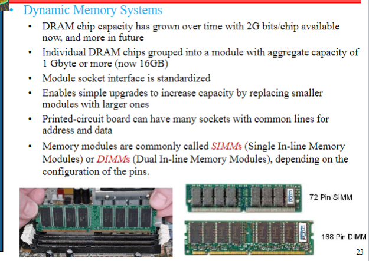
Chips are manufactured in different organizations, to provide flexibility in designing memory systems. For example, a 1-Gbit chip may be organized as 256M × 4, or 128M × 8. Packaging considerations have led to the development of assemblies known as memory modules. 
---


## MEMORY Controller

Let's say the processor wants to access a specific cell in the memory. The complete address is **1001101011.**

High-Order Bits (Row Address):

Suppose the first 5 bits  **10011** are high-order bits.
These bits are sent first to select a row.
Low-Order Bits (Column Address):

The remaining 5 bits **01011** are low-order bits.
These bits are sent next to select a column.
Memory Controller's Role:

It receives the full address **1001101011** from the processor.
Splits the address into **10011** (row) and **01011** (column).
Sends row address with RAS signal and column address with CAS signal.

# Summary of Dynamic RAM (DRAM) Addressing and Refresh

## DRAM Addressing
- **Address Split**: DRAM chip addresses are divided into high-order and low-order bits.
- **High-Order Bits**: Select a row in the cell array. These are latched first with the RAS (Row Address Strobe) signal.
- **Low-Order Bits**: Select a column. These are latched after row selection, using the same address pins, with the CAS (Column Address Strobe) signal.
- **Processor and Memory Controller**: A typical processor issues the complete address at once, requiring a multiplexer. This role is often fulfilled by a memory controller.
- **Memory Controller Functions**:
  - Accepts the full address and R/W signal from the processor.
  - Splits the address for row/column selection.
  - Generates RAS and CAS signals with appropriate timing.
- **Module Selection**: In systems with multiple memory modules, the high-order bits of the address are used to select the appropriate module.

## DRAM Refresh
- **Necessity**: Dynamic RAMs require periodic refreshing.
- **Refresh in Synchronous and Asynchronous DRAM**:
  - Synchronous DRAMs have internal control circuitry for refresh cycles.
  - Asynchronous DRAMs need an external control circuit, typically part of the memory controller.
- **Refresh Overhead**:
  - Refresh operations cause a small delay in memory access.
  - Example: In an SDRAM needing a refresh every 64 ms, the total time for refreshing all rows is about 0.41 ms. This results in a refresh overhead of less than 1%.

## Choice of Technology
- **Static vs. Dynamic RAM**:
  - Static RAM (SRAM): Fast, but more complex and costly. Used for small, fast memory needs.
  - Dynamic RAM (DRAM): High bit density, low cost per bit. Synchronous DRAMs are common for main memory.

Synchronous DRAMs are the predominant choice for implementing the main memory.

---

**READ-ONLY Memory (ROM)**
- A special writing process is needed to place the information into a nonvolatile memory. Since its normal operation involves only reading the stored data, a memory of this type is called a *read-only memory (ROM)*.


**Programmable READ-ONLY Memory (PROM)**
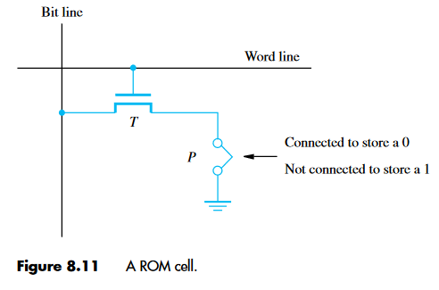

- Some ROM designs allow the data to be loaded by the user, thus providing a programmable ROM (PROM). Programmability is achieved by inserting a fuse at point P in *Figure 8.11* The user can insert 1s at the required locations by burning out the fuses at these locations using high-current pulses but this IS PERMANENT!

**Erasable, reprogrammable ROM, called an (EPROM)**
- It allows the stored data to be erased and new data to be written into it
- Since EPROMs are capable of retaining stored information for a long time, they can be used in place of ROMs or PROMs while software is being developed.
- The cell looks very similar to *Figure 8.11* but instead, the point P is a Transistor, where it's normally turned off. *(Open Switch)*

- **Charge Injection**: EPROM (Erasable Programmable Read-Only Memory) cells are activated by injecting charge into them.
- **Trapped Charge**: This charge becomes trapped inside, allowing the cell to function as a memory unit, similar to ROM (Read-Only Memory) cells.
- **Erasure Method**: To erase data, the trapped charge in the transistors, which form the memory cells, needs to be dissipated.
- **Use of Ultraviolet Light**: Exposing the EPROM chip to ultraviolet light erases the entire contents of the chip.
- **Packaging with Transparent Windows**: EPROM chips are housed in special packages that have transparent windows to facilitate exposure to ultraviolet light for erasure.


**Electrically Erasable Reprogrammable ROM, called an (EEPROM)**

- Can be programmed, erased, and reprogrammed electrically.
- Needs different voltages for erasing, writing, and reading stored data PROM, EPROM, and EEPROM

**Flash Memory**
- Similar to EEPROM, For higher density, Flash cells are designed to be erased (or written) in larger blocks of cells, not individually.
- Greater density & lower cost of Flash memory outweighs the inconvenience of block writes
- Widely used in cell phones, digital cameras, and solid-state drives *(e.g., USB memory keys)*

---

## Direct Memory Access (DMA):

**DMA Controller** is shared by many I/O devices, or part of an I/O device
- Although a DMA controller transfers data without intervention by the processor, its operation must be under the control of a program executed by the processor, usually an operating system routine.


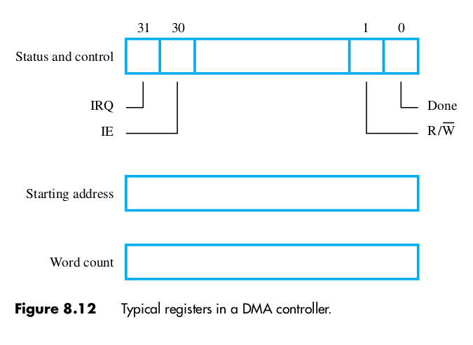

1. **DMA Controller Registers**: The DMA (Direct Memory Access) controller uses three types of registers:
   - **Starting Address Register**: Stores the initial address for data transfer.
   - **Word Count Register**: Holds the number of words to be transferred.
   - **Status and Control Flags Register**: Contains flags for controlling and monitoring the transfer.

2. **Transfer Direction Control (R/W Bit)**:
   - **Read Operation (R/W = 1)**: Data is transferred from memory to the I/O device.
   - **Write Operation (R/W = 0)**: Data moves from the I/O device to memory.

3. **Additional Data Transfer**: In some cases, like with a disk, extra information (e.g., data location on the disk) is provided by the processor to the I/O device.

4. **Transfer Completion and Commands**:
   - **Done Flag**: Set to 1 when a data block transfer is complete and the controller is ready for a new command.
   - **Interrupt-enable Flag (IE, Bit 30)**: When set to 1, it enables the controller to issue an interrupt after completing a data block transfer.
   - **IRQ Bit**: Indicates an interrupt request by the controller.

5. **Example of DMA Usage in a Computer System**:
   - **Ethernet Connection**: A DMA controller connects a high-speed Ethernet to the computer’s I/O bus.
   - **Disk Controller with DMA**: Controls two disks and provides two DMA channels, allowing two independent DMA operations as if each disk had its own controller. The necessary registers for memory address and word count are duplicated for each disk.

</details>