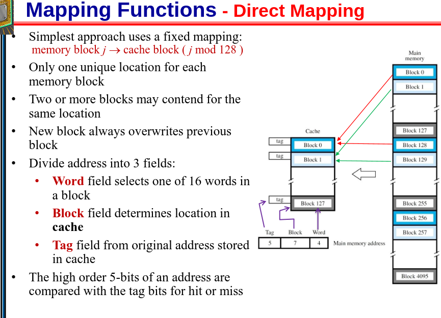

  
Nov 15. Hafeez Micro Lec

**Mapping Function** Slide: 39

*Divided in 3 Fields*

Processes uses *Tag*, *Block* & *Word* Bits to map it into Main Memory

*Issue* Lots of different words can be stored in different blocks, which requires lots of Seperate block calls

#### Direct Mapping 

- A Program can be fighting for 1 Block

#### Fully Associative Mapping
- goto a block which is free

If processor wants to read, it will compare the **Tag** with all valid Tags in the Main Memory Block.

If it's full, you can pick a "Victim" block to replace, we usually pick a block that hasn't been used for a Long While... *(Least Recently Used)*

Each block in cache will have a counter, that resets upon usage, and the counter at the highest value is the *Least Recently Used*

**Associative Mapping** has an Issue with Comparative Circuit, lots of Tag comparsions

---
#### Set-Associative Mapping

- Directly Maps to a Set

- If we have 128 Blocks, and we want 64 Sets, each Set has 2 blocks. *(Each set is 2^6, represents 1 set)*

TAG | SET | WORD

In a Set, where is the Block *(Tag differentiates within Tag)*

uses Set first! in what set? OK set 1, In what Tag?? Tag 1

*Broadphasing and Narrowphasing* Reduces Circuit complexity and speed as there are less comparisons.

Now we got the block, take the Word

If tag doesn't match? **Cache Miss**
If replacement occurs, we always replace within the SET *(Even if other Sets have empty blocks)

*Direct To the Set* And then Associated within the set

---

#### Stale Data
- RAM & Cache are always sync if *WRITE-THRU*

- At some point the Ram will be Full
  - That's why sometimes you'll have process with part of DATA in RAM, and part in Secondary Storage 

---

#### Least Recently Used (LRU) Replacement Algorithm

- Based on a Circuit

