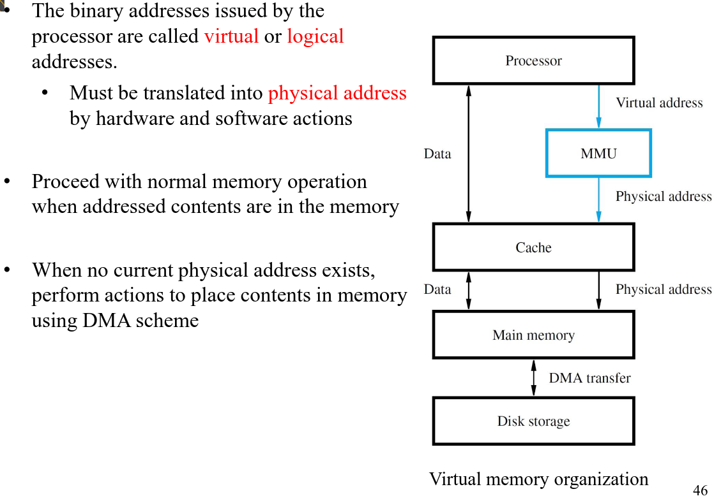
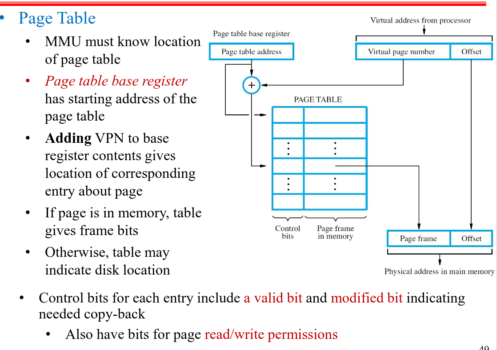

  
Nov 15. Hafeez Micro Lec

**Mapping Function** Slide: 39

*Divided in 3 Fields*

Processes uses *Tag*, *Block* & *Word* Bits to map it into Main Memory

*Issue* Lots of different words can be stored in different blocks, which requires lots of Seperate block calls

#### Direct Mapping 

- A Program can be fighting for 1 Block

#### Fully Associative Mapping
- goto a block which is free

If processor wants to read, it will compare the **Tag** with all valid Tags in the Main Memory Block.

If it's full, you can pick a "Victim" block to replace, we usually pick a block that hasn't been used for a Long While... *(Least Recently Used)*

Each block in cache will have a counter, that resets upon usage, and the counter at the highest value is the *Least Recently Used*

**Associative Mapping** has an Issue with Comparative Circuit, lots of Tag comparsions

---
#### Set-Associative Mapping

- Directly Maps to a Set

- If we have 128 Blocks, and we want 64 Sets, each Set has 2 blocks. *(Each set is 2^6, represents 1 set)*

TAG | SET | WORD

In a Set, where is the Block *(Tag differentiates within Tag)*

uses Set first! in what set? OK set 1, In what Tag?? Tag 1

*Broadphasing and Narrowphasing* Reduces Circuit complexity and speed as there are less comparisons.

Now we got the block, take the Word

If tag doesn't match? **Cache Miss**
If replacement occurs, we always replace within the SET *(Even if other Sets have empty blocks)

*Direct To the Set* And then Associated within the set

---

#### Stale Data
- RAM & Cache are always sync if *WRITE-THRU*

- At some point the Ram will be Full
  - That's why sometimes you'll have process with part of DATA in RAM, and part in Secondary Storage 

---

#### Least Recently Used (LRU) Replacement Algorithm

- Based on a Circuit

  
Nov 20. In Lecture

## Virtual Memory

- Dividing Applications into pages

- All Apps. Divided into Pages *(Starting at Page N: 0)*
- Hard-disk is divided into Pages, and ready to be loaded into the RAM

- Only a select **few** pages will be loaded into the RAM, for example: Main Program get's loaded in, but side-features and sub-routines aren't yet *(Until they need to be called)*

- I want INSTR: 4 from PAGE: 0, Load Entire Page 0 in the RAM, and use the *same* offset.

- **VIRTUAL MEMORY** will be talked about more in the POV of Hardware, Software side will be seen in later course (OS)

- Let's assume that the Page 0, is actually loaded into location 10000 of RAM, so we need to:
  - Map Pages into actual Physical Ram
  - MMU will build a Page table, to preform this mapping
    - Page, and Location in Ram *(Page 0: 0x10000 in RAM)*
    - Every Application has it's own Page Table

**Page Table Example**
- Think about an App, 100 MB *(size of normal application)  - Page Size is 1 KB
- 100 MB / 1 KB, that's **100K PAGES** !!!!
- Let's say a record in Page Table is 8 byte, so 800k BYTES! It can't fit in Hardware!
- Saved somewhere in **RAM**

It's hard to find like 800 blocks, for the Page Table in RAM...

**Page Table Base Register** has the starting address of the page table. *Let's say you need Page 0 of the Application 1* where it's Page Table is located at 0x10000 in ram, so it's 0x10000 + 0 + Instruction number, for the first instruction.

- The Control bit here: **R/W, Dirty, Execution Perms**

Offset of any Entry in Page table is the same, the key is the Page Table base Register's offset.

**Translation Look-Aside Buffer**
- Stored in MMU Cache! for very fast Page Access

  
Arithmetic | Lecture 8

**Content of this chapter**
- Adders, Substractors, Multipliers, divider Circuits
- High Speed Adders, using Carry Lookahead

---

  
Tutorial Micro. nov 22

Set & Block are the same behavior

- Word Addressable: Memory is accessed in groups of words
- Byte Addressable: Memory is accessed in groups of bytes

`#sets = #blocks / N` from the *N Way Set*, then you treat your sets as blocks

