

  
October 27th Lecture

*Natural Language Scenario*:
- Trying to get a better sense of Quality Components

*In FCAPS* they talk about Quality Attributes with N.L.

**Exam Question Hint**

Take this Description, and move it into a Quality Attribute Scenario
*(Source, Stimulus, Artifact, Environment Response, Response Measure)*

*Architecture* Is more influenced by Quality Attributes

### Utility Tree:

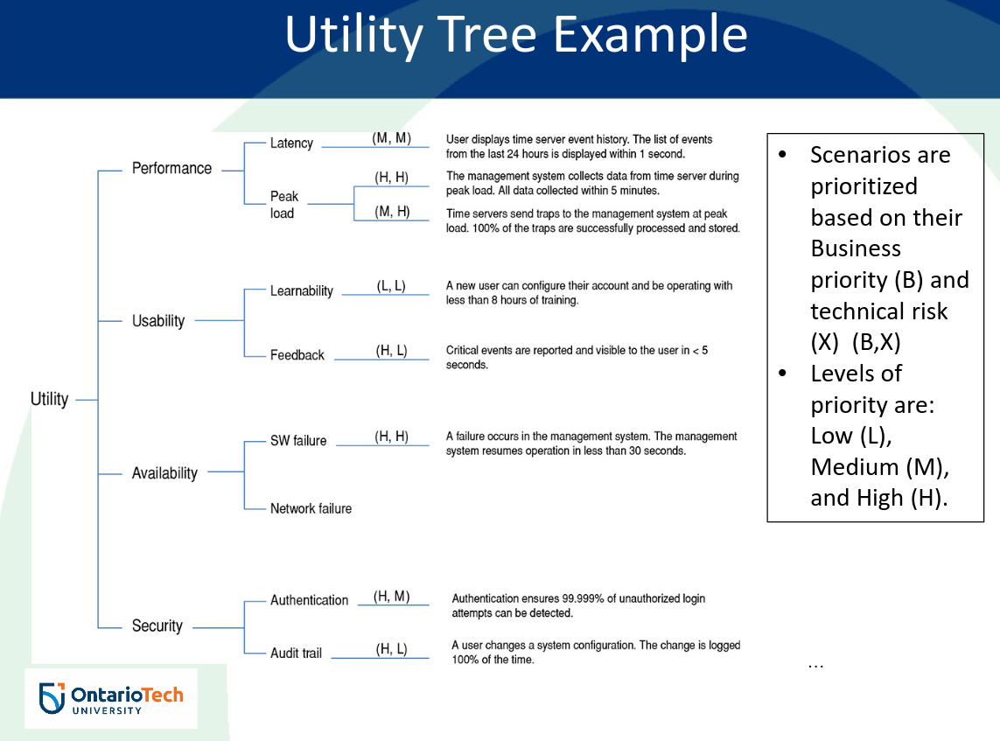

- 2nd Column : Seperating Q.A Attributes more specifically
- 3rd Column : (Priority, Technical Risk)
    - Priority of Q.A *(important or not)*
    - Technical Risk; can we develop this !?

**(H,H)** Is the ones you need to address first always, *High Priority, High Risk*

**Utility Tree : ASR**
Core Functionality of LMS System for EX: *Content Distribution for Students & Teachers*

*Q.A Scenario* Which gives you a bit of an insight on the *(Source, Stimulus, Artifact, Environment Response, Response Measure)*

---

**QAW** vs **Utility Tree**

- Different, but same goal "Listing and Prioritizing the most Important Quality Attributes"

---

### Integrability General Scenario:

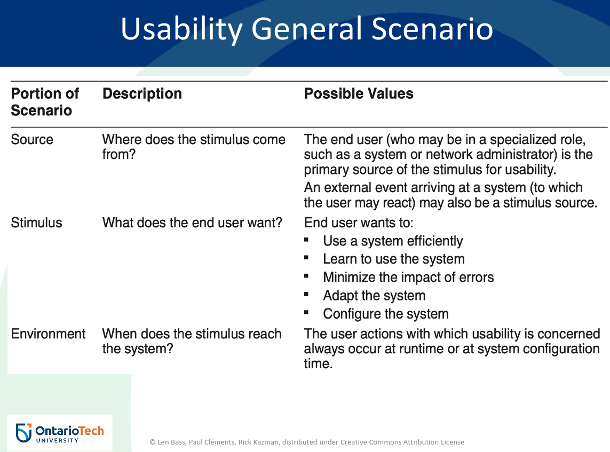
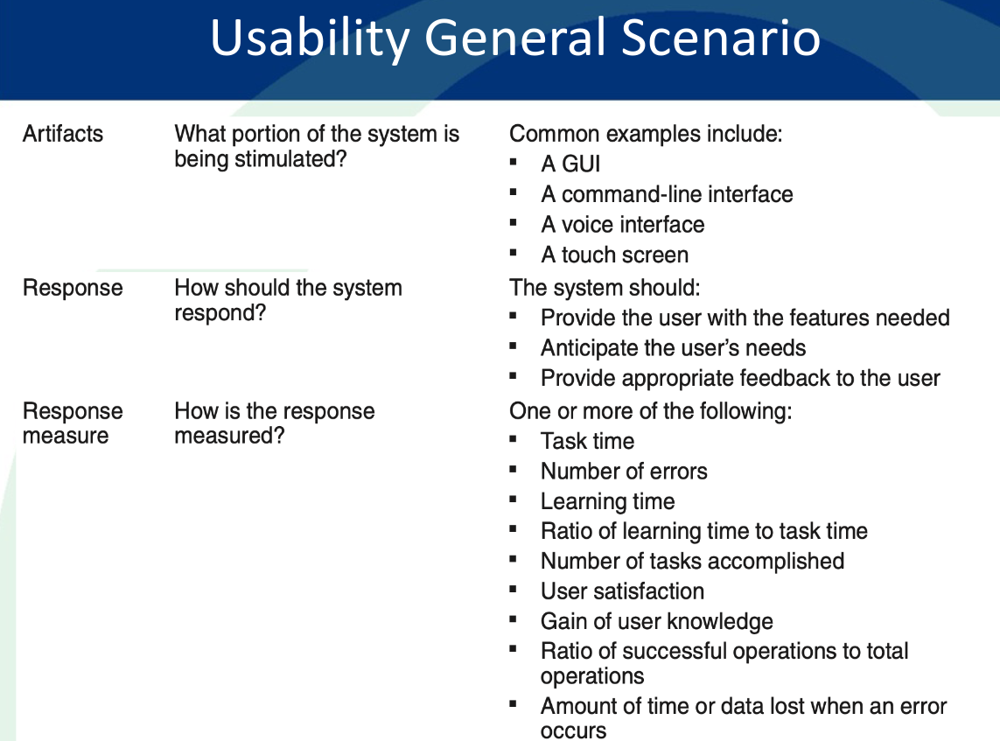

---

**Package Diagram**
- Use Dependency 
- Can have 1 layer with many different seperations

--- 

*Hint | SD 5*:

Highlighting the Natural Language:

**Identify Different Attributes**

Quality Attribute table | Source | Stimulus | Artifcat | Response & Measure

*Modifiability*, *Interop*, etc... *Reliability*

  
November 1st Lecture

**ADD Iteration 1:** Due Nov. 12

- Question on the Example
- Design Process that covers overview of Design

**ADD Iteration 2:**

- ???

--- 

**Layer Architecture**

- Layers seperate dependencies

## **Reference Architecture**

- Refference model, mapped onto an Architectural Pattern
- *Blueprint:* 

**WEB Reference Architecture Example**
- Distributed Client/Server Architecture

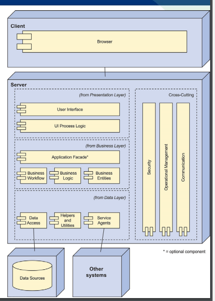

**Presentation Layer**
- Here it's in the backend, similar to Django filling out *Template HTML* JINJA

**Web Frameworks**:
- Emphasize the Business Layer, as the Developer will be modifying this alot, for their SaaS app or wtv.

Isn't an Implementation !!!!

**Cross Cutting**
- Security *(On The business side, On the Data side)*
- Communication *(Comms across layers)*

---

**Rich Client Applications Reference Architecture**
- For example, Gaming, where the entire game is on 1 machine
- No Deployment *(Like no browser)*

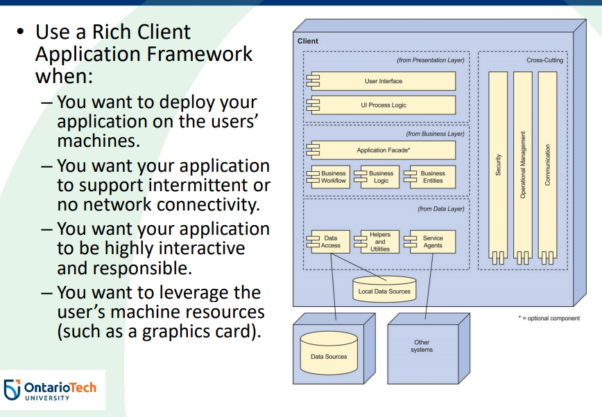

---

**Rich Internet Applications Reference Architecture**
- JavaScript & XML *(AJAX)*

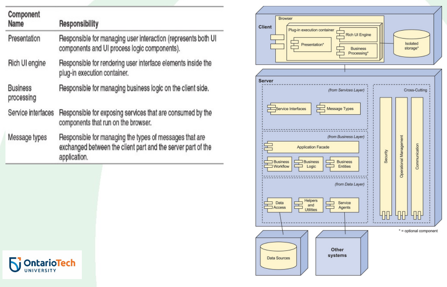

- **Plugin**: has business logic
- **Caching**: Permanency, Isolated files *(Outside the browser)* 

#### Limitations with RIA
  - Loading time is non-negligible
  - Access to local ressources can be limited

---

## Application Frameworks

- Re-usable software element to produce specific App
- Based on Patterns, Tactics
- Domain Specific *(Web, Game, Desktop App)*
- Increases productivity of Programmers *(Don't need to implement from scratch)*

**Static Web Rendering**

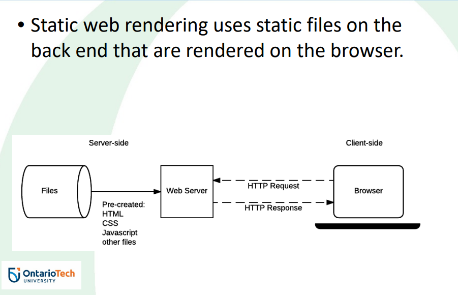

**Dynamic Web Servers**
Like DJANGO
- Templating Language *(JINJA)*

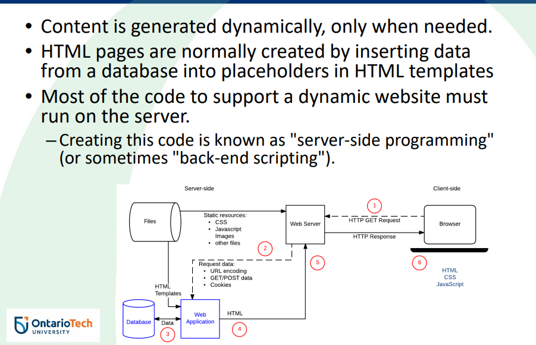

---

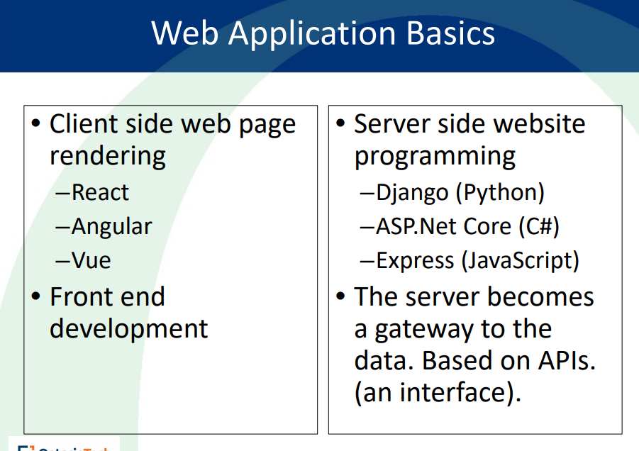

--- 

**DJANGO**
- You don't need to deal with Cross-Cutting, WE GOT IT
- Just do the Business Logic
- Debugging is hard, as you're working at quite a High Level of Abstraction
- ORM *(Abstraction layer for DB)*

- "Batteries Included" Philosophy
- Completeness, Versatility, Security, Scalability, 
Maintainability, Portability

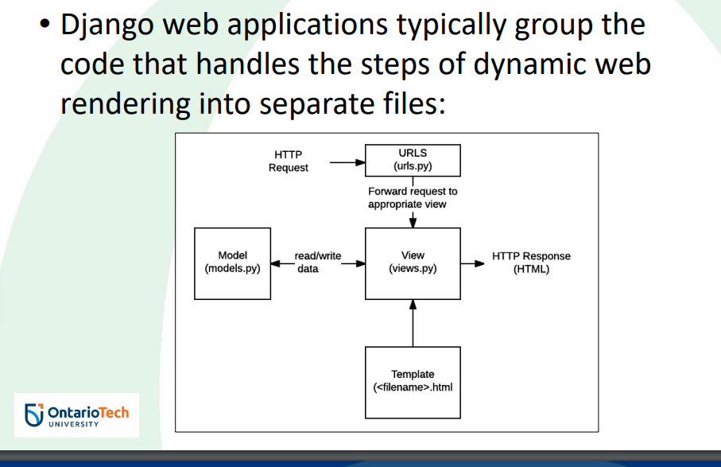

- Django: VIEW for every URL
- Data Driven Framework

**Hint**: Which package does all Logic?

URLS.py

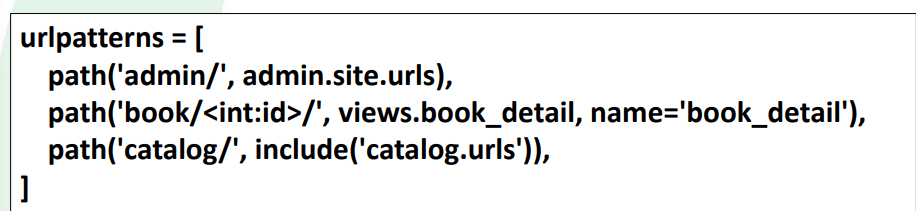

path('catalog/') ROUTING

VIEWS.py

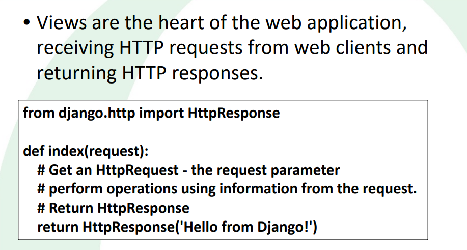

**request** can be broken down, to get req. parameters
For example `/book/1` , DJANGO can decode that with `HTTPRequest` obj to have `request.id`

MODELS.py

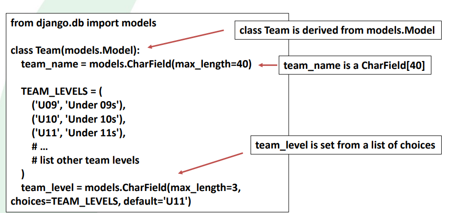

---

Querying from VIEWS.py

Rendering of Data, "The template has access to a list variable called *youngest_teams* that is contained in the context
variable inside the render() function."

**Django also includes:**

- HTML Forms: to collect data for processing on the
server.
- User authentication:
- Caching: to improve the performance of accessing the
HTML pages.
- Administration: provides admin pages to create, edit,
and view data models.
- Serializing data: can serve data as XML or JSON. Good
for creating a Web service as opposed to Web application.

---

**Web Service**
API based, Service application provides service to other Applications

**Web Applications**
Actual Web Application that serves content to Client

  
November 8th | ADD Iteration , Architecture Design Process

## **ADD Iteration 1**:
    - Deliverable 2; 

*First Deliverable:* Design Objectives, Quality Attributes, Constraints, Concerns

# **ADD Step 1**:
- Look at my Inputs, why are we building this Design
- Primary Function Requirements
- Prioritize Quality Attributes *(Pick the Highest Priority Values, Utility Tree)*
    - Pick the ones that are `H / H`

# **ADD Step 2**
- Establishing a goal for the Iteration is
important as it is used to decide what drivers
are important for this Iteration.

- **Iteration 1** Establising an Overall System Structure
- **Iteration 2** Identifying Structures to Support Primary Functionality
- **Iteration 2** Addressing Quality Attribute Scenarios

# **ADD Steps 3-5**

---

What Occurs when we go thru this?

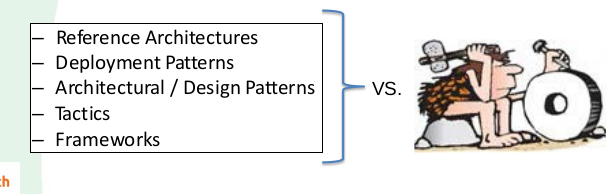

- Don't re-invent the Wheel!

**Deployment Patterns**
Guide deployment of Reference Architectures

- 2,3,4 or N-Tier Deployment
- Load Balanced Cluster
- Failover Cluster
- Private/Public Cloud
- Etc...

**Tactics** (Revisited)

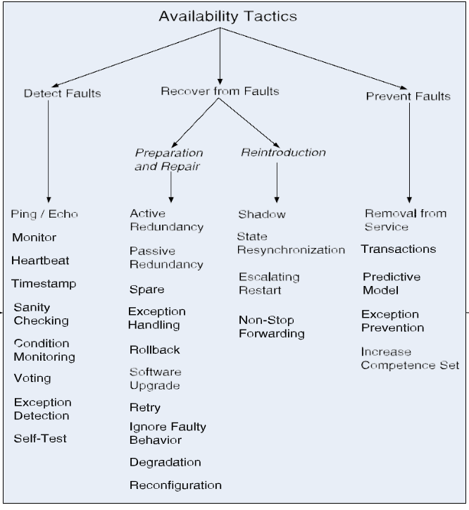

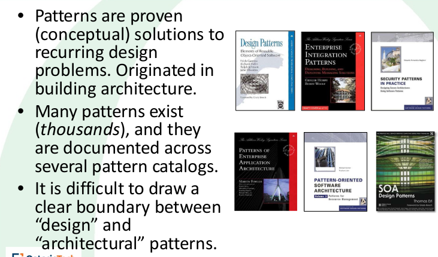

**Frameworks & their Concerns**

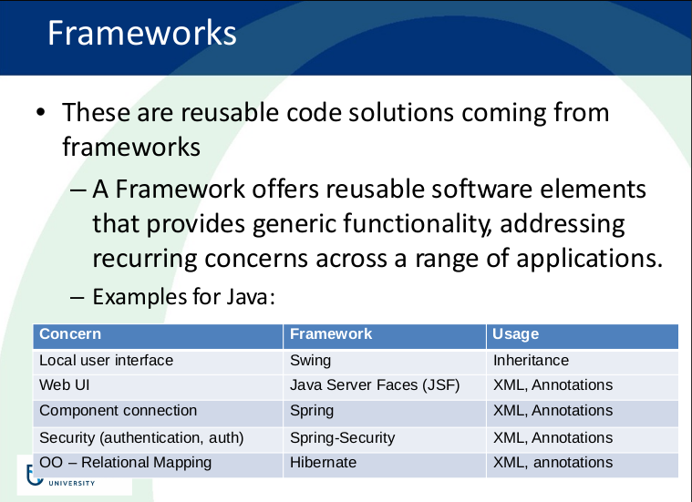

**Design Concepts, Pros and Cons**

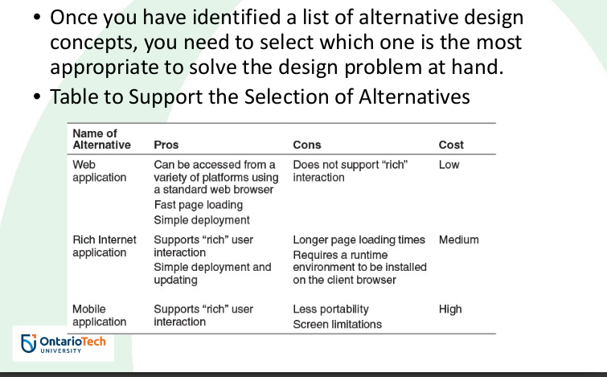

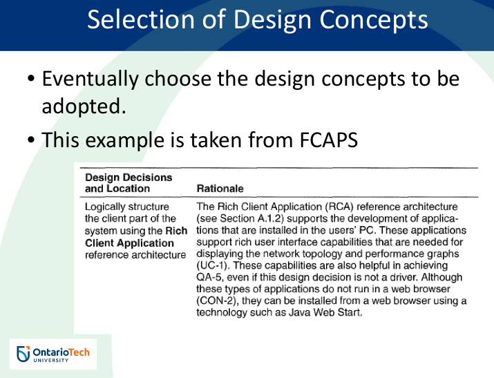

- Justify what I'm covering *(Covering Use Case #1)*
    - Decision Addressing Functionality of System

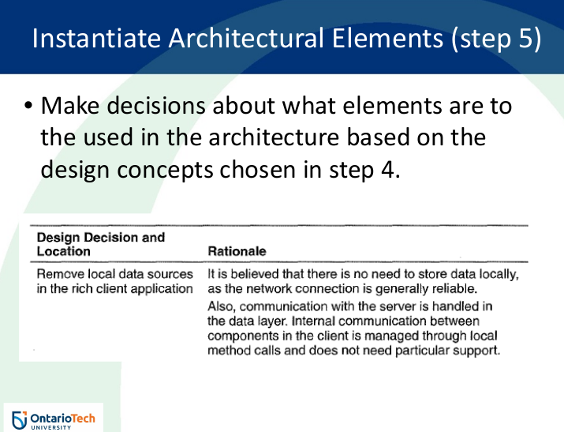

---

# **ADD Step 6**
- UML Diagrams, Refference Architecture
- Sketch Views, and Record Design Decisions

**Usually the Software Architect's Job**
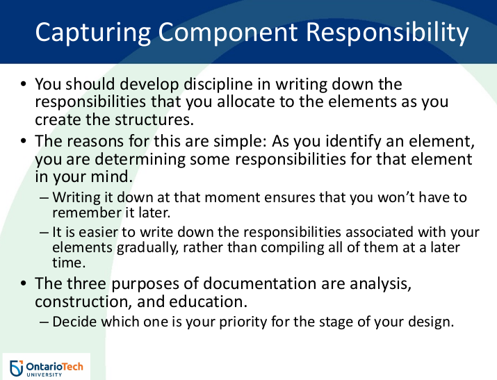

- Minimal Design Documentation
    - Choosing why you did something
    - Initial Interface Specification
        - From Sequence Diagrams / Swimlane

---

## Example (FCAPS)

#### Logical View Example

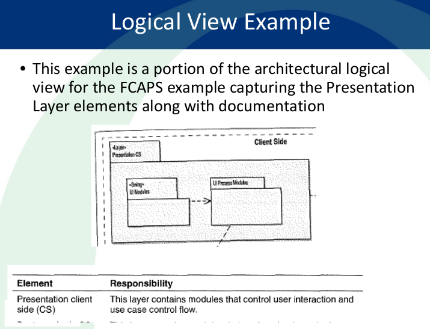
**Layered Architecture**

#### Deployment View

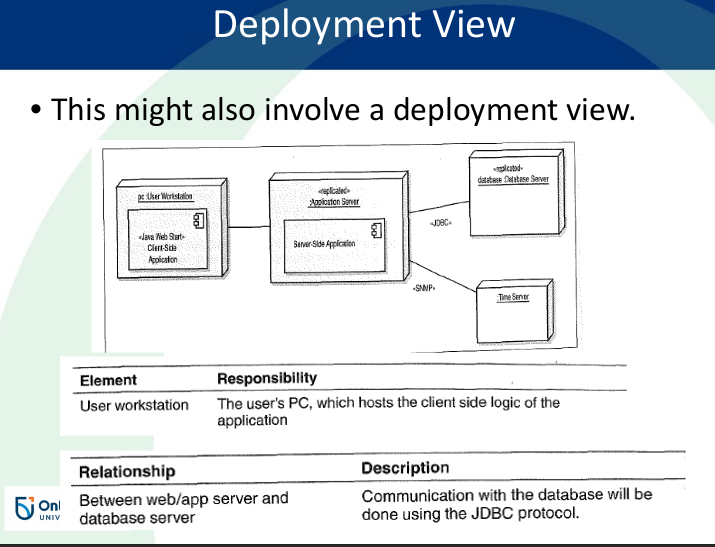

#### External Interface
- External interfaces include interfaces from other systems that are required by the system that you are developing and interfaces that are provided by your system to other systems.

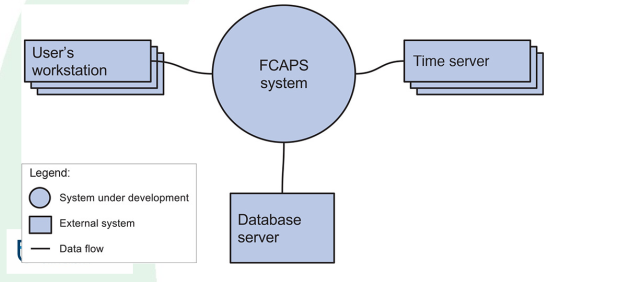

#### Internal Interfaces

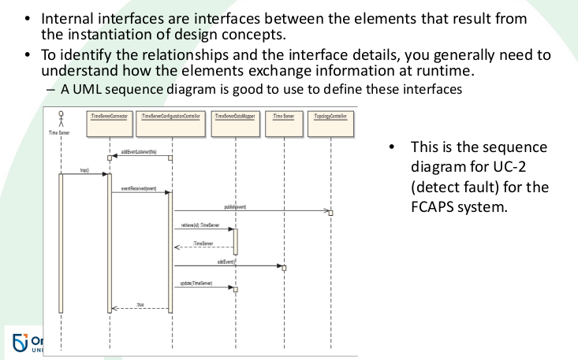

- Get's Components & Interfaces from it, very powerful for System Design

**Common Issue**: Elements "pop-up" in the sequence diagram that isn't in the Architecture.

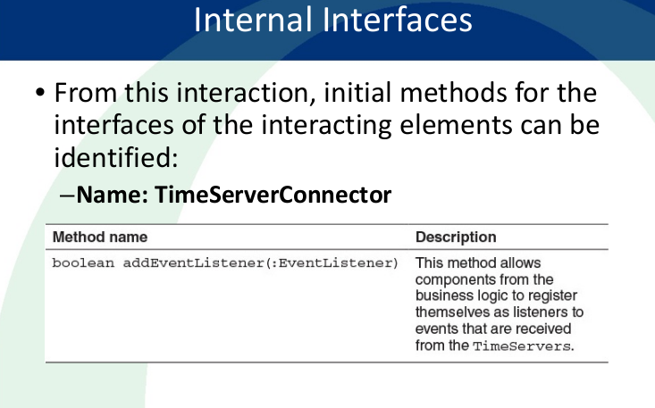

---

#### Add Step 7.

Recording & Addressing Design Decisions

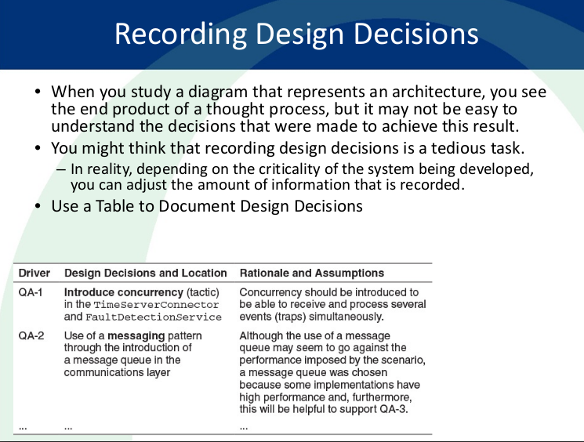
- Trying to Use Concurrency for general System
- Message Queue

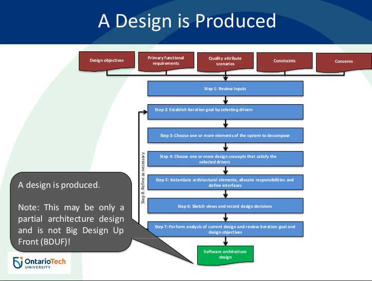

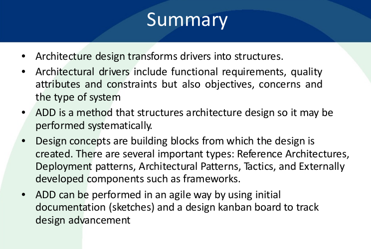

**Frameworks** VS **Reference Architecture**

Framework is a Tool, Code, you can build off of it.
Ref. Arch is a Architectural Structure to maybe follow.
---

#### Use Kanban
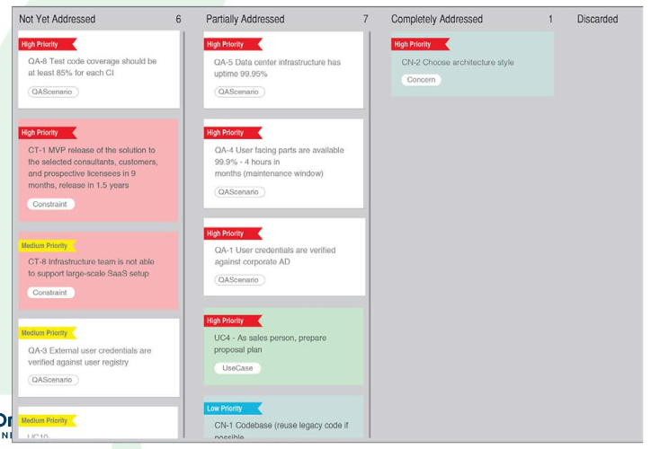

**How Addressed** Are these Q.A Scenarioes, Notice that the High Priority ones are being **ADDRESSED FIRST**

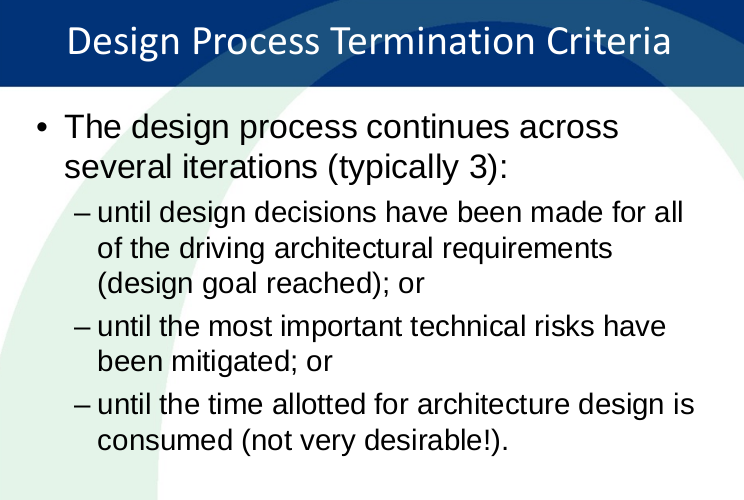

We're building something from Scratch, maybe you'll do an Iteration on a pre-designed architecutre... and do like Iteration 3 off the bat.

- Mitigation of Technical Risks, coming back to Kanban Board

**Prototype**
- Understand Concept of Product
- Monolithic System

- Learn something about the Product you're building, Testing & Trials

  
November 15th | ADD Iteration #3

**FCAPS Example has Active Redundancy | ADD 3 Discussion**:
- *Address all your Quality Attributes as much as possible*
- Important we've got a Process in place for the Software Design, so we're achieving Quality Attributes & Constraints

#### Exercise #7 | ADD #1 Review

- Constraints & Quality Attributes, usually given
- ADD #1, come up with a general Refference Architecture you want to use

-ADD #2, Breaks down the components within the Reference Architecture

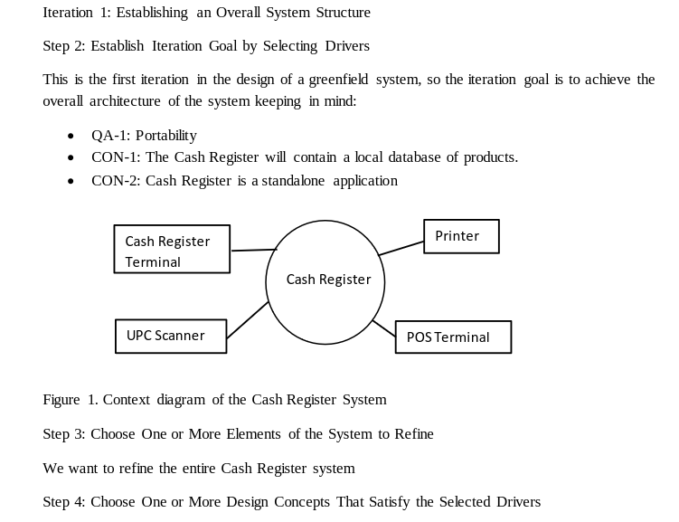

*Understand what's External, and what's Internal*

*Hardware is External, Payment Service is outside, POS Terminal is outside* My system is strictly the **Cash Register**

- These External components will eventually have internal modules interfacing outwards!

- ADD #1, Looks at the Large High-level Architecture
  - Step 4. Decisions
  - Step 5. Instanciations *(What am I gonna do with my Decision, how will I Make it Happen?)*
    - Instanciation generally becomes a tactic

- Step 6. What LISCANO looks for !!
  - Based on the Reference Architecture *(Rich Client in this case)* 
  - Added & Removed Modules that are required for our Application *(Cash Register)*
  - Use a common Reference Architecture

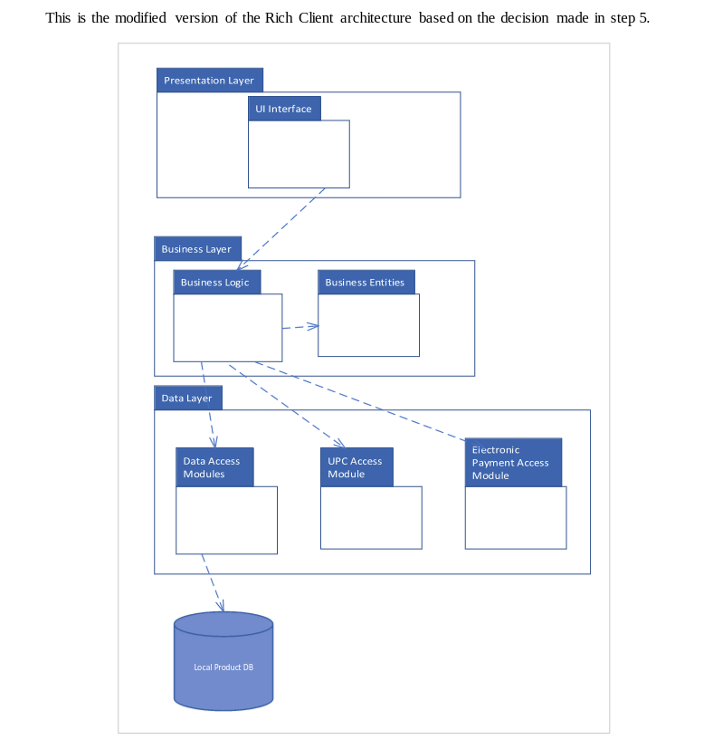

- Upon implementations, these High-Abstraction Layers dissapear, like no such thing as a Presentation Layer.

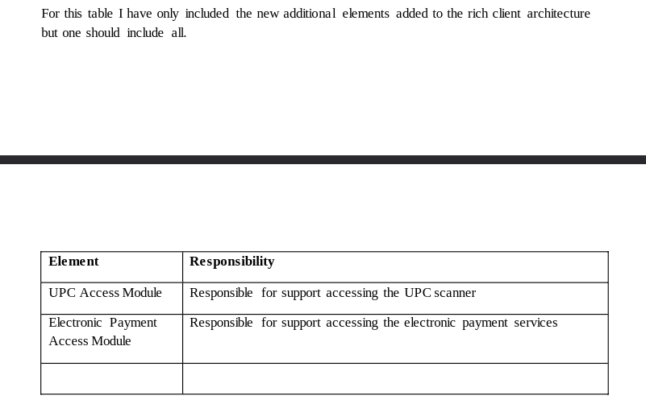

For Elements that aren't "Generic" to the Refference Architecture, add them into a table.

---

#### ADD Iteration #2

- ALWAYS Address one Quality Attribute at a Time!

- **Domain Model**:
  - What are the key classes that need to be defined for an Application? Extracting classes and Actors from Natural Language. *(Car rental site... well we need a Model of a "car" which we can rent off)*

  - **Ignore Domain Model** Until the time for Implementation arrises. 

  - **Domain Analysis** Is still Needed!  Go thru use-cases and extract elements: for EX8
      - Session, Is it a Domain Component? or Domain Entity?
      - Product is a Domain Entity
      - Barcode Scanner (Domain Component) *Interface to Barcode scanner hardware*
      - Display (Domain Component) *Interface to display of Presentation Layer*

  - Anything that's decided to be a **Domain Component** Will be put into the Diagram *Logical Architecure Diagram*

    - What are Domain Specific Things you need in your system
    - The Product **Domain Entity** is a part of these Domain components, so you need to go from this Domain Analysis to an Architecture *Sketch* which uses these!  
      - Dependencies, for example a Controller is the centralized dependency module, it depends on everything to control it.

  **TABLE: Element | Domain Component | Domain Entity**

    - EX8: Added a Local Storage Database, and Session DB

  **Fcaps** Gets Domain Analysis, then defines Domain Components, then adds those into the Layers

  **Grading Quality | By liscano**
  - Consistency of Components between Diagrams
    - Consistent Interfaces 

  
November 22nd Lecture

**Reference Architectures**
- Also cover Deployment Patterns
- Banking System uses one of these aswell!

- STUDY THE DESIGN CONCEPT CATALOG
  - Know Deployment Diagrams
  - Know Tactics

---

### Banking System Docx Exam Questions

