<details>
  <summary style="font-size: 30px; font-weight: 500; cursor: pointer;">System Calls Part #2 | Signals & Process Terminations </summary>

# **Exec Variants**

### execlp

**execlp** works like **execl** but does not require a full path to the executable. 
Instead, it searches the directories in the **PATH** environment variable for the executable.

```c
#include <stdio.h>
#include <unistd.h>

int main() {
    printf("Running ls with execlp\n");
    execlp("ls", "ls", "-l", (char *)NULL);

    printf("This will only print if execlp fails!\n");
    return 0;
}

```

### execv

**execv** takes two arguments: the path to the executable and an array of pointers to null-terminated strings that represent the argument list. 
This array must be terminated by a NULL pointer.

```c
#include <stdio.h>
#include <unistd.h>

int main() {
    char *args[] = { "ls", "-l", NULL };

    printf("Running ls with execv\n");
    execv("/bin/ls", args);

    printf("This will only print if execv fails!\n");
    return 0;
}
```

### execlp

**execlp** works like execl but does not require a full path to the executable. Instead, it searches the directories in the PATH environment variable for the executable.

```c
#include <stdio.h>
#include <unistd.h>

int main() {
    printf("Running ls with execlp\n");
    execlp("ls", "ls", "-l", (char *)NULL);

    printf("This will only print if execlp fails!\n");
    return 0;
}
```


### execvp

**execvp** is a combination of execv and execlp. It takes an array of pointers to strings for arguments like execv, and it searches the PATH for the executable like execlp.

```c
#include <stdio.h>
#include <unistd.h>

int main() {
    char *args[] = { "grep", "main", "file.txt", NULL };

    printf("Searching for 'main' in file.txt with execvp\n");
    execvp("grep", args);

    printf("This will only print if execvp fails!\n");
    return 0;
}
```

---

# chdir

When a new process is created, typically through a fork followed by an exec, it inherits the current working directory from its parent process. This means that, for example, if you're in a shell and your current working directory is `/home/user`, any program you start from that shell without changing the directory will start with `/home/user` as its current working directory.

The **chdir()** system call is used to change the current working directory of the process that invokes it. Here's a description and an example of using chdir() in a C program:

```c
#include <stdio.h>
#include <unistd.h>

int main() {
    // The current working directory is inherited from the parent process.
    // Let's say we want to change it to "/tmp".

    printf("Changing the current working directory to /tmp\n");
    if (chdir("/tmp") != 0) {
        perror("chdir failed");
        return 1; // Return a non-zero value to indicate an error.
    }

    // If successful, the current working directory is now /tmp.
    printf("Current working directory changed to /tmp successfully\n");

    // The rest of the program would go here.

    return 0;
}
```

Another Example of using `chdir` change dir
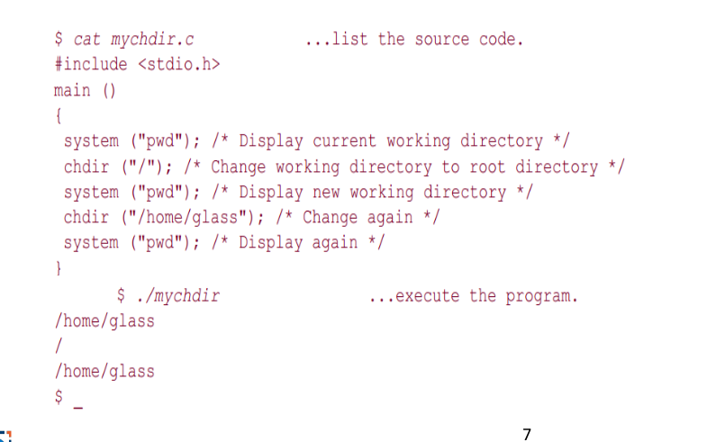


---

# Signals

Programs must sometimes deal with unexpected or unpredictable
events, such as:

- a floating-point error
- a power failure
- an alarm clock "ring"
- the death of a child process
- a termination request from a user (i.e., a Control-C)
- a suspend request from a user (i.e., a Control-Z)

These kind of events are sometimes called interrupts, as they must interrupt the regular flow of a program in order to be processed.


```c
#include <stdio.h>
#include <unistd.h> // For alarm() and pause()

// main function starts here
int main() {
    alarm(3); // Schedule an alarm signal to be sent in 3 seconds

    printf("Looping forever...\n");
    while(1); // Infinite loop, normally not a good idea, but for demo purposes.

    // This line will not be executed because the program will be terminated by the alarm signal
    printf("This line should never be executed\n");

    return 0; // Return 0, although the program will never reach this point due to the alarm
}
```


### Alarm with Signal Handler to do more upon Alarm:

```c
#include <stdio.h>
#include <unistd.h> // For alarm() and pause()
#include <signal.h> // For signal handling

int alarmFlag = 0; // Global variable to communicate between the signal handler and the main loop

void alarmHandler(); // Forward declaration of the alarm signal handler

// Signal handler definition
void alarmHandler() {
    printf("An alarm clock signal was received\n");
    alarmFlag = 1; // Set the flag to break the loop in main
}

// main function starts here
int main() {
    signal(SIGALRM, alarmHandler); // Register the alarmHandler function for the SIGALRM signal

    alarm(3); // Schedule an alarm signal in 3 seconds
    printf("Looping...\n");

    while(!alarmFlag) { // Loop until alarmFlag is set by the signal handler
        pause(); // Wait for a signal to arrive
    }

    printf("Loop ends due to alarm signal\n");

    return 0; // Return 0 to indicate success
}
```

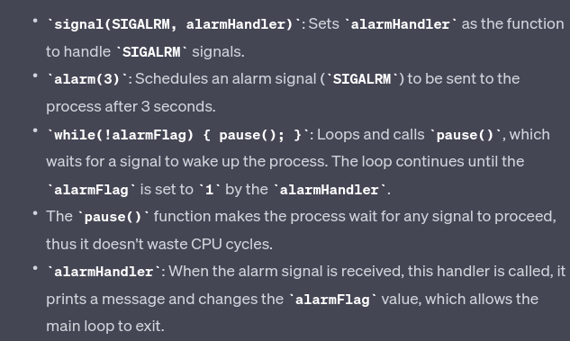

* Signals are a separate mechanism from file sockets and General IO, and they are used for inter-process communication and handling asynchronous events.

### Protecting Critical Code and Chaining Interrupt Handlers

- The same techniques may be used to protect critical
pieces of code against Control-C attacks and other such
signals.
- In these cases, it's common to save the previous value of
the handler so that it can be restored after the critical
code has executed.
- Here's the source code of a program that protects itself
against SIGINT signals:

**CTRL+C Attack** refer to the action of a user sending an interrupt signal *(SIGINT)* to a running program by pressing Control-C on the keyboard. This key combination is commonly used in Unix-like operating systems to terminate a running process.

In many command-line interfaces (CLIs), pressing Control-C will send the interrupt signal to the foreground process group, which by default causes the process to terminate. However, this behavior can be customized or overridden within a program by changing the signal handler for SIGINT.

```c
#include <stdio.h>
#include <signal.h>
#include <unistd.h>

// Global variable for original SIGINT handler to restore later
void (*originalSigintHandler)(int);

// Custom SIGINT handler
void customSigintHandler(int signalNumber) {
    // Do something specific to handle Control-C
    // Typically nothing, or print a message that this section cannot be interrupted
    printf("SIGINT received, but we're ignoring it due to critical operation!\n");
}

// Function to protect a critical section
void criticalSection() {
    // Install the custom SIGINT handler
    originalSigintHandler = signal(SIGINT, customSigintHandler);

    // Critical code goes here...
    printf("Critical section is running. Try pressing Ctrl-C and see what happens.\n");
    sleep(10);  // Pretend to do something important

    // Restore the original SIGINT handler
    signal(SIGINT, originalSigintHandler);
}

int main() {
    printf("Press Ctrl-C during the critical section to test the custom handler.\n");
    criticalSection();
    printf("Critical section finished, Ctrl-C will now stop the program as usual.\n");
    
    // This sleep is just to allow us time to try Ctrl-C after the critical section
    sleep(10);

    return 0;
}
```

In this program, **criticalSection()** changes the signal handler for SIGINT to a custom handler that ignores the Control-C during its execution. After the critical section is complete, it restores the original behavior, allowing the process to be terminated by Control-C as usual.

Protecting critical sections of code from interruption is important in various scenarios, such as when a program is in the middle of a transaction or updating shared resources where an unexpected termination could lead to data corruption or inconsistency.

---


### Sending Signals with `kill`

- A process can signal another with `kill()` system call.
- Misnamed as `kill()` since not all signals terminate processes.
- Historically, `kill()` was used mainly to terminate processes in UNIX.

### Syntax

```c
int kill(pid_t pid, int sigCode);
```

Sends sigCode to process with PID pid.

**kill()** succeeds if:
- Both processes belong to the same user.
- The sender is a super-user.

**Variations of kill()**

- `pid == 0`: The signal is sent to all processes in the sender's process group.

- `pid == -1` with super-user:
  - The signal is sent to all processes.
- `pid == -1` without super-user:
  - The signal is sent to all processes owned by the sender's user, except the sender itself.

- `pid < 0` and `pid != -1`: 
  - The signal is sent to all processes in the specified process group (`pid`).

- **Return Values of `kill()`**:
  - `0`: Signal was sent successfully.
  - `-1`: An error occurred while sending the signal.

---

### Suspension & Resuming of Processes 

```c
#include <signal.h>
#include <stdio.h>
#include <unistd.h>
#include <sys/types.h>
#include <stdlib.h>

int main() {
    int pid1;
    int pid2;

    // Create first child process
    pid1 = fork();
    if (pid1 == 0) { // First child
        while (1) { // Infinite loop
            printf("pid1 is alive\n");
            sleep(1);
        }
    }

    // Create second child process
    pid2 = fork();
    if (pid2 == 0) { // Second child
        while (1) { // Infinite loop
            printf("pid2 is alive\n");
            sleep(1);
        }
    }

    // Parent process
    // If the fork calls were successful, pid1 and pid2 should be non-zero in the parent process
    if (pid1 > 0 && pid2 > 0) {
        sleep(3); // Give children time to start

        // Suspend first child
        kill(pid1, SIGSTOP);
        sleep(3);

        // Resume first child
        kill(pid1, SIGCONT);
        sleep(3);

        // Terminate first child
        kill(pid1, SIGINT);
        
        // Terminate second child
        kill(pid2, SIGINT);
    }

    return 0; // End of parent process
}
```

 In Unix-like operating systems, signals are used for inter-process communication. The SIGSTOP and SIGCONT signals are specifically used to control the execution of processes:

- **SIGSTOP:**  *Process Suspension* This signal stops a process in its tracks, effectively suspending its execution. The process will remain in a stopped state until it receives a signal to continue. The SIGSTOP signal cannot be caught, blocked, or ignored by the process, making it a reliable way to pause a process.

- **SIGCONT:** *Process Resuming* This signal is used to resume a process that has been stopped by SIGSTOP or another stopping signal like SIGTSTP (which is the signal sent by the Ctrl+Z key combination in a terminal). When a process receives SIGCONT, it continues its execution from where it was stopped.

- **SIGINT** (Signal Interrupt): This signal is typically sent when the user types the interrupt character *(normally Ctrl+C)* at the keyboard. SIGINT tells the process to immediately terminate. 

---

## Process Groups

- **Process Group:** A process group is a collection of one or more processes, usually associated with the same job, that can receive signals as a group. Every process belongs to a process group.

- **Inheritance of Process Group:** When a process (parent) creates a new process (child) through fork(), the child process inherits its parent's process group ID.

- **Changing Process Group:** A process can change its process group by calling setpgid(). *(Maybe dis-associate from parent group as a child proc?)*

- **Control Terminal:** This is the terminal device from which the process was initiated. Typically, it's the terminal you are using to interact with the shell.

- **Inheritance of Control Terminal:** Like process groups, when a process forks, the child process inherits its control terminal from the parent process.

- **Control Process:** The control process is a special process in a session that has a controlling terminal. It's the process group leader of the process group associated with the terminal.

- **Terminal Signals:** If you hit a control key *(like Control-C for SIGINT)* on a terminal, the terminal sends the signal to all processes in the foreground process group of the terminal.

The following C program demonstrates the concept of process groups and how signals like SIGINT (from Control-C) and SIGTTIN can affect processes. The program will create a child process, which will try to read from the terminal while being in a different process group.


```c
#include <stdio.h>
#include <unistd.h>
#include <signal.h>
#include <stdlib.h>

int main() {
    pid_t pid = fork();

    if (pid == -1) {
        // Error
        perror("fork");
        return EXIT_FAILURE;
    }

    if (pid == 0) { // Child process
        // Change the process group of the child
        if (setpgid(0, 0) == -1) {
            perror("setpgid");
            return EXIT_FAILURE;
        }

        // Attempt to read from the control terminal
        char input[10];
        printf("Child process group ID: %d\n", getpgrp());
        printf("Enter some text: ");
        fgets(input, sizeof(input), stdin);
        printf("Child read: %s\n", input);
        return EXIT_SUCCESS;
    } else { // Parent process
        printf("Parent process group ID: %d\n", getpgrp());
        // Wait for the child process to complete
        wait(NULL);
    }

    return EXIT_SUCCESS;
}
```
When you run this program and try to input text for the child process, if it's in the background, it should get suspended because it's trying to read from the terminal while not being in the foreground process group. If it's in the foreground, it should be able to read from the terminal normally.

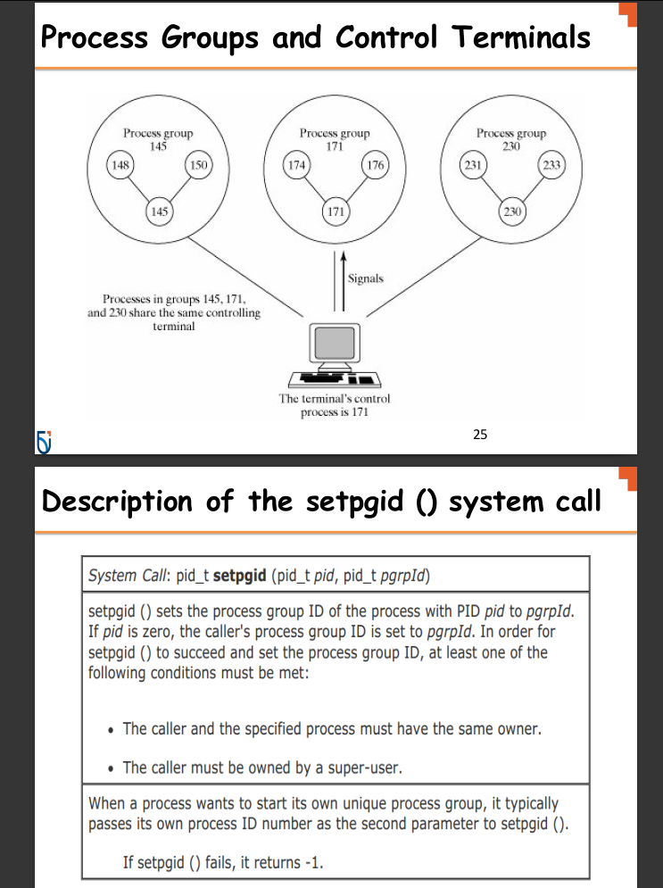

Also you can do `getpgid()` to get a Process's Group ID

`pid_t getpgid(pid_t pid)` returns Process Group ID of PID parameter, if PID is 0, the Process Group ID of caller is returned.
</details>

<details>
  <summary style="font-size: 30px; font-weight: 500; cursor: pointer;">Pipe</summary>

```c
int pipe(int fd[2])
```

- **pipe()** creates an unnamed pipe and returns two file
descriptors;
- The descriptor associated with the *"read"* end of the pipe
is stored in fd[0].
- The descriptor associated with the *"write"* end of the
pipe is stored in fd[1].

#### Unnamed Pipes

- **Definition**: Unnamed pipes provide a form of interprocess communication (IPC) that allows data to be transferred in one direction (i.e., no bidirectional communication like sockets).
- **Use Case**: They are often used to enable communication between a parent and its child process.
- **Mechanism**:
  1. The parent process creates an unnamed pipe with the `pipe()` system call, which creates two file descriptors: 
     - `fd[0]` for reading from the pipe.
     - `fd[1]` for writing to the pipe.
  2. The parent process then creates a child process using `fork()`.
  3. In typical use:
     - The writing process (usually the parent) closes the reading end `fd[0]`.
     - The reading process (usually the child) closes the writing end `fd[1]`.
- **Data Flow**: Data written to the writing end of the pipe by the writer is buffered by the kernel until it is read by the reader from the reading end of the pipe.

```c
#include <stdio.h>
#include <stdlib.h>
#include <unistd.h>
#include <string.h>

int main() {
    int pipefd[2]; //Pipe File Descriptor
    pid_t cpid;
    char buf;
    const char *msg = "Hello from parent!\n";

    // Create a pipe
    if (pipe(pipefd) == -1) {
        perror("pipe");
        exit(EXIT_FAILURE);
    }

    // Fork a child process
    cpid = fork();
    if (cpid == -1) {
        perror("fork");
        exit(EXIT_FAILURE);
    }

    if (cpid == 0) {    // Child process
        close(pipefd[1]); // Close unused write end

        // Read data from the pipe
        while (read(pipefd[0], &buf, 1) > 0) {
            write(STDOUT_FILENO, &buf, 1);
        }

        write(STDOUT_FILENO, "\n", 1);
        close(pipefd[0]); // Close read end
        _exit(EXIT_SUCCESS);

    } else {            // Parent process
        close(pipefd[0]); // Close unused read end

        // Write message to the pipe
        write(pipefd[1], msg, strlen(msg));
        close(pipefd[1]); // Reader will see EOF

        // Wait for child to finish
        wait(NULL);
        exit(EXIT_SUCCESS);
    }
}
```

 **pipefd[2]** declares an array named pipefd that contains two integers. These two integers serve as file descriptors that the pipe() system call uses to provide access to the two ends of the pipe.*(for Read/Write)*

**Here's a breakdown:**

    *pipefd[0]*: This is the read end of the pipe. The process can read data from the pipe through this file descriptor.
    *pipefd[1]*: This is the write end of the pipe. The process can write data to the pipe through this file descriptor.

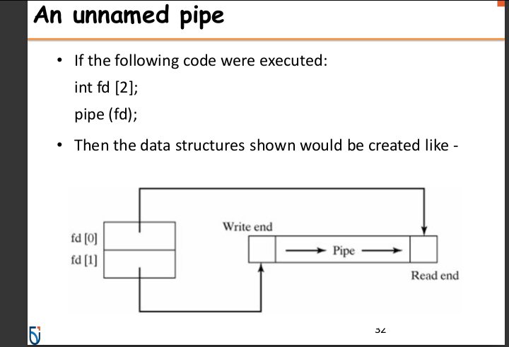

---

### Named Pipes (FIFOs) *FIFO is like Stack Data Struct.*

Named pipes, also known as FIFOs (First In, First Out), are a type of inter-process communication mechanism that provide several advantages over unnamed pipes:

- **Persistence**: Unlike unnamed pipes, named pipes have a presence in the file system. This means they persist until they are explicitly removed.
  
- **Accessibility**: They can be accessed by any process that has the appropriate permissions, not just the processes that have a parent-child relationship.
  
- **Communication Between Unrelated Processes**: Named pipes can facilitate communication between two unrelated processes, which is not possible with unnamed pipes.

Named pipes can be created using:

1. **The `mkfifo` command-line utility**: A simple shell command to create a FIFO in the filesystem.
   **EX**:  `mkfifo /path/to/myfifo`


2. **The `mkfifo()` system call**: This allows a FIFO to be created from within a C program.


```c
#include <stdio.h>
#include <stdlib.h>
#include <sys/stat.h>
#include <fcntl.h>
#include <unistd.h>
#include <string.h>

#define FIFO_NAME "/tmp/myfifo"

int main() {
 // Create a FIFO named pipe
 mkfifo(FIFO_NAME, 0666);

 // Writing to the named pipe
 int fd = open(FIFO_NAME, O_WRONLY);
 char *message = "Hello from the writer!";
 write(fd, message, strlen(message));
 close(fd);

 // Reading from the named pipe in the same process
 // (Usually, you would read in a separate process)
 fd = open(FIFO_NAME, O_RDONLY);
 char buf[128];
 read(fd, buf, sizeof(buf));
 close(fd);

 // Print the message read from the pipe
 printf("Received: %s\n", buf);

 // Cleanup the FIFO
 unlink(FIFO_NAME);

 return 0;
}
```

This program creates a named pipe, writes a message to it, and then reads the message back. Typically, the write and read operations would be done in separate processes. The **unlink()** function is called at the end to remove the named pipe from the filesystem.
</details>

<details>
  <summary style="font-size: 30px; font-weight: 500; cursor: pointer;">Sockets
</summary>


</details>


<details>
  <summary style="font-size: 30px; font-weight: 500; cursor: pointer;">Week 7. Linkers and Loaders
</summary>

Convenient Environment for Program Developpement:

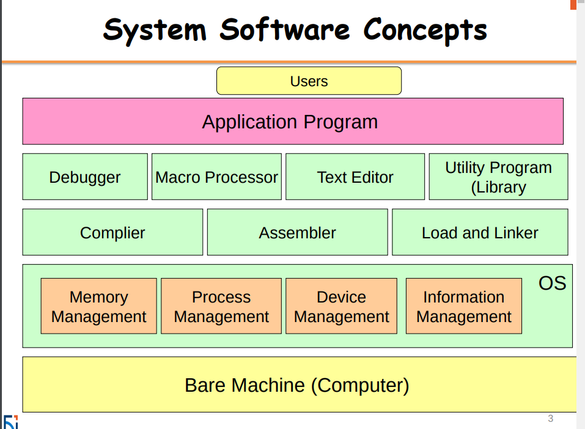

**Device Management**:

**Memory Management**:
- Crucial component in O.S
- Manages Physical Memory, to support the large infra-structure built on top of the hardware.

#### System Programs:
- File manipulation
- Status information
- File modification
* Program language support
* Program loading and execution
- Communications
- Application programs

**Object File** Created by Compilation

**Assembler** takes **object** files and makes them **Assembly Files**

Then the **Loader** Executes the Assembly Files *(Instructions)*

---

#### *Linking*
Combining a set of programs, including library routines, to create a loadable image. Links seperate files, together into a final image of that program. 
*(Let's say I have 2 C files, and then some Library Usage, It will link my source files together, and also linked the compiled libraries also)*

- Resolving symbols defined with the set
- Listing symbols needing to be resolved by Loader.


#### *Loading*
Copying the loadable image into memory, connecting it with any other programs already loaded, and updating addresses as needed.
- (In Unix) interpreting file to initialize the process address space
- (in all systems) kernel image is special (own format)

---

## Workflow for Typical Compilation and Execution

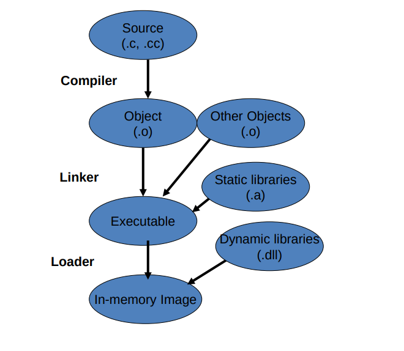

**Static Libraries:** They are linked to the program at compile time. When you compile a program that uses a static library, the code from the library is copied into the executable. This means that the executable contains the library code within it.

- This is better for Distributing Software, as an EXE might compile, but rely on a DLL that might not be there. Static Libraries are "Baked-In" to the EXE.

**Dynamic Libraries:** They are linked during runtime or load time, not at compile time. The code is not included in the executable; instead, the program uses the library code that is stored separately in `.dll` files.

- Multiple different Executable's use the same **DLL**s so it doesn't need to be replicate static libraries all the time. *(Example: Window DLLs)*

- You can update a dll without having to recompile the orginal program. The static libraries get baked into the program.

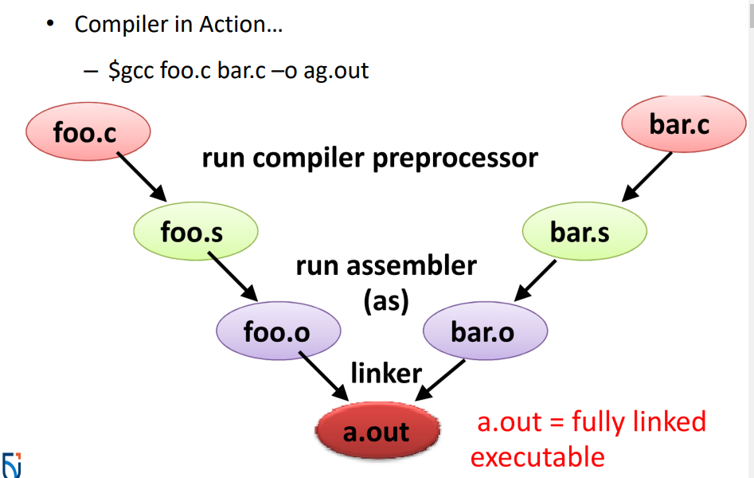

`gcc main.c second.c -o final`

</details>


<details>
  <summary style="font-size: 30px; font-weight: 500; cursor: pointer;">Week ?. Program Tracing & Debugging
</summary>

### Tracing System Calls from Commands

- Specifically traces system calls, the power of **strape**

`strace` on Linux
`strace -e trace=read ls` Traces the **read()** calls that LS preforms upon command execution
`strace -e trace=write ls` Traces the **write()** calls that LS preforms upon command execution

`strace -t ...` Tracing with a Timestamp

[StackOverFlow | system write(), print to Terminal](https://stackoverflow.com/questions/3866217/how-can-i-make-the-system-call-write-print-to-the-screen)

### Tracing System Process
- Once Application runs, it will load it into memory, and Execute... You can trace all of this

Tracing specific Process ID: `sudo strace -p 3306 -o output.txt`

`ps -C <Application Name>` *(Show's current processes in the Terminal)*
`ps aux` *Show all process, from all users Root, Jason and System*

**Anwar's Example**
Step 1. find firefox processes `ps aux | grep "firefox"`
Step 2. Find Firefox process via `ps -c firefox`

You can trace any commands, as Commands has underlying Code being executed.

### **Why Trace Applications?**
 It is primarily used to monitor the system calls and signals received by a process. This tool is invaluable for understanding how a program interacts with the system's kernel. 

### Tracing Limitations:
- Less effective for debugging issues within the program's own code, such as logic errors or algorithmic bugs.
- Limited to system call level; doesn't provide insights into the internal logic or state of the program.

---
## Debugger
Post-mortem debugging, when the file runs, and a run-time error occurs and it "core-dump"

"core-dump" System generates a file which is a "backtrace"

`ulimit` <= Limit to generating Core Dumps
`ulimit -c unlimited` <= change Limit of Core-dump file to Unlimited space

in `var/lib/apport/coredump` you can view Core Dumps

How can I trace the core-dump

</details>

<details>
<summary style="font-size: 30px; font-weight: 500; cursor: pointer;">Week 10. Parsing</summary>

Lexical Rules: *Like rules of the language, *

Semantics Rules: *How the compiler "understands" the expressions*


---

Using **YACC** Yet Another Compiler: Compiler

**Scanner** is generation of the Lexeme & Token Pairs, it's called `Lex` on Linux 
Output is a Function from Lexer: `yylex()`

LEX Output: `yylex()` from Input *(Raw Token Stream, which is just an Input String)*

YACC calls `Lex` to retrieve `yylex()` Function, then does it's normal operations .

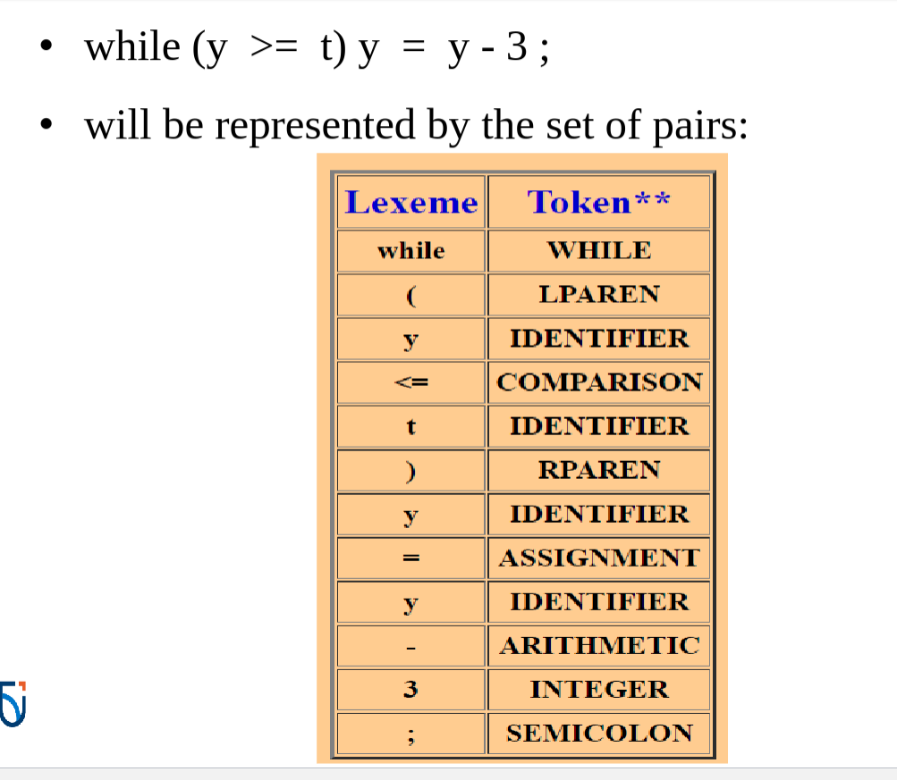

- LEX & YACC are available on UNIX ! 
- BISON is a replacement on GNU

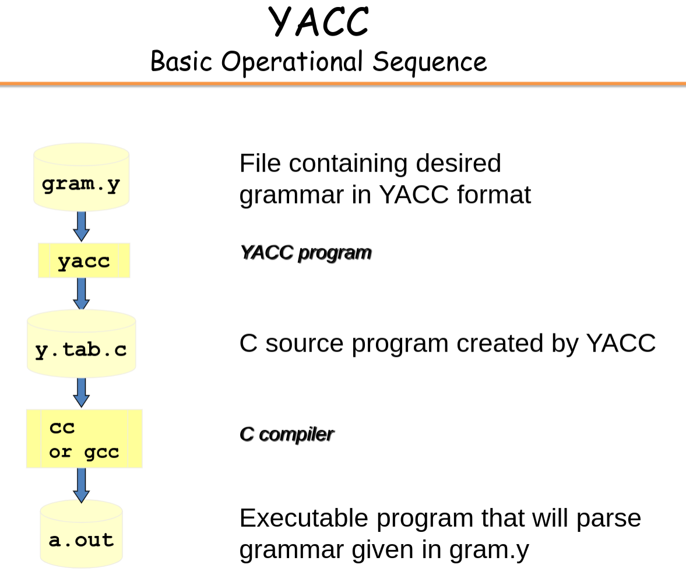

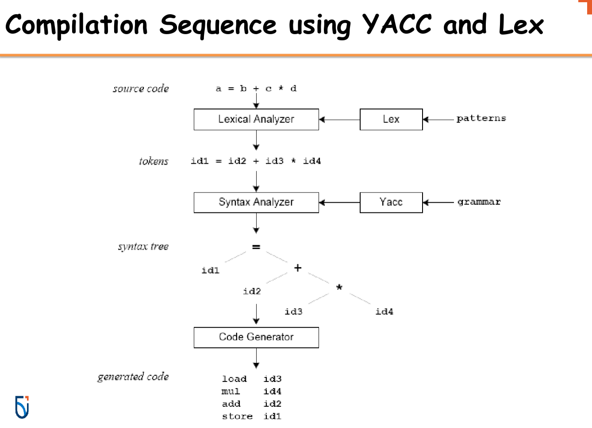

## Parsing:


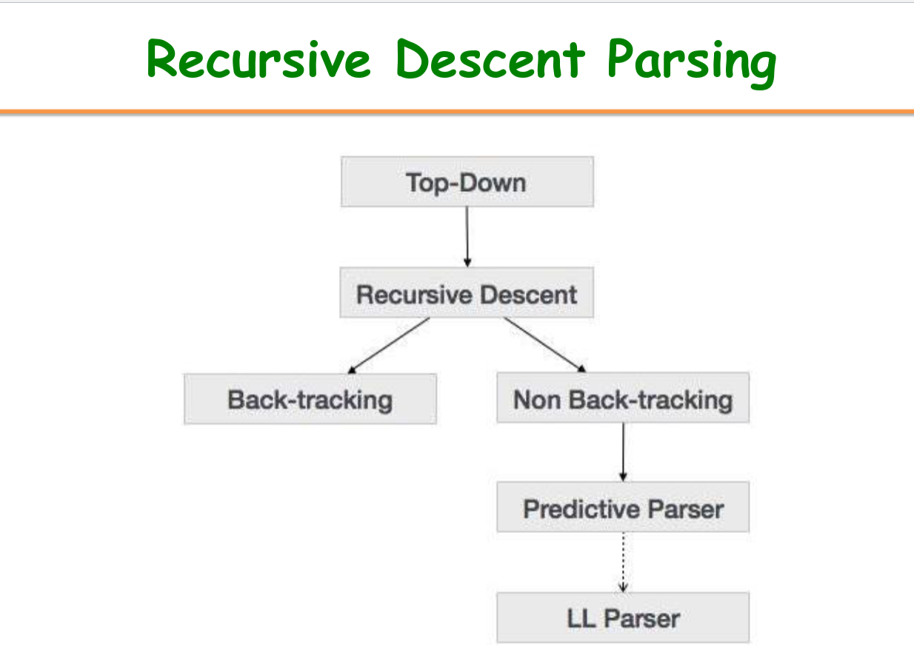

General Grammar Rules, Here we have some symbols, and their possible reductions: Example: **E -> E + T**, **E** can also be reduced to just **T**

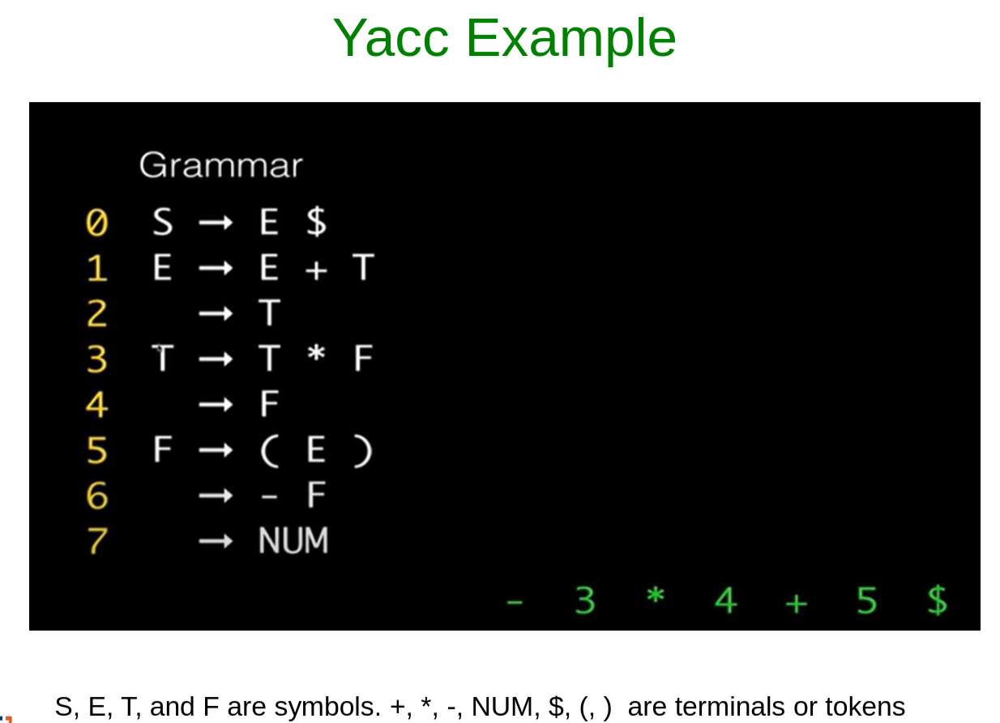

`- 3 * 4`, it's `- F * F`, as `F` can be **NUM**, and since `-F` can be `F`, and T can be F, therefore `-F * F` can be `T * F` which can simply to just `T`, so like for a Token in brackets, we can just take `$2` the second token, which is in the middle of the brackets

This is done over the entire Expression.

Defining the Grammer, in the code $1 and $3 and the "Tokens" to be added up, E (1) + (2) E (3), we want to add up 1 and 3

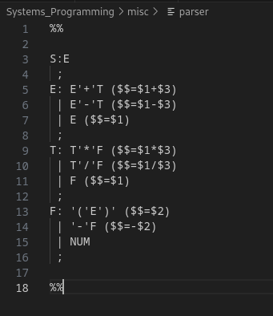

---

`yacc -d parser.y` Generates my y.tab *(C & Header File)*

`lex parser.l` For the lexical generator

`cc lex.yy.c y.tab.c -o calc` Compiled *(or gcc works)*

---

**November 28th Attempt at it, given calc.l and calc.y:**

1.) `yacc -d calc.y` Generates the `y.tab.c` & `y.tab.h` *(C & Header File)*

2.) `flex calc.l` Use Lex/Flex to process the .l file, which will generate a C source file *(Generated `lex.yy.c`)*

3.) `gcc lex.yy.c y.tab.c -o calc` This will generate the executable binary `calc` 

4.) `./calc`


**Same Outputs**
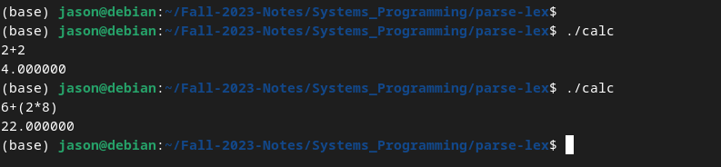

</details>


<details>
<summary style="font-size: 30px; font-weight: 500; cursor: pointer;">Week 11. Windows Powershell</summary>

`help *service*` shows Services on Powershell, like Git Service

Just showing all services
`Get-Service`
Each services returned, is an Object, It's an instantiated class!

Get all services, Pipe, then `Select-Object`, then the param `name` & `status`
`Get-Service | Select-Object name, status`

All **Cmdlet**'s are an Instantiation of some sort of class, *Object-Oriented-Approach*


## gm | Get Member

Get all Objects of Service, and showcase Global Members *(Class Methods)*

`Get-Service | gm`

*Getting a service with a specific name, then showing all the members, class methods with Get-Member, gm for short* 

```ps1
# ...
    # Get the service object
    $service = Get-Service -Name $serviceName

    # Display general information about the service
    Write-Host "Most recently started service: $($service.DisplayName) - Status: $($service.Status)"

    # Show the members of the service object
    $service | Get-Member
```

Example `Pause`, it's a `Method` and it's definition is `void Pause()` as it doesn't return anything whilst **Pausing**
Example #1 `Equals`, it's a `Method` and it's definition is `bool Equals(System.Object obj)` Equals will return, where another Object is equal to self, or not.

`Get-Process` get's all running processing

`Get-Process | gm` All processes are Object Instances, that can be used for Process manipulation, like the `void kill()` command, you can't kill a Service however

`Get-Service -name wisvc | gm` get specific functions that can be done with a specific service, with name: **wisvc**

`Get-Service | Select-Object -Property name, status` Listing all instantiated Services with specific Properties, and it can be a column in the output
**-Property | name | Status**

Select Name, Status, StartType, and Sort by Name
`Get-Service | Select-Object -Property name, status, starttype | sort - Property Name`

### Event Log stuff:

`Get-Eventlog system` Get all the system logs

`Get-eventlog -Logname system -Newest`

Select the newest 5 system Logs Pipeline, select the Warning Flag

`Get-eventlog -Logname system -Newest 5 | Select-Object {$_.EntryType -eq "Warning"}`

Select the newest 5 system Logs, and get all the Messages out of those objects

`Get-eventlog -LogName system -Newest 5 | Select-Object Message`


**Where?**

`get-service | where {$_.status -eq "running"}`

**$_** is pretty much a Lambda Iterator, and it iterates thru all the CLAUSE's output *where, Select-Object, etc...*

All CMDlets in PS1 is like, Verb-Noun , *SELECT* verb, *OBJECT* noun

**wmiObject**

Windows Management Instrument:
- Deals with Harddrives, Network Cards, and other I/O

`get-wmiObject` *It will bring up another Input, to input a class*

`get-wmiObject win32_service` Show all WIN32 Services

**Get-WmiObject Cmdlet in PowerShell**

**Functionality**: Get-WmiObject is a PowerShell cmdlet used to retrieve management information by querying WMI classes. 
**Input Parameter**: When you use Get-WmiObject, you need to specify a WMI class as an input. This class determines the type of information you're querying.

**Relation to Win32 API**

**WMI and Win32 API:** While both WMI and Win32 API provide access to system resources, they serve different purposes. Win32 API is a lower-level interface primarily used for application development and direct interactions with the system's components. WMI, on the other hand, is more about system management and monitoring.
**WMI Classes like win32_service:** These classes are part of the WMI schema and provide an abstraction over the system resources. For instance, win32_service allows you to manage and query Windows services.
**Not Direct Hosting:** WMI does not "host" the Win32 API. Instead, it uses the underlying infrastructure, including parts of the Win32 API, to access and manage system information.
---

# **Service vs. Process**

### Services in Windows
1. **Definition**: Services are specialized programs that perform functions to support other programs, particularly at the system level. They often run in the background and are not directly interacted with by the user.

2. **Characteristics**:
   - **Autonomy**: Services can start automatically at boot time or be started and stopped manually.
   - **Background Operation**: They usually run in the background and do not have a user interface.
   - **Longevity**: Services are designed to run for long periods, often as long as the OS is running.
   - **User Session Independence**: They do not depend on a user being logged in and can run under a system account.
   - **Management**: Managed via the Services console (`services.msc`) or command line tools.

3. **Use Cases**:
   - Core system functionalities like networking, event logging, and file serving.
   - Applications that need to run in the background, independent of user sessions, such as a database server.

4. **Windows Specifics**:
   - Services are often essential for the operation of the OS or certain applications and can be configured through the Windows Service Control Manager.

### Processes in Windows
1. **Definition**: A process is an instance of a program that is being executed. It consists of the program code and its current activity.

2. **Characteristics**:
   - **User Interaction**: Processes often have a user interface and are initiated by user actions.
   - **Session Dependent**: They usually run within a user's session and terminate when the user logs out.
   - **Short-Lived**: Processes may have a shorter life span, typically as long as the task they are performing.
   - **Resource Allocation**: Each process has its own set of resources (memory, process identifiers) allocated by the OS.

3. **Use Cases**:
   - General applications like word processors, web browsers, and games.
   - Short-term tasks like running a script or a batch job.

4. **Windows Specifics**:
   - Processes in Windows are managed by the Task Manager, where users can view and control running processes.
   - Each process in Windows is isolated, with its own virtual memory and resources.

### Key Differences
- **Initiation and Lifespan**: Services are often auto-started and long-lived, while processes are user-initiated and may have a shorter lifespan.
- **User Interface**: Processes usually have a GUI, whereas services do not.
- **Session Dependency**: Services can operate independently of user sessions, while processes are generally tied to them.
- **Management Tools**: Services are managed via the Services console, while processes are managed through the Task Manager.

### Conclusion
In Windows OS, understanding the distinction between services and processes is fundamental for systems programming. Services are integral for the system's operations and function independently of user sessions, providing background support. Processes, conversely, are more user-centric, often having a GUI and a shorter lifespan. This knowledge aids in effective system-level programming and resource management.

---

`Get-Process | Out-Gridview` Outputs the Get-Process to a Grid Viewing Window.

Can also use `Export-Csv` or `ConvertTo-Csv` with **.csv**
Or for HTML, `ConvertTo-HTML` for **.html** outputs

Before doing something, you can use `-Whatif`, **what will happen if I kill a process?**

`Remove-Item file.html -WhatIf` <-- What would happen if I executed this command?

## **PowerShell Script Execution Policy**

`Get-ExecutionPolicy` Mine said *Unrestricted*

**Restricted:** Current user, has *NO* priveldge to run a script, unless it has a very specific **Script Signature**.

**RemoteSigned:** Downloaded from Internet, and signed *Remote Signed*, and can potentially be ran by the a Trusted Publisher.

**Unrestricted:** There is no Restrictions! Go Wild!

Change Script Exec. Policy

`Set ExecutionPolicy "policy"` --> `"unrestricted"` , `"restricted"`, etc...

---

Powershell Lang stuff:

`Read-Host "Enter your name"` it's like an **input** in python, or CIN
`Write-Host "Warning" -ForegroundColor red` Writes to user's terminal "Warning" in red color
- `Write-Debug` , `Write-Error`, etc...

---

### Windows Powershell ISE, Powershell IDE

```ps1
# Get all running services
$runningServices = Get-Service | Where-Object { $_.Status -eq 'Running' }

# Iterate over each service
foreach ($service in $runningServices) {
    # Display the service name
    Write-Host "Service: $($service.Name) is currently running."

    # Ask user for action
    $userInput = Read-Host "Do you want to stop this service? (yes/no)"

    # Check user input
    if ($userInput -eq "yes") {
        # Attempt to stop the service
        try {
            Stop-Service -Name $service.Name
            Write-Host "Service $($service.Name) stopped successfully."
        } catch {
            Write-Host "Error stopping service $($service.Name): $_"
        }
    } else {
        Write-Host "Service $($service.Name) will continue running."
    }
}

Write-Host "All services have been processed."
```

**Use Select**, to compare if Service's Status is equal to "running" *(LIST of T/F)*
**Use Where**, to select all Services, WHERE a condition is true.

</details>