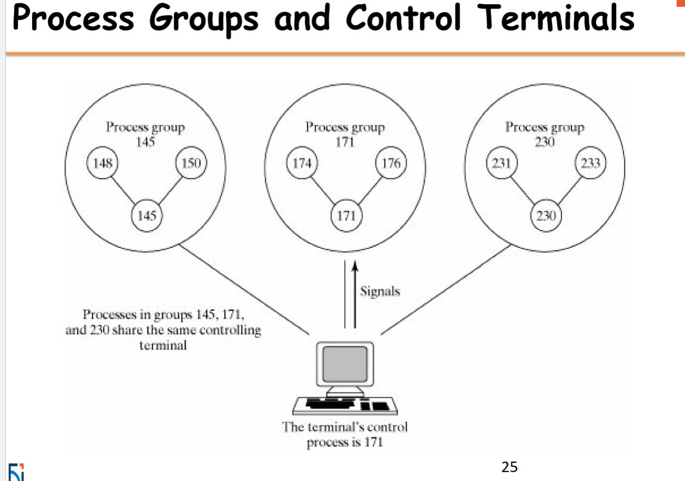
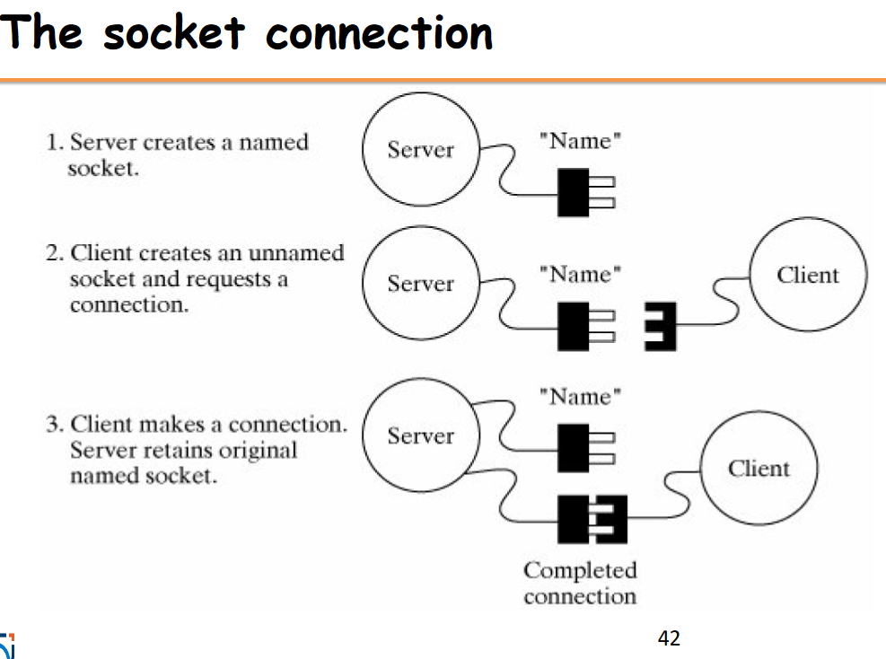
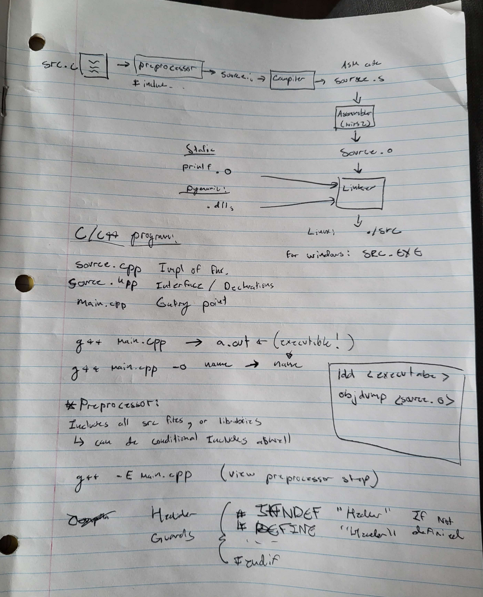
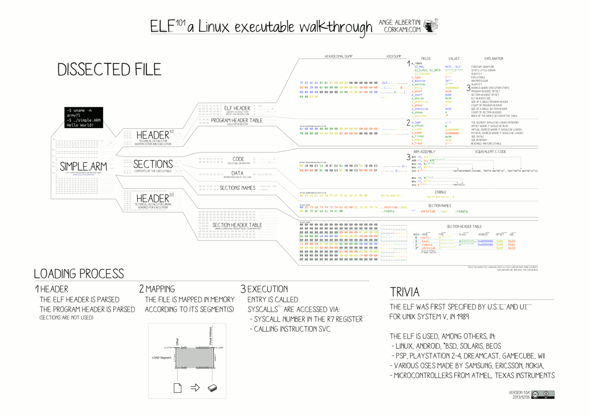
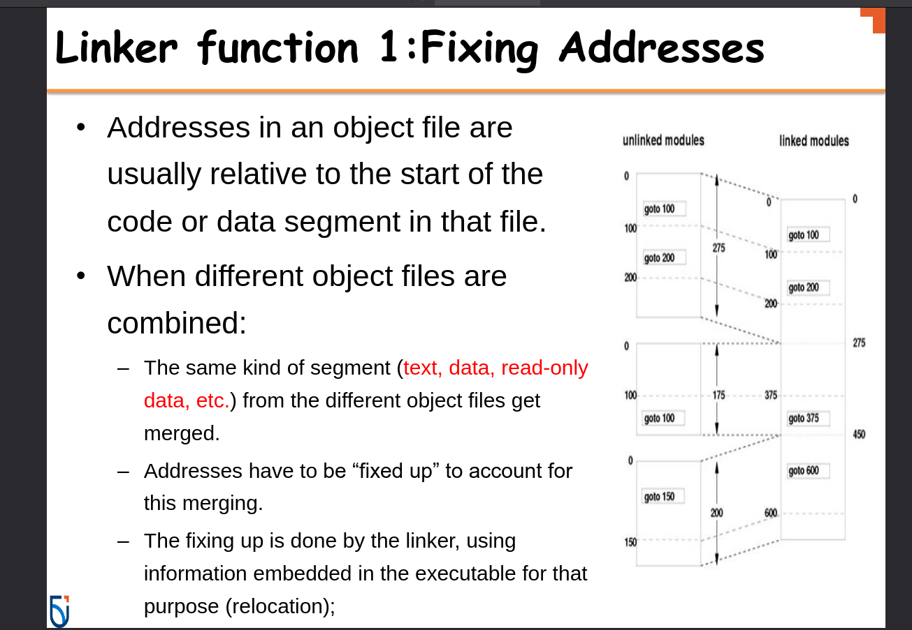
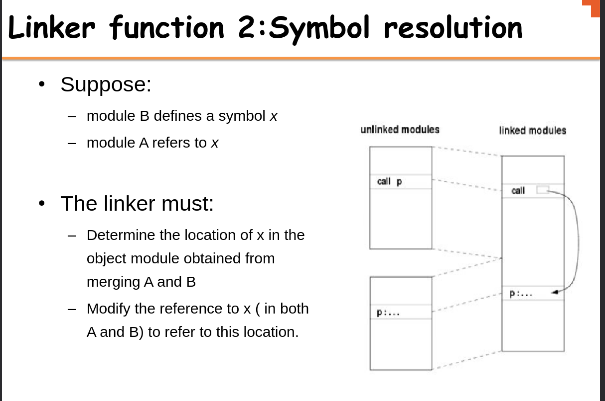
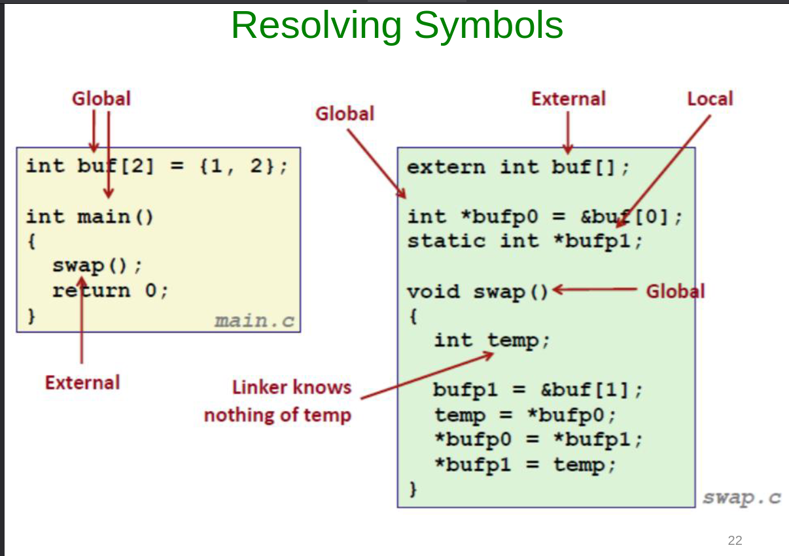
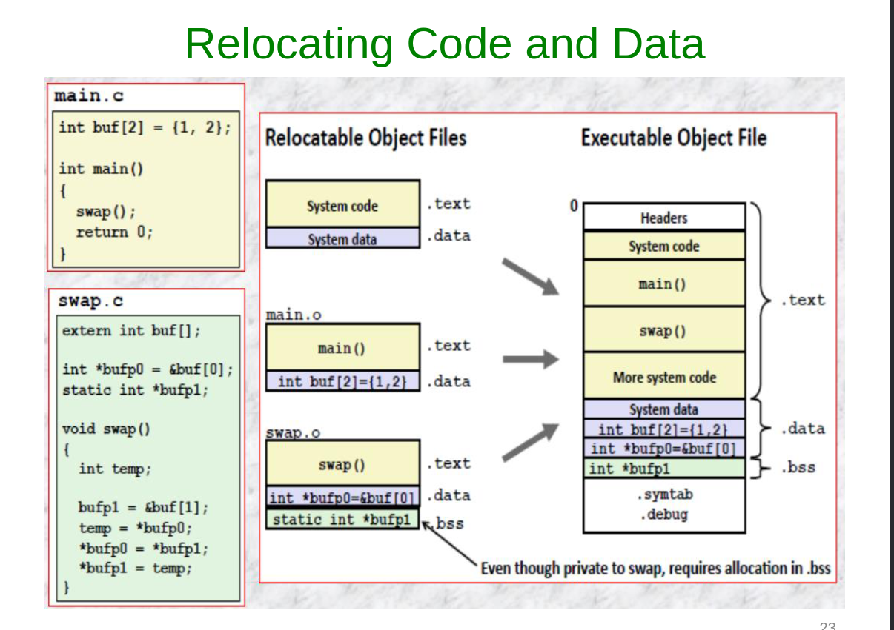
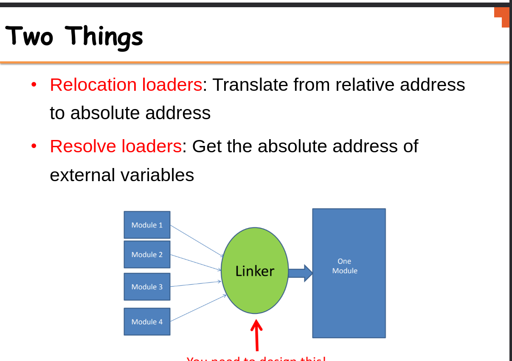
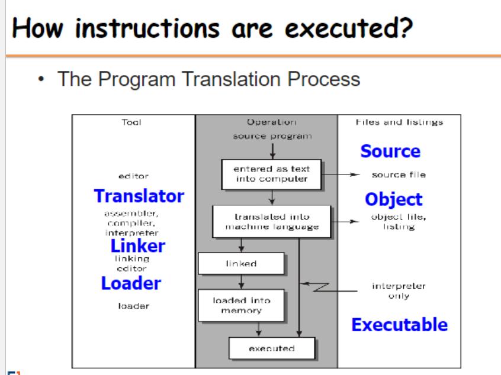

# Chapter 6

<details>
<summary style="font-size: 30px; font-weight: 500; cursor: pointer;"> Week 6 | System Calls (Continued.) </summary>

### 1. `execl`, `execv`, `execlp`, `execvp`
These are part of the `exec` family of functions. They replace the current process image with a new process image. This is used for executing a different program within a process. The difference between them is mainly in how they accept arguments:

- `execl` and `execlp` take a variable number of arguments.
- `execv` and `execvp` take an array of strings.

#### Example of `execl`:
```c
#include <unistd.h>
#include <stdio.h>

int main() {
    printf("Starting program...\n");
    execl("/bin/ls", "ls", "-l", (char *) NULL);
    printf("This won't be printed if execl is successful\n");
    return 0;
}
```
This code will print a starting message, then replace the current process with the `ls` command, listing files in the long format.

### 2. `chdir()`
`chdir()` changes the current working directory of the calling process to the directory specified in its argument.

#### Example:
```c
#include <unistd.h>
#include <stdio.h>

int main() {
    system("pwd"); //Display current working dir.

    if (chdir("/tmp") == 0) { //If change dir was success
        printf("Changed directory to /tmp\n");
    } else {
        perror("chdir failed");
    }
    return 0;
}
```
This code attempts to change the working directory to `/tmp`. If successful, it prints a confirmation.
chdir fn. def `int chdir(const char* path)`
- Successful response: `0`
- Erroneous Response: `-1`

### 3. `pause()`
`pause()` causes the calling process to sleep until a signal is received that either terminates the process or causes the invocation of a signal-catching function.

#### Example:
```c
#include <unistd.h>
#include <stdio.h>
#include <signal.h>

void signal_handler(int signal) {
    printf("Signal received: %d\n", signal);
}

int main() {
    signal(SIGINT, signal_handler); // Catch interrupt signal (Ctrl+C)
    printf("Pausing. Press Ctrl+C to send signal.\n");
    pause();
    printf("This will be printed after a signal is received.\n");
    return 0;
}
```
This code sets up a signal handler and then pauses the process. It resumes when an interrupt signal (Ctrl+C) is received.

### 4. `kill()`
`kill()` sends a signal to a process or a group of processes, specified by `pid`.

#### Example:
```c
#include <unistd.h>
#include <stdio.h>
#include <signal.h>

int main() {
    pid_t pid = /* PID of the target process */;
    if (kill(pid, SIGTERM) == 0) {
        printf("Sent SIGTERM to process %d\n", pid);
    } else {
        perror("kill failed");
    }
    return 0;
}
```
This code sends a `SIGTERM` signal to a process with a specified PID. Replace `/* PID of the target process */` with an actual PID.
Kill() function definition `int kill(pid_t pid, int sigCode)`
- If **pid = 0** All processes of the sender's process group are killed!
- If **pid = -1** And the cmd is sent by super-user: Kill() is sent to all processes! *(including sender)*
- If **pid = -1** And the cmd is NOT sent by super-use: Kill() Owner specific processes! *(excluding sender)*

---

# Process Groups & More Signals

*The concepts of pausing and resuming processes in Unix-like systems are closely associated with signals and process groups.*

### Process Groups and Control Terminals
- **Process Groups**: A process group is a collection of one or more processes, usually associated with the same job, that can receive signals from the same terminal. A process group is identified by its **process group ID.**
- **Control Terminal**: This is the terminal from which the process was initiated. It can send signals to the process group that is associated with it. *(Master Control Terminal of Process Group)*

### Signals

- **SIGSTOP:**  *Process Suspension* This signal stops a process in its tracks, effectively suspending its execution. The process will remain in a stopped state until it receives a signal to continue. The SIGSTOP signal cannot be caught, blocked, or ignored by the process, making it a reliable way to pause a process.

- **SIGCONT:** *Process Resuming* This signal is used to resume a process that has been stopped by SIGSTOP or another stopping signal like SIGTSTP (which is the signal sent by the Ctrl+Z key combination in a terminal). When a process receives SIGCONT, it continues its execution from where it was stopped.

- **SIGINT** (Signal Interrupt): This signal is typically sent when the user types the interrupt character *(normally Ctrl+C)* at the keyboard. SIGINT tells the process to immediately terminate. 

#### Example 1: Pausing and Resuming a Child Process
```c
#include <stdio.h>
#include <stdlib.h>
#include <unistd.h>
#include <signal.h>

int main() {
    pid_t pid = fork(); // Create a child process
    
    if (pid == 0) { // Child process
        printf("Child process started with PID: %d\n", getpid());
        while(1) {
            // Infinite loop to simulate a long-running process
        }
    } else { // Parent process
        printf("Parent process with PID: %d\n", getpid());
        sleep(2); // Give the child process time to start
        kill(pid, SIGSTOP); // Pause the child process
        printf("Child process paused\n");
        sleep(5); // Wait for 5 seconds
        kill(pid, SIGCONT); // Resume the child process
        printf("Child process resumed\n");
        sleep(2); // Give the child process time to run
        kill(pid, SIGINT); // Terminate the child process
        printf("Child process terminated\n");
    }
    
    return 0;
}
```

use of *kill()* to sent the Signals to the child, given it's PID and SigCode (SIGTERM)

#### Example 2: Handling SIGTTIN
```c
#include <stdio.h>
#include <unistd.h>
#include <signal.h>

void sigttin_handler(int sig) {
    printf("Received SIGTTIN, process is not in the foreground group.\n");
}

int main() {
    struct sigaction sa;
    sa.sa_handler = sigttin_handler; // Set the handler
    sigemptyset(&sa.sa_mask);
    sa.sa_flags = 0;

    sigaction(SIGTTIN, &sa, NULL); // Register the handler for SIGTTIN

    pid_t pid = fork(); // Fork a child process

    if (pid == 0) { // Child process
        setpgid(0, 0); // Change the process group
        printf("Child process with different group, PID: %d\n", getpid());
        char c;
        read(STDIN_FILENO, &c, 1); // Try to read from terminal (will fail)
    } else { // Parent process
        printf("Parent process, PID: %d\n", getpid());
        sleep(2); // Give the child process time to change its group and attempt to read
    }

    return 0;
}
```

The `setpgid(0, 0)` call in the child process changes its process group, making it different from the parent's process group. When the child process attempts to read from the terminal (`read(STDIN_FILENO, &c, 1)`), it will receive a `SIGTTIN` because it is not in the foreground process group of the terminal. The signal handler `sigttin_handler` is invoked, which prints a message indicating that the signal was received.

These examples demonstrate how a process can be paused and resumed, and how the terminal signals like `SIGTTIN` are handled in Unix-like systems.

---



Process groups in Unix-like systems are collections of one or more processes that are usually related in some way, often because they were initiated as a job from the same shell. They share the same process group ID (PGID), which is used for delivering signals to the group, like when you hit Ctrl+C in a terminal.

Here's a more detailed explanation with examples:

### Creating Process Groups
Every process is a member of a process group. When a process is started, it inherits its parent's process group. You can also create a new process group by setting the child process's PGID to its own PID (process ID).

### Example: Creating and Using Process Groups
Consider a shell script that starts multiple processes:

```bash
#!/bin/bash

# Start three background processes
sleep 30 &
sleep 30 &
sleep 30 &

# List all jobs with process group IDs
jobs -l
```

Running this script would start three background processes, each running `sleep 30`. The shell assigns them to the same process group, which is typically the PID of the shell script's process.

### C Code Snippet: Creating a Process Group

```c
#include <stdio.h>
#include <unistd.h>
#include <stdlib.h>

int main() {
    pid_t pid1, pid2;

    // Create a new child process
    pid1 = fork();
    if (pid1 == 0) {
        // This is the first child process
        setpgid(0, 0); // Create a new process group with the child's PID
        printf("First child process with PGID: %d\n", getpgrp());
        // ... child does its work ...
        exit(0);
    }

    // Create another child process
    pid2 = fork();
    if (pid2 == 0) {
        // This is the second child process
        setpgid(0, pid1); // Join the first child's process group
        printf("Second child joined first child's group, PGID: %d\n", getpgrp());
        // ... child does its work ...
        exit(0);
    }

    // Parent process continues...
    printf("Parent's process group ID: %d\n", getpgrp());
    // Parent waits for children to finish
    wait(NULL);
    wait(NULL);

    return 0;
}
```

In this example:

- The first child process creates a new process group with `setpgid(0, 0)`, setting its own PGID to its PID.
- The second child process joins the first child's process group with `setpgid(0, pid1)`, making its PGID the same as the first child's PID.
- The `getpgrp()` function returns the calling process's process group ID.
- The parent process prints its process group ID, which has not changed, because it didn't join a new group or create one.

### Signals and Process Groups
Signals can be sent to every process in a process group. For example, sending a SIGINT to a process group ID will attempt to interrupt every process in that group:

```c
kill(-pgid, SIGINT);
```

Here, the negative sign before the process group ID indicates that `SIGINT` should be sent to the entire group rather than a single process.

Process groups are especially useful for managing jobs in a shell. When you start a background job, the shell creates a new process group for that job. If you start several background jobs, each will typically have its own process group. This allows the shell to manage these jobs collectively or individually, sending signals to pause, resume, or terminate them as needed.

---

### General System Calls for Process Grouping (Getter & Setter)

#### `pid_t setpgid(pid_t pid, pid_t, pGrpId)`
Function *setpgid()* will set a Process' group Id, with **pid**, to the second param **pGrpId**
- If **pid** param is 0, the caller's pGrpId is set. *(The calling process is set to given pGrpId)*

**This function call only works if**
- Either the Caller process, and the PID where their group is being changed, have the same "Owner"
- Or, the caller is owned by a **Super-user**

---

#### `pid_t getpgid(pid_t pid)`
Function *getpgid()* will get a Process (pid)'s Process Group ID!
- If **pid** param is 0, the function will get the *Caller's Process Group ID* (PGID)
</details>

<details>
  <summary style="font-size: 30px; font-weight: 500; cursor: pointer;">Week 6 | Pipe</summary>

```c
int pipe(int fd[2])
```

- **pipe()** creates an unnamed pipe and returns two file
descriptors;
- The descriptor associated with the *"read"* end of the pipe
is stored in fd[0].
- The descriptor associated with the *"write"* end of the
pipe is stored in fd[1].

#### Unnamed Pipes

- **Definition**: Unnamed pipes provide a form of interprocess communication (IPC) that allows data to be transferred in one direction (i.e., no bidirectional communication like sockets).
- **Use Case**: They are often used to enable communication between a parent and its child process.
- **Mechanism**:
  1. The parent process creates an unnamed pipe with the `pipe()` system call, which creates two file descriptors: 
     - `fd[0]` for reading from the pipe.
     - `fd[1]` for writing to the pipe.
  2. The parent process then creates a child process using `fork()`.
  3. In typical use:
     - The writing process (usually the parent) closes the reading end `fd[0]`.
     - The reading process (usually the child) closes the writing end `fd[1]`.
- **Data Flow**: Data written to the writing end of the pipe by the writer is buffered by the kernel until it is read by the reader from the reading end of the pipe.

```c
#include <stdio.h>
#include <stdlib.h>
#include <unistd.h>
#include <string.h>

int main() {
    int pipefd[2]; //Pipe File Descriptor
    pid_t cpid;
    char buf;
    const char *msg = "Hello from parent!\n";

    // Create a pipe
    if (pipe(pipefd) == -1) {
        perror("pipe");
        exit(EXIT_FAILURE);
    }

    // Fork a child process
    cpid = fork();
    if (cpid == -1) {
        perror("fork");
        exit(EXIT_FAILURE);
    }

    if (cpid == 0) {    // Child process
        close(pipefd[1]); // Close unused write end

        // Read data from the pipe
        while (read(pipefd[0], &buf, 1) > 0) {
            write(STDOUT_FILENO, &buf, 1);
        }

        write(STDOUT_FILENO, "\n", 1);
        close(pipefd[0]); // Close read end
        _exit(EXIT_SUCCESS);

    } else {            // Parent process
        close(pipefd[0]); // Close unused read end

        // Write message to the pipe
        write(pipefd[1], msg, strlen(msg));
        close(pipefd[1]); // Reader will see EOF

        // Wait for child to finish
        wait(NULL);
        exit(EXIT_SUCCESS);
    }
}
```

 **pipefd[2]** declares an array named pipefd that contains two integers. These two integers serve as file descriptors that the *pipe()* system call uses to provide access to the two ends of the pipe.*(for Read/Write)*

**Here's a breakdown:** <br></br>
*pipefd[0]*: This is the read end of the pipe. The process can read data from the pipe through this file descriptor. <br></br>
*pipefd[1]*: This is the write end of the pipe. The process can write data to the pipe through this file descriptor.


---

### Named Pipes (FIFOs) *FIFO is like Stack Data Struct.*

Named pipes, also known as FIFOs (First In, First Out), are a type of inter-process communication mechanism that provide several advantages over unnamed pipes:

- **Persistence**: Unlike unnamed pipes, named pipes have a presence in the file system. This means they persist until they are explicitly removed.
  
- **Accessibility**: They can be accessed by any process that has the appropriate permissions, not just the processes that have a parent-child relationship.
  
- **Communication Between Unrelated Processes**: Named pipes can facilitate communication between two unrelated processes, which is not possible with unnamed pipes.

Named pipes can be created using:

1. **The `mkfifo` command-line utility**: A simple shell command to create a FIFO in the filesystem.
   **EX**:  `mkfifo /path/to/myfifo`


2. **The `mkfifo()` system call**: This allows a FIFO to be created from within a C program.


```c
#include <stdio.h>
#include <stdlib.h>
#include <sys/stat.h>
#include <fcntl.h>
#include <unistd.h>
#include <string.h>

#define FIFO_NAME "/tmp/myfifo"

int main() {
 // Create a FIFO named pipe
 mkfifo(FIFO_NAME, 0666);

 // Writing to the named pipe
 int fd = open(FIFO_NAME, O_WRONLY);
 char *message = "Hello from the writer!";
 write(fd, message, strlen(message));
 close(fd);

 // Reading from the named pipe in the same process
 // (Usually, you would read in a separate process)
 fd = open(FIFO_NAME, O_RDONLY);
 char buf[128];
 read(fd, buf, sizeof(buf));
 close(fd);

 // Print the message read from the pipe
 printf("Received: %s\n", buf);

 // Cleanup the FIFO
 unlink(FIFO_NAME);

 return 0;
}
```

This program creates a named pipe, writes a message to it, and then reads the message back. Typically, the write and read operations would be done in separate processes. The **unlink()** function is called at the end to remove the named pipe from the filesystem.
</details>


<details>
  <summary style="font-size: 30px; font-weight: 500; cursor: pointer;"> Week 6 | Sockets </summary>

- Mechanism that allows processes to talk to each other even if they're on different machines.
- For example, the **rlogin** utility, which allows a user on one machine to log into a remote host, is implemented using sockets.

**Server Process**
- Creates the socket, which is accessible by client socket processes.
- Client processes can "talk" to the server.

**Client Process**
- Creates an `un-named socket` then requests it to be connected to a `server's named socket`
- Successful connection returns file descriptor to client, and to server
- Sockets are Bi-Directional! Unlike **pipe**



### 1. **Domains**

   **Definition**: Domains in socket programming define the communication space where both client and server operate.

   **Types**:
   - `PF_LOCAL` or `PF_UNIX`: 
     - **Usage**: Communication between client and server on the same machine.
     - **Example**: Inter-process communication in Unix systems.
     - **C Example**: 
       ```c
       struct sockaddr_un {
           sa_family_t sun_family;       /* AF_UNIX */
           char        sun_path[108];    /* pathname */
       };
       ```
   - `PF_INET`: 
     - **Usage**: For IPv4 Internet protocols.
     - **Example**: HTTP/FTP servers and clients.
     - **C Example**: 
       ```c
       struct sockaddr_in {
           short            sin_family;   /* AF_INET */
           unsigned short   sin_port;     /* Port number */
           struct in_addr   sin_addr;     /* Internet address */
       };
       ```
   - `PF_INET6`: 
     - **Usage**: For IPv6 Internet protocols.
     - **Example**: Modern web applications supporting IPv6.
     - **C Example**: 
       ```c
       struct sockaddr_in6 {
           sa_family_t     sin6_family;   /* AF_INET6 */
           in_port_t       sin6_port;     /* Port number */
           struct in6_addr sin6_addr;     /* IPv6 address */
       };
       ```

### 2. **Types**

   **Definition**: Socket types determine the nature of communication (data transmission) between client and server.

   **Types**:
   - `SOCK_STREAM`: 
     - **Usage**: Provides sequenced, reliable, two-way, connection-based byte streams.
     - **Example**: TCP (Transmission Control Protocol).
     - **C Example**: 
       ```c
       int sockfd = socket(AF_INET, SOCK_STREAM, 0);
       ```
   - `SOCK_DGRAM`:
     - **Usage**: Supports datagrams (connectionless, unreliable messages of a fixed maximum length).
     - **Example**: UDP (User Datagram Protocol).
     - **C Example**: 
       ```c
       int sockfd = socket(AF_INET, SOCK_DGRAM, 0);
       ```

### 3. **Protocols**

   **Definition**: The protocol specifies the specific protocol mechanism being used by the sockets.

   **Usage**: Usually set to `0` to choose the default protocol for the given domain and type.

   **Example**:
   - For a TCP socket, the default protocol is TCP.
   - For a UDP socket, the default protocol is UDP.

   **C Example**:
   ```c
   // For TCP
   int sockfd = socket(AF_INET, SOCK_STREAM, 0);

   // For UDP
   int sockfd = socket(AF_INET, SOCK_DGRAM, 0);
   ```

### Summary:
- Domains (`PF_LOCAL`, `PF_INET`, `PF_INET6`) determine where clients and servers are located.
- Types (`SOCK_STREAM`, `SOCK_DGRAM`) define the communication method.
- Protocols are usually set to `0` to auto-select the standard protocol for the chosen domain and type.
- TCP is used with `SOCK_STREAM` for reliable connections, and UDP is used with `SOCK_DGRAM` for connectionless messages.

**View an Example:** *(in socket_ex/...)*
- Server Socket : `serversocket.c`
- Client Socket : `clientsocket.c`


# Some notes about the code:

- In both `clientsocket.c` & `serversocket.c` They share an exact Initialization and Setup procedure:

client's socket setup: *clientsocket.c*
```c
//* ------------  Step 1. Socket Creation: -------------

//! Socket Creation Setup: (SAME as SERVER!!!)
// AF_INET denotes an IPv4 Internet protocol. 
// SOCK_STREAM provides reliable, two-way, connection-based byte streams 
// (TCP). 0 is for default protocol (TCP).

    sock = socket(AF_INET, SOCK_STREAM, 0);
    if (sock == -1) 
        printf("ERROR opening socket"); 
    puts("Socket created");	

//* ------------  Step 2. Server Structure Configurations: -------------

    server.sin_addr.s_addr = inet_addr("127.0.0.1"); // Localhost, indicating machine-only comms. between processes
    server.sin_family =AF_INET; // Specify IPv4 again
    server.sin_port = htons( 8888 );  // Port
```

In this Snippet, it's clear that Both socket conns are being set for IPv4 connection, for a 2-way connection stream, on the default TCP protocol.

Then, upon configuration, they are connected to the same port, on both sockets *(client & server)* the server connection address is explicitly defined!

**clientsocket.c beginning**
```c
    int sock;
    struct sockaddr_in server;
```

**serversocket.c beginning**
```c
int socket_desc, c,read_size;    //* Server Socket Descriptor | c, read_size: Variables to store sizes and return values.
long unsigned int client_socket; //* Client's socket descriptor (Server knows which client is connected).
struct sockaddr_in server, client;
```

---

# Extra

Here you can see the Server Socket uses a client_socket socket descriptor, so it knows who to send back to. If there where more clients, we could potentially make an array of client_sockets?

multi_serversocket.c
```c
#include <stdio.h>
#include <stdlib.h>
#include <string.h>
#include <unistd.h>
#include <pthread.h>
#include <sys/socket.h>
#include <netinet/in.h>
#include <arpa/inet.h>

#define MAX_CLIENTS 10

// Client handling function
void *connection_handler(void *);

int main(int argc, char *argv[]) {
    int socket_desc, new_socket, c, *new_sock;
    struct sockaddr_in server, client;
    char *message;

    // Create socket
    socket_desc = socket(AF_INET, SOCK_STREAM, 0);
    if (socket_desc == -1) {
        printf("Could not create socket");
    }
    puts("Socket created");

    // Prepare the sockaddr_in structure
    server.sin_family = AF_INET;
    server.sin_addr.s_addr = INADDR_ANY;
    server.sin_port = htons(8888);

    // Bind
    if (bind(socket_desc, (struct sockaddr *)&server, sizeof(server)) < 0) {
        perror("bind failed. Error");
        return 1;
    }
    puts("bind done");

    // Listen
    listen(socket_desc, 3);

    // Accept and incoming connection
    puts("Waiting for incoming connections...");
    c = sizeof(struct sockaddr_in);
    while ((new_socket = accept(socket_desc, (struct sockaddr *)&client, (socklen_t *)&c))) {
        puts("Connection accepted");

        pthread_t sniffer_thread;
        new_sock = malloc(1);
        *new_sock = new_socket;

        if (pthread_create(&sniffer_thread, NULL, connection_handler, (void *)new_sock) < 0) {
            perror("could not create thread");
            return 1;
        }

        // Now join the thread, so that we don't terminate before the thread
        // pthread_join(sniffer_thread, NULL);
        puts("Handler assigned");
    }

    if (new_socket < 0) {
        perror("accept failed");
        return 1;
    }

    return 0;
}

// This will handle connection for each client
void *connection_handler(void *socket_desc) {
    // Get the socket descriptor
    int sock = *(int *)socket_desc;
    int read_size;
    char *message, client_message[2000];

    // Receive a message from client
    while ((read_size = recv(sock, client_message, 2000, 0)) > 0) {
        // Send the message back to client
        write(sock, client_message, strlen(client_message));
    }

    if (read_size == 0) {
        puts("Client disconnected");
        fflush(stdout);
    } else if (read_size == -1) {
        perror("recv failed");
    }

    // Free the socket pointer
    free(socket_desc);

    return 0;
}
```

The main function now contains an infinite loop that constantly accepts new connections.
When a new connection is accepted, it creates a new thread using pthread_create() and passes the new socket descriptor to the connection_handler() function.
    
Each client is handled concurrently because each one is running in a separate thread. **connection_handler()** function is used to handle communication with the client. It reads the message from the client and sends it back (echoes it).

It is important to note that we do not join the threads with **pthread_join()** in the main loop because we want the server to continue accepting new clients. If you wanted to clean up the threads properly, you would need to keep track of the thread IDs and join them when the server shuts down.


There is one main socket, referred to as `socket_desc`, which the server uses to listen for incoming connections. When a client attempts to connect to this listening socket, the `accept` system call creates a new socket for that particular client connection. This new socket is what the `new_socket` variable holds. The `accept` call generates a new file descriptor for each client that is used for communication with that specific client.

Here’s a breakdown of the flow:

1. **Server Socket Creation (`socket_desc`)**: The server starts by creating a listening socket using `socket()`. This socket listens for incoming connections.

2. **Binding**: The server binds the listening socket to a specific port (8888 in this case) using `bind()`.

3. **Listening**: The server calls `listen()` on the listening socket, which allows it to listen for incoming connection requests.

4. **Accepting Connections**: Inside an infinite loop, the server waits for incoming connections using `accept()`. When a client connects, `accept()` returns a new socket file descriptor (`new_socket`) that is unique to that connection.

5. **Handling Multiple Clients**: For each new connection, the server creates a new thread to handle communication with that client. The `new_socket` is passed to the `connection_handler()` function through a pointer to ensure that each thread has its own socket descriptor to communicate with its specific client.

6. **Connection Handler**: The `connection_handler()` function runs in a separate thread for each client. It receives messages from its assigned client and sends responses back.

Each client has its own unique `new_socket` file descriptor, and each of these sockets is managed by a separate thread. The `socket_desc` is only used for listening for new connections, not for communicating with connected clients. The actual communication with each client happens over their unique `new_socket` file descriptors.
</details>

---

# Chapter 7
<details>
    <summary style="font-size: 30px; font-weight: 500; cursor: pointer;"> Week 7 | Linkers & Loaders - General Info. </summary>
</summary>

Convenient Environment for Program Developpement:


**Memory Management**:
- Crucial component in O.S
- Manages Physical Memory, to support the large infra-structure built on top of the hardware.

### Examples of System Programs:
- File manipulation
- Status information
- File modification
* Program language support
* Program loading and execution
- Communications
- Application programs

---

## Workflow for Typical Compilation and Execution


---

1. **Preprocessing**: Before actual compilation starts, the preprocessor takes a C source code file and processes all the preprocessor directives, such as `#include`, `#define`, and `#ifdef`. This step essentially prepares the code by including all the header files and expanding any macros.

2. **Compilation**: The compiler takes the preprocessed C source code and converts it into assembly code specific to the target processor architecture. This step transforms the C code into a lower-level form that is closer to machine code but is still human-readable.

3. **Assembly**: The assembler takes the assembly code produced by the compiler and translates it into machine code, producing an object file. Object files contain binary code but are not yet executable because they may reference symbols (functions, variables) that are defined in other source files or libraries.

4. **Linking**: The linker takes one or more object files produced by the assembler and combines them into a single executable file. During this process, it resolves symbol references between object files and includes code from libraries that the program uses. If there are unresolved symbols after this step, linking will fail, and the executable won't be produced.

5. **Loading**: When you run the executable, the loader is responsible for loading it into memory, performing any necessary memory address translations, and starting its execution. The loader handles the process of reading the executable file from the disk into memory and setting up the program's runtime context, including memory space and environment variables.

Here’s a more accurate description of the steps:

1. **Preprocessor**: Handles directives such as `#include`, `#define`, and conditional compilation.
2. **Compiler**: Transforms preprocessed C code into assembly code.
3. **Assembler**: Converts assembly code into machine code, generating object files.
4. **Linker**: Combines object files and resolves symbols to produce a final executable.
5. **Loader**: Loads the executable file into memory and starts its execution.

Each step is crucial, and they must occur in this specific order for the compilation process to succeed and produce a runnable program.

---


#### Extra Notes

*Linking*
Combining a set of programs, including library routines, to create a loadable image. Links seperate files, together into a final image of that program. 
*(Let's say I have 2 C files, and then some Library Usage, It will link my source files together, and also linked the compiled libraries also)*
- **Linker is inside of gcc command**
- Resolving symbols defined with the set
- Listing symbols needing to be resolved by Loader.

*Loading*
Copying the loadable image into memory, connecting it with any other programs already loaded, and updating addresses as needed.
- **Loader is part of exec system call**
- (In Unix) interpreting file to initialize the process address space
- (in all systems) kernel image is special (own format)
---

#### **Static Libraries:** 
They are linked to the program at compile time. When you compile a program that uses a static library, the code from the library is copied into the executable. This means that the executable contains the library code within it.

- This is better for Distributing Software, as an EXE might compile, but rely on a DLL that might not be there *(EXAMPLE, lots of Windows & Xbox games rely on DX3D12 DLLS DirectX graphics library by Microsoft)*. Static Libraries are "Baked-In" to the EXE, thus don't need to be called seperate from program.


#### **Dynamic Libraries:** 
They are linked during runtime or load time, NOT at compile time. The code is not included in the executable; instead, the program uses the library code that is stored separately in `.dll` files. *(On Linux, it's `.so` files)*

- Multiple different Executable's use the same **DLL**s so it doesn't need to be replicate static libraries all the time. *(Example: Window DLLs)*

- You can update a **DLL** without having to recompile the orginal program, unlike The static libraries which get baked into the program.

---

# Some Personal Study, G++ 



### Another Useful Figure I found


---

The process of preparing a program for execution involves several key steps, each of which prepares the program in different ways:

**Translation**: This is the step where the source code is compiled into an object file, which contains machine code that is not yet ready to execute because it may have unresolved references or addresses.

**Allocation**: The operating system selects a space in memory for the program to run. This space must be sufficient for the program's code, data, and any dynamic allocations it will make during execution.

**Relocation**: Object files contain code and data with addresses based on an assumed starting location. Relocation adjusts these addresses to reflect where the loader will place the program in memory.

**Linking**: This step involves combining multiple object files into a single executable or library. External references in the object files are resolved here, meaning that calls to functions that are not defined within the same object file are linked to the proper addresses.

**Loading**: Once the program has been linked, the loader places it into memory. This involves reading the executable from storage, placing its segments into memory, and performing any final relocation adjustments so that all addresses point to the correct locations.

The loader, which performs the loading step, can take several forms:

- **Absolute Loaders**: Simplest type of loader that assumes the program will be loaded at a known, specific address in memory.
    - **DISADVANTAGE TO ABSOLUTE LOADERS**
    - The programmer needs to specify the actual address at which it will be loaded into memory.
    - Difficult to run several programs concurrently, sharing memory between them.
    - Difficult to use subroutine libraries
- **Bootstrap Loaders**: Specialized absolute loaders found in ROM or firmware that load the initial program (usually an operating system) upon hardware initialization.
- **Relocating Loaders**: Adjust the object program so that it can be loaded at an address different from the specified one.
- **Linking Loaders**: Perform the linking step at load time, which can be advantageous for loading modules that reference each other.
- **Dynamic Loaders**: Load modules into memory only as they are needed during execution, rather than loading the entire program at start time.
    - **DISADVANTAGE**
    - The need for the programmer to specify the actual address at which it will be loaded into memory
    - Difficult to use subroutine libraries efficiently
- **Dynamic Linking**: Similar to dynamic loading, but also allows sharing of code between programs by loading library routines into memory only once for multiple programs.

---

</details>

<details>
    <summary style="font-size: 30px; font-weight: 500; cursor: pointer;"> Week 7 | ELF & deep-dive on Linker Functions </summary>
</summary>



The ELF *(Executable and Linkable Format)* file is a common standard file format for executable files, object code, shared libraries, and core dumps. Let's delve into the specific components you've mentioned:

### ELF Header
The ELF header is at the beginning of the ELF file and acts as a roadmap for the system, describing how to interpret the file. It contains information about the file's identity (magic number), class (32 or 64-bit), data encoding, version, OS ABI, and type of the ELF file (e.g., executable, relocatable, shared object, etc.). It also contains pointers such as the program header table offset and the section header table offset.

For example, in the hex dump of the ELF header, `7f 45 4c 46` represents the magic number, and the subsequent bytes provide the architecture and version information.

### Program Header Table
The program header table tells the system how to create a process image in memory. It contains an array of program headers for each segment in the file. Each program header describes a segment or other information the system needs to prepare the program for execution. Segments can include:

- Code (text) segment
- Data segment
- BSS segment (uninitialized data)
- Dynamic segment (dynamic linking information)
- Interp segment (path name of a program interpreter)

### Linker Functions
The linker is responsible for combining object files into a single executable or library and performing several crucial tasks:

### **Fixing Addresses (Relocation):**
Each object file has addresses starting at zero, assuming it will be loaded at the beginning of memory. The linker will adjust these addresses to reflect where the code will actually reside in memory. This process is called relocation.



**Example:**
- Object file A has a text segment of length 100 bytes.
- Object file B has a text segment of length 200 bytes.
- If A is to be loaded first, its text segment addresses remain unchanged.
- B's text segment addresses need to be increased by 100 bytes so that they follow A's segment in memory.

### **Symbol Resolution:**
Linkers also resolve symbols, which means they connect the dots between symbol references in different object files.




**Example:**
- Module A calls a function `foo()` that is defined in module B.
- The linker finds the definition of `foo()` in B and replaces the placeholder in A with the actual address.

### ELF Sections
Sections contain data used by the linker and for other non-runtime purposes, such as debug information.

Common sections include:
- `.text`: The executable code.
- `.data`: Initialized data.
- `.bss`: Uninitialized data that is zeroed out at the start.
- `.rodata`: Read-only data, like constant strings.
- `.symtab`: A symbol table for linking and debugging.
- `.strtab`: A string table for the names in the `.symtab`.
- `.rel.text`, `.rel.data`: Relocation information for the `.text` and `.data` sections, respectively.

### Detailed Example of Linking
Assume we have two object files, A.o and B.o:

- A.o defines a global variable `int x` and a function `foo()` that uses `x`.
- B.o defines a function `bar()` that calls `foo()`.

During linking:
- The linker checks **A.o** and **B.o** for global symbols (`x`, `foo`, `bar`).
- It finds that `foo()` is undefined in **B.o** and is defined in **A.o**.
- It adjusts the address references in **B.o** so that calls to `foo()` point to the correct location in the combined executable.
- If `x` is used in `bar()`, the linker updates the reference to `x` to point to its location in the executable.

The resulting executable will have a single `.text` section where `foo()` and `bar()` reside contiguously, and a `.data` section where `x` resides. All references to `foo()` and `x` are updated to reflect their actual runtime addresses.


*How the Linker is Resolving Symbols:*


This explanation is an oversimplification but gives a sense of the complexity and precision involved in the linker's operations. It's a critical tool that bridges the gap between the compilation of individual object files and the creation of a functioning executable.

*Relocation of code & data*


**Relocatable Object Files (main.o and swap.o):**
    These are intermediate files generated by the compiler. The .text section contains the code (instructions), and the .data and .bss sections contain initialized and uninitialized data, respectively. The .data section of main.o contains the initialized array buf[2]. In swap.o, the .data section contains `int *bufp0=&buf[0]`, which initializes bufp0 with the address of the first element of buf[], and the .bss section contains int *bufp1, which will be allocated space but not initialized.

**Executable Object File:**
    This file is created by the linker and includes the final executable code. The headers define the structure of the file. The .text section includes the executable code from both main() and swap(). The .data section includes the initialized data, like `int buf[2] = {1, 2}.` The .bss section will allocate space for uninitialized data like *bufp1.

**Key Point:**
    The note at the bottom highlights that even though the pointer *bufp1 is private to the swap() function, it requires allocation in the .bss section of the executable object file.

</details>

<details>
  <summary style="font-size: 30px; font-weight: 500; cursor: pointer;"> Week 7 | Create a Linking Loader :-O </summary>

# How to implement your own Linking Loader?



# I. Data Structures

### Passes
*A linking loader makes two passes over its input*
- In pass 1: collect information about each of the object modules being linked i.e. assign addresses to external references
- In pass 2: construct the output, carrying out address relocation and symbol resolution using the information collected in pass 1.

The text you provided outlines the steps involved in the process of linking and loading programs in the context of systems programming, particularly focusing on the concept of a Linking Loader and its use of data structures such as External Symbol Tables (ESTAB), PROGADDR, and CSADDR. Let's delve deeper into these concepts and examine how they work with an illustrative example.

### Data Structures Used in Linking and Loading

1. **External Symbol Tables (ESTAB):**
   - This table maintains the names and addresses of external symbols that are defined across different control sections being loaded.
   - It includes information about where each symbol is defined, which is crucial for resolving external references.

2. **PROGADDR:**
   - This represents the starting address in memory where the linked program will be loaded. This address is typically provided by the operating system.

3. **CSADDR:**
   - This is the current starting address of the control section being processed by the loader. It's used to adjust relative addresses within the control section.

### Algorithm: Pass 1

- **Construct ESTAB:**
  - All object modules are scanned, and their external symbols and lengths are recorded in the ESTAB.
- **Address Assignment:**
  - Each module is assigned a load address based on the information in the ESTAB.
- **Global Symbol Table Update:**
  - The linker reads each module's symbol table and updates a global symbol table, calculating the absolute address of each symbol.
- **ESTAB Finalization:**
  - By the end of Pass 1, ESTAB contains a complete set of external symbols and their assigned addresses.

### Algorithm: Pass 2

- **Address Relocation:**
  - The loader adjusts addresses within the object code by adding the load address (CSADDR) to relative addresses.
- **External Symbol Resolution:**
  - References to external symbols in the code are resolved by replacing them with the actual addresses from ESTAB.


1. **Automatic Library Search:**
   - The loader automatically searches for external symbols in standard libraries if they are not found in the provided object modules.

2. **Loader Options:**
   - The loader may support various options, like specifying additional search paths for libraries or overriding default behaviors.

### Example

Imagine you are loading two control sections, `CTRL1` and `CTRL2`, with the following external symbols defined:

- `CTRL1`:
  - `START: 0x1000`
  - `SYMBOL_A: 0x1003`

- `CTRL2`:
  - `START: 0x2000`
  - `SYMBOL_B: 0x2004`

#### Pass 1 Example:

- ESTAB is constructed, and it might look like this:

  ```
  Symbol     Address    Control Section
  START      0x1000     CTRL1
  SYMBOL_A   0x1003     CTRL1
  START      0x2000     CTRL2
  SYMBOL_B   0x2004     CTRL2
  ```

- The load addresses are assigned based on the length of each module. Let's say `CTRL1` is `0x0500` bytes long, and `CTRL2` starts right after `CTRL1`.

#### Pass 2 Example:

- During the loading phase, if an instruction in `CTRL1` needs to call `SYMBOL_B` in `CTRL2`, the loader will:
  - Find the reference to `SYMBOL_B`.
  - Look up `SYMBOL_B` in ESTAB, finding its absolute address `0x2004`.
  - Add the CSADDR of `CTRL1` to the relative address (if any) within `CTRL1` to get the correct address in the loaded program's address space.
  - Replace the reference in the instruction with the absolute address `0x2004`.

By the end of Pass 2, all instructions that reference external symbols will have been updated to reflect their actual loaded addresses, and the program will be ready to execute.

This entire process enables the linker/loader to manage multiple object modules, resolving internal and external symbol references, and to correctly place the executable code in memory, ready for the CPU to execute. The advantages of such a dynamic system include the ability to update individual modules without recompiling the entire program and the efficient use of memory by avoiding duplication of shared libraries.

# II. Machine Independent Features

Machine independence in the context of linking loaders and the automatic library search process refers to the ability of these tools and processes to function across different hardware and operating systems without modification. Here's how the concepts you've asked about contribute to machine independence:

1. **Automatic Library Search:**
   - This process does not rely on a specific machine architecture. Instead, it abstracts the process of searching for and resolving external symbols during the linking phase. The loader searches for unresolved symbols in specified libraries regardless of the underlying machine, making the linking process adaptable to different systems.

2. **Loader Options:**
   - Providing the ability to specify loader options allows the same loader to be configured for different environments and use cases. These options give the loader instructions that can be interpreted and executed regardless of the machine's specifics, contributing to the portability of the tool.

3. **Linkage Editors and Dynamic Linking:**
   - Both linkage editors and dynamic linking tools are designed to handle the resolution of references and linking of modules in a way that is not dependent on a particular machine. They manage addressing and symbol resolution in a standardized manner, which means the same concepts and tools can be applied across different systems.

4. **Position-Independent Code (PIC):**
   - In dynamic linking, the use of PIC means that the code does not assume it will be loaded at a specific address, allowing it to run correctly regardless of where it is placed in memory. This is crucial for machine independence, as different systems may have different memory layouts and addressing schemes.

5. **Standard Libraries:**
   - Standard libraries (like `libmath.a` in the example) are often implemented in a machine-independent manner. They provide a consistent interface for programs, while their internals may be optimized for different architectures. This allows a program to use these libraries without worrying about the specifics of the underlying machine.

6. **Loader Design:**
   - A well-designed loader will abstract away the details of the machine hardware from the linking process. For example, it will manage different formats of object files and resolve symbols in a way that is consistent across various machines.

7. **Portability of Code:**
   - By using these machine-independent features, software developers can write code that is portable. This means the same source code can be compiled and linked on different machines, and the resulting program will run correctly in each environment.

In essence, the goal of machine independence in the context of linking loaders is to ensure that the process of turning individual modules into a running program is as universal as possible, reducing the need for machine-specific adjustments and allowing the same tools and processes to be used regardless of the underlying hardware or operating system.

---

# Example:

Let's consider a hypothetical scenario where a programmer is compiling and linking a program that performs mathematical operations. The program is divided into several modules and makes use of various mathematical functions such as `add`, `subtract`, `multiply`, and `divide`. These functions are common and may already be provided by standard math libraries.

### Scenario Setup:

- The main program `mainprog.c` uses two custom functions `customadd` and `customsub`.
- The object modules `mainprog.o`, `customadd.o`, and `customsub.o` have been compiled from their source.
- There's a standard math library `libmath.a`, which contains `add`, `subtract`, `multiply`, `divide` functions.

### Automatic Library Search Process:

#### Pass 1:

- The linking loader enters all symbols from the `mainprog.o`'s Refer records into ESTAB.
- When it encounters Define records in `customadd.o` and `customsub.o`, it assigns addresses to these symbols.
- After Pass 1, suppose `multiply` and `divide` from `libmath.a` remain undefined in ESTAB, indicating unresolved external references.
- The loader then automatically searches `libmath.a` for `multiply` and `divide`, and includes them in the linking process as if they were part of the primary input.

#### Pass 2:

- If `multiply` and `divide` have external references, the loader repeats the search process in the libraries.
- Suppose `divide` uses a helper function `invert` which is also in `libmath.a`, it will be included similarly.

### Loader Options Application:

- Assume the programmer decides to use the more efficient `multiply` and `divide` provided in `libmath.a` instead of their custom ones.
- Without modifying the source code, the programmer specifies loader options to replace the use of `customadd` and `customsub` with `add` and `subtract` from the library.

### Loader Options Commands:

```bash
Include add (libmath.a)
Include subtract (libmath.a)
Delete customadd, customsub
Change customadd, add
Change customsub, subtract
```

### Example Execution:

- When the loader processes these options:
  - It adds `add` and `subtract` to ESTAB and ensures they are linked with `mainprog.o`.
  - It removes `customadd` and `customsub` from consideration.
  - It changes any references to `customadd` to `add` and `customsub` to `subtract`.

### Result:

- The final executable will call the standard `add` and `subtract` functions from `libmath.a` whenever `customadd` and `customsub` are called in the code.
- This change is transparent to the main program, which does not require recompilation or source code modification.

</details>

<details>
  <summary style="font-size: 30px; font-weight: 500; cursor: pointer;"> Week 7 | Practical Static & Dynamic Linking </summary>
Dynamic linking is a mechanism in systems programming that allows a program to call a subroutine or use a library that is not statically linked into the executable file. This linking occurs at runtime, rather than at compile time. Here's an in-depth look at the process and benefits of dynamic linking, along with a concrete example of how it works in the context of the C programming language.

### Dynamic Linking Process

1. **Compilation Phase:**
   - Source code files (like `ctest1.c` and `ctest2.c`) are compiled into object files (`ctest1.o` and `ctest2.o`). These object files contain machine code but have not been linked yet.

2. **Linkage Types:**
   - **Linkage editors** perform linking before load time, creating a complete executable by resolving all symbolic references.
   - **Linking loaders** perform the linking at load time, combining object files into a running process in memory.
   - **Dynamic linking** occurs after load time, during execution. Here, a subroutine is linked the first time it's called.

3. **Execution Phase:**
   - In dynamic linking, when the program is executed and a subroutine (like `ctest1` or `ctest2`) is called, the dynamic linker loads the necessary library into memory and links the subroutine calls in the running program to the appropriate entry points in the library.

### Dynamic Linking Application

In object-oriented systems, dynamic linking is used for references to software objects, enabling the implementation of an object to be determined at runtime. This is particularly useful for late-binding where the exact code to be executed is not known at compile time.

### Dynamic Linking Advantages

- **Efficiency:** Only the necessary routines are loaded, saving time and memory.
- **Flexibility:** The program doesn't need to be recompiled if the library is updated; it simply uses the new version the next time it runs.
- **Sharing:** Multiple programs can share a single copy of a library (e.g., a Dynamic Link Library in Windows or a shared object `.so` file in Unix-like systems).

### Static vs. Dynamic Linking Example

Let's consider a scenario where we have two C files `ctest1.c` and `ctest2.c`, each containing a function that sets an integer's value.

**Static Linking Steps:**
1. Compile individual C files into object files.
2. Create a static library (e.g., `libctest.a`) from the object files.
3. Link this static library with the main program (`prog.c`) to create an executable.
4. Run the program.

**Dynamic Linking Steps:**
1. Create position-independent code (PIC) for `ctest1.c` and `ctest2.c` to facilitate relocation.
2. Create a shared library (e.g., `libbasic.so`).
3. Compile the main program (`prog.c`) and link it with the shared library.
4. Install the shared library into a standard library path (like `/usr/lib`) and update the linker cache using `sudo ldconfig`.
5. Run the dynamically linked program.

**Example Execution:**
- With static linking, running `./staticlinkingexample` would use the code from `libctest.a`.
- With dynamic linking, running `./dynamic` would use the shared library `libbasic.so`.

In dynamic linking, if `libbasic.so` is updated with new versions of `ctest1` or `ctest2`, the next execution of `./dynamic` will use the updated routines without recompiling `prog.c`. This exemplifies the flexibility of dynamic linking.

### Conclusion

Dynamic linking is a powerful feature that enables programs to be more modular, efficient, and easy to update. It defers the resolution of functions and library calls to the runtime, which allows for the use of the latest code and shared libraries among multiple programs, optimizing resource use and simplifying maintenance.

---

Certainly! Below are the formatted markdown representations of the C source files and commands from your provided text blob.

### ctest1.c

```c
// ctest1.c
void ctest1(int *i)
{
    *i=5;
}
```

### ctest2.c

```c
// ctest2.c
void ctest2(int *i)
{
    *i=100;
}
```

### prog.c

```c
// prog.c
#include <stdio.h>

void ctest1(int *);
void ctest2(int *);

int main()
{
    int x;
    ctest1(&x);
    printf("Valx=%d\n", x);
    return 0;
}
```

### Commands for Static Linking

```bash
# Compiling ctest1.c and ctest2.c with all warnings
gcc -Wall -c ctest1.c ctest2.c

# Creating a static library libctest.a
ar -cvq libctest.a ctest1.o ctest2.o

# Listing files in the static library
ar -t libctest.a

# Linking the static library with the main program
gcc -o staticlinkingexample prog.c libctest.a

# Executing the statically linked program
./staticlinkingexample
```

### Commands for Dynamic Linking

```bash
# Creating position independent code for ctest1.c and ctest2.c
gcc -Wall -fPIC -c ctest1.c ctest2.c

# Creating a shared library libbasic.so
gcc -shared -o libbasic.so ctest1.o ctest2.o

# Compiling prog.c and linking with the shared library
gcc -o dynamic prog.c -L. -lbasic

# Moving the shared library to a standard library path
sudo mv libbasic.so /usr/lib

# Updating the linker cache
sudo ldconfig

# Executing the dynamically linked program
./dynamic
```

These markdown-formatted code snippets and shell commands reflect the steps for compiling, creating libraries, linking, and executing C programs with both static and dynamic linking methods.

</details>


<details>
  <summary style="font-size: 30px; font-weight: 500; cursor: pointer;"> Week 7 | More on Linkage Editor VS. Dynamic Linking </summary>

### Generally, linkers are of two types : 

1. Linkage Editor
2. Dynamic Linker 

---

The process of preparing a program for execution involves several steps, one of which is linking. Linking can be broadly classified into two categories: static linking and dynamic linking. A Linkage Editor is involved in static linking, while dynamic linking is a runtime process.

### Linkage Editor

A Linkage Editor, also known as a static linker, is a tool that combines various object modules (produced by a compiler) into a single executable file before the program is loaded into memory. Here's what a Linkage Editor does in detail:

1. **Combines Object Modules:**
   - It takes object modules and combines them into a single, contiguous block of code and data.

2. **Symbol Resolution:**
   - It resolves external symbols, which means it finds the addresses of all functions and variables that are defined in different modules.

3. **Relocation:**
   - It performs relocation of all control sections relative to the start of the linked program. It adjusts the code and data addresses so that they reflect their actual locations in the final executable.

4. **Output:**
   - It outputs a relocatable module, often called a load module or an executable image, that can be stored on disk and executed later.

5. **One-Pass Loading:**
   - When a program is run, a simple relocating loader can be used to load the executable into memory for execution. Because all of the linking has been done ahead of time, this loader does not need to perform complex tasks and often operates in a single pass without an external symbol table.

The main advantage of static linking is that all necessary code is contained within the executable. This means that once loaded, the program can run without further external dependencies, ensuring that it has all the libraries it needs packaged within it.

### Dynamic Linking

Dynamic linking, on the other hand, is a process where the linking of libraries and modules is deferred until runtime, or even until a particular function is first called. Here's what happens during dynamic linking:

1. **Runtime Resolution:**
   - Instead of being resolved at compile time, addresses of functions and variables are determined when the program is running.

2. **Load On-Demand:**
   - Only the necessary parts of libraries (like DLL files in Windows) are loaded into memory when they are required, which can save memory and reduce the program's startup time.

3. **Shared Libraries:**
   - Multiple programs can share the same library code in memory, which saves space because the library doesn't need to be included in the executable for each program that uses it.

4. **Flexibility:**
   - Libraries can be updated independently of the executable. As long as the interface remains the same, the program can take advantage of the updated library without needing to be recompiled.

5. **Late Binding:**
   - The exact code that will be executed to implement a function can be decided at the last moment. This is particularly useful in object-oriented systems where polymorphism means that the specific implementation of an object's method may not be determined until runtime.

### Key Differences

- **Timing:** A Linkage Editor operates before a program is loaded for execution, creating a self-contained executable. Dynamic linking occurs at execution time, bringing in external code as needed.

- **Flexibility:** Dynamic linking allows for more flexibility since updates to libraries do not require the main program to be re-linked or re-distributed. Static linking with a Linkage Editor creates an executable that does not depend on external libraries at runtime, but it lacks the flexibility of dynamic linking.

- **Memory Use:** Dynamic linking can save memory space because the same library code can be shared across multiple programs. Static linking, however, results in each executable containing its own copy of the library code.

- **Portability:** An executable created with a Linkage Editor contains all of its dependencies, which can make it more portable across systems. Dynamic linking assumes that the required libraries will be present on the system where the program runs.

- **Performance:** Static linking usually results in faster program startup times since all the code is already contained within the executable. Dynamic linking may introduce a slight overhead during runtime because of the need to locate and load libraries.

Both static and dynamic linking have their places in software development. The choice between them depends on various factors, including the need for portability, memory constraints, flexibility with library updates, and performance considerations.
</details>

---

# Chapter 8

<details>
<summary style="font-size: 30px; font-weight: 500; cursor: pointer;"> Week 8 | Tracing & Debugging #1 </summary>



User's Programs have their own "Space" in Memory, this includes the Libraries aswell, and there is a seperate **Operation System Kernel** Mem. Space, that is paritioned away from user space.

## Program Tracing:

`strace` is an immensely powerful command-line tool used on UNIX and UNIX-like operating systems, such as Linux. It's used to trace system calls and signals. System calls are the primary mechanism by which a program interacts with the operating system, and tracing them can provide deep insights into the behavior of a program.

### Understanding `strace`

1. **Basic Usage**: `strace` runs the specified command until it exits. For example, `strace ls` would run `ls` while tracing the system calls it makes.

2. **Tracing System Calls and Signals**: It intercepts system calls made by a process and signals received by a process. This information is crucial for debugging and understanding how a program interacts with the kernel.

3. **Output**: The output of `strace` includes the name of each system call, its arguments, and its return value. This output is typically printed to standard error or to a file if specified.

### Practical Examples of `strace`

1. **Basic Command Execution Tracing**:
   - `strace ls`
   - This command traces all the system calls made by the `ls` command. It's a simple way to see what system calls are used by `ls`.

2. **Tracing Specific System Calls**:
   - `strace -e trace=open,read ls /home`
   - This command only traces `open` and `read` system calls made by `ls`. It's useful when you're only interested in certain types of system calls.

3. **Saving Trace Output to a File**:
   - `strace -o output.txt ls`
   - This saves the trace output of `ls` to `output.txt`. Useful for analyzing the output later or for longer traces that are hard to follow on the screen.

4. **Attaching to a Running Process**:
   - `sudo strace -p [PID] -o firefox_trace.txt`
   - This attaches `strace` to a running process with a specific PID (Process ID), for example, a Firefox instance. It's useful for debugging live processes.

5. **Printing Timestamps**:
   - `strace -t ls /home`
   - This prints the timestamp for each line of the trace output. It's valuable for understanding the timing of system calls.

6. **Printing Relative Time for System Calls**:
   - `strace -r ls`
   - This prints the execution time for each system call, which helps in performance analysis.

7. **Generating Statistical Reports**:
   - `strace -c ls /home`
   - Generates a statistical report about the system calls made, including how many times each was called. It's great for an overview of system call usage.

### Understanding the `top` Command

The `top` command is used to display Linux processes. It provides a real-time dynamic view of a running system. It shows processor and memory usage, including:

- **PID**: Process ID
- **USERNAME**: The username that owns the process
- **CPU and Memory Usage**: How much CPU and Memory the process is consuming
- **COMMAND**: The command that started this process

For example, the `top` output shows that a process owned by 'root' with PID 144 (`ypserv`) is consuming 3.67% CPU, which is the highest in the list.

### Breaking Down a `top` Command View

Consider this line from a `top` output:

```
PID USERNAME THR PRI NICE SIZE RES STATE TIME CPU COMMAND
144 root 1 53 0 3384K 1728K sleep 33.3H 3.67% ypserv
...
...
... 
```

- **PID 144**: The process ID of the process.
- **root**: The user running the process.
- **1 THR (Thread)**: Number of threads.
- **PRI 53**: Priority of the task.
- **NICE 0**: The nice value of the task, affecting its priority.
- **3384K SIZE**: Virtual memory size of the process.
- **1728K RES**: Resident set size, the non-swapped physical memory the task has used.
- **SLEEP**: Current state of the process.
- **33.3H TIME**: The total CPU time the task has used since it started.
- **3.67% CPU**: Percentage of the CPU used by this process.
- **ypserv**: Command name/Executable name.

---

# Debugging:

Debugging is an essential process in software development and maintenance, aimed at identifying, isolating, and fixing problems or "bugs" in software. The necessity for debugging arises from various types of issues that can occur during the lifecycle of a program.

### Why Debug?

1. **Misbehavior**: When a program doesn't function as expected, debugging helps in understanding why and where the problem lies.

2. **Memory Leaks**: These occur when a program fails to release memory that is no longer needed, leading to wastage and potential system crashes.

3. **Invalid/Illegal Memory Access**: This includes dereferencing null or uninitialized pointers, accessing memory outside the bounds of allocated space, etc.

4. **Invalid Instructions**: These are operations that the CPU cannot execute, often due to programming errors.

5. **Synchronization Issues**: In multi-threaded applications, problems can arise from improper handling of shared resources, leading to deadlocks or inconsistent states.

### Classes of Errors

1. **Runtime Errors**: These are detected by the hardware or library functions, such as dereferencing a null pointer or division by zero. These often cause the program to abort.

2. **Logical Errors**: The program runs but yields incorrect results or behaves unexpectedly, like entering an infinite loop or producing erroneous output.

### Debuggers

Debuggers are specialized tools that assist in debugging. They come in two main forms:

1. **Post-Mortem Debugging**: Analyzing the state of a program after it has crashed. In UNIX systems, this often involves examining a *core dump*.

2. **Dynamic/Tracing Debugger**: Running a program under the debugger's control, allowing step-by-step execution and inspection.

### Practical Examples of Debugging

1. **Investigating a Segmentation Fault**:
   - A program crashes with a segmentation fault. Using gdb, you load the core dump to find where it occurred.
   - The backtrace (`bt` command in gdb) shows the function call stack at the point of crash.
   - You identify that the crash happened due to a null pointer dereference.

2. **Resolving a Deadlock in a Multi-threaded Application**:
   - Your application hangs intermittently. Using a debugger, you attach to the running process.
   - You check the threads' states and find that two threads are waiting for each other, creating a deadlock.
   - You trace back the sequence of lock acquisitions to find and resolve the deadlock cause.

3. **Fixing a Memory Leak**:
   - Using a tool like **Valgrind**, you run your application to check for memory leaks.
   - Valgrind reports memory that was allocated but never freed.
   - You identify the leak's location in your code and modify it to ensure proper memory management.

4. **Solving Logical Errors**:
   - The application gives incorrect output. You use a debugger to step through the code.
   - By inspecting variable values at various points, you find a logic error in your algorithm.
   - You correct the algorithm and verify the output.

5. **Handling Infinite Loops**:
   - Your application enters an infinite loop. You pause the execution with a debugger.
   - By examining the loop conditions and variable states, you identify the reason for the loop not terminating.
   - You modify the loop condition or the variables influencing it to resolve the issue.

### Debugging Information

Debuggers can provide a wealth of information, such as:

- The exact *Line Num. and file* where an error occurred.
- *Stack backtrace* showing the path of execution leading to the error.
- Values of parameters, local, and global variables formatted according to their types.
- Ability to inspect complex data structures, following pointers and examining structure components.

### Tips for Efficient Debugging

- Start by analyzing any available error messages or logs.
- Use breakpoints strategically to pause execution at critical points.
- Inspect variable values at different execution stages to understand the state changes.
- Simplify and isolate the problematic code segment, if possible.
- Use conditional breakpoints or logging to gather information without stopping execution in loops or frequently called functions.
- Keep track of changes made during debugging to avoid introducing new issues.

</details>

<details>
<summary style="font-size: 30px; font-weight: 500; cursor: pointer;"> Week 8 | TODO: Hands-on GDB Debugging</summary>

</details>

---

# Chapter 9

