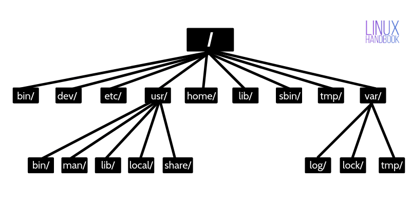
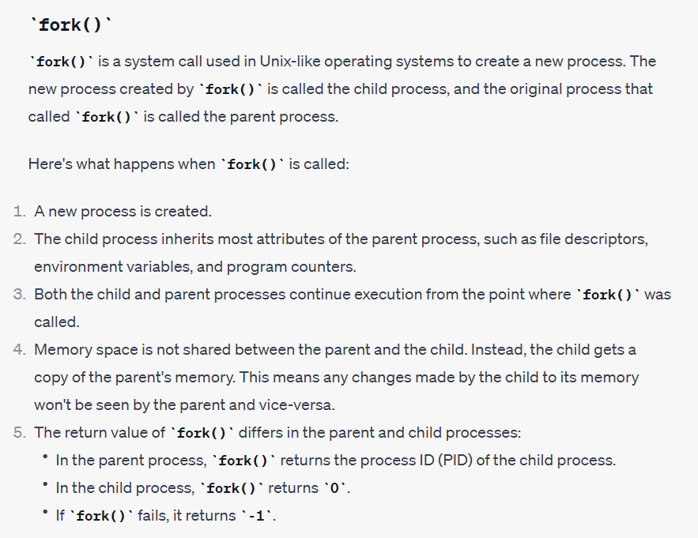
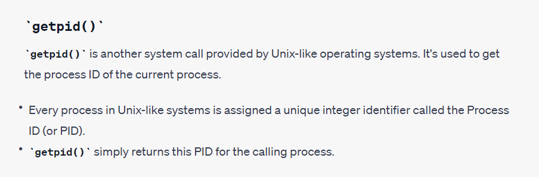
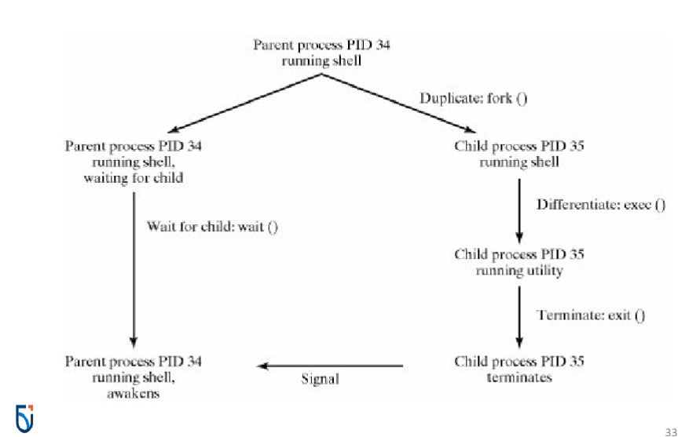

# Systems Programming

---

<details>
  <summary style="font-size: 30px; font-weight: 500; cursor: pointer;">Lecture 1.</summary>
  
  #### `pwd` P.rint W.orking D.irectory
  Prints the Directory, that this Terminal is currently in.

  #### `cd` C.hange D.irectory
  Change Directory

  `cd ..` CD One level down

</details>

<details>
  <summary style="font-size: 30px; font-weight: 500; cursor: pointer;">Lecture 2.</summary>
  
  #### `chmod` (Change Mode)

  Will be discussed next week

  #### `passwd` (Change Password for current User)

  - Important, Linux Supports File Hierachy;

  - Root, with Children, Children with Users, etc...

  

  **Everytime you want to MODIFY a File**, make a backup first!

  So like... how do I know `passwd` is a File, not a Directory


```shell
  (base) jason@debian:/etc$ ls -l passwd
-rw-r--r-- 1 root root 2062 Jul 17 14:44 passwd
(base) jason@debian:/etc$ 
  ```

First character of the `-rw-r--r--` doesn't start with a `d`, there it's a file.

Upon `ls -l <File or Directory>`


#### Example of a Directory, when using ls -l on it

```shell
drwxr-xr-x  4 root root    4096 Jul 17 14:39 apache2
-rw-r--r--  1 root root     433 Aug 23  2020 apg.conf
```

Here **apache2** is a directory, whereas **apg.conf** isn't.

---

What's nice about **Linux** is that we can change Networking & Hosts Configurations quite easily!

```shell
(base) jason@debian:/etc$ cat hosts
127.0.0.1	localhost
127.0.1.1	debian

# The following lines are desirable for IPv6 capable hosts
::1     localhost ip6-localhost ip6-loopback
ff02::1 ip6-allnodes
ff02::2 ip6-allrouters

(base) jason@debian:/etc$ cat networks
default		0.0.0.0
loopback	127.0.0.0
link-local	169.254.0.0
```

View groups; sudo, adm, cdrom, dip, plugdev, lpadmin...
- By doing: `groups`

---

### File Types

**b** Buffered (Block-Oriented) Special File *(Such as a disk drive)*

**-** Regular File

**d** Directory File *(Folder)*

**p** Pipe

</details>


<details>
  <summary style="font-size: 30px; font-weight: 500; cursor: pointer;">Lecture 3.</summary>

Creates new Linux Group:
`sudo newgrp {-l groupname}`

List all groups:
`groups`

# `ls -l` Command in Linux

The `ls -l` command is used to list files and directories in a long format, providing detailed information about each item in a directory. The output includes file permissions, ownership, size, modification date, and more.

## File Permissions

The file permissions section in the `ls -l` output consists of ten characters that represent various aspects of a file or directory's access control. These characters are divided into four parts:

### 1. File Type

- The first character indicates the type of the item.
  - `-` indicates a regular file.
  - `d` indicates a directory.
  - `l` indicates a symbolic link.
  - `c` indicates a character device.
  - `b` indicates a block device.
  - `p` indicates a named pipe (FIFO).
  - `s` indicates a socket.

### 2. Owner Permissions

- Characters 2-4 represent permissions for the owner of the file.
  - `r` indicates read permission.
  - `w` indicates write permission.
  - `x` indicates execute permission.
  - `-` indicates no permission.

### 3. Group Permissions

- Characters 5-7 represent permissions for the group associated with the file.
  - `r` indicates read permission.
  - `w` indicates write permission.
  - `x` indicates execute permission.
  - `-` indicates no permission.

### 4. Other Permissions

- Characters 8-10 represent permissions for others (users not in the owner group or group owner).
  - `r` indicates read permission.
  - `w` indicates write permission.
  - `x` indicates execute permission.
  - `-` indicates no permission.

## Examples

Here are some examples of `ls -l` output and their interpretations:

- Regular file with read and write permissions for the owner, read-only for the group and others:
---

## **Interpreter vs. Compiler**

Scripting uses an Interpreter

#### Interpreter


- **Interpreter** is a program that directly executes the source code line by line without converting it into an intermediate machine code or binary.
- It reads, translates, and executes the code line-by-line, which means it's relatively slower in execution compared to compilation.
- Errors are reported as they are encountered during execution, making debugging easier.
- Typically used in scripting languages like Python, Ruby, and JavaScript.

#### Compiler

- **Compiler** is a program that translates the entire source code into machine code or an intermediate representation (e.g., bytecode) before execution.
- It performs analysis of the entire program before execution, which can result in faster execution times.
- Errors are reported after the compilation phase, which means you may need to compile the code again after fixing errors.
- Commonly used in languages like C, C++, and Java.


</details>


<details>
  <summary style="font-size: 30px; font-weight: 500; cursor: pointer;">Week 5 | System Calls</summary>

## Linux System Calls

### Introduction
- Application programs communicate with the OS for services such as:
  - File creation
  - Process duplication
  - Interprocess communication (IPC)
- This is done via `system calls`.
- For developers, system calls are similar to libraries but invoke subroutines directly in Linux.

### System Calls Overview
- Act as an interface to services provided by the OS.
- Allow programs to request services from the OS kernel.
- Implemented as routines in C and C++.

#### Categories of System Calls
1. **File Management**:
   - Linux considers IPC as a subset of file management because it treats IPC mechanisms as special files.
2. **Process Management**:
3. **Error Handling**:

### File Management System Call Hierarchy
- Includes operations like:
  - Opening, closing, reading, writing files.
  - Managing sockets and directories.

### Process Management System Call Hierarchy
- Involves operations related to:
  - Process creation, termination.
  - Signal handling.

---

# Error Handling with `perror()`

`perror()` is used for system call error handling in C, it's a good practice to use, instead of the conventional return -1.

Lib fn: `void perror(char* str)` A void function, which takes a string *(array of chars)* as param str

## Key Points:
- System calls may fail, and by convention, they return `-1` on error.
- The global variable `errno` stores the numeric error code from the last system call.
- `perror()` provides a description of system call errors based on `errno`. *(Better than an Ambigious -1)*
- `perror()` **IS NOT** a system call, it's a STD library method

## Example:

```c
#include <stdio.h>
#include <errno.h>

int main() {
    FILE *fp;

    fp = fopen("nonexistent.txt", "r");
    if(fp == NULL) {
        perror("Error");
        printf("Error code: %d\n", errno);
    }
    
    return 0;
}
```

**Output:**
```
Error: No such file or directory
Error code: 2
```

Here, `perror("Error")` prints the string "Error" followed by a colon and the system's error message corresponding to the current value of errno, which is set to 2 indicating "No such file or directory". 

---

## File Management

- File system calls let you work with files, directories, and special files.
- The `open()` call accesses or creates files.

### File Descriptors
- A returned integer called a **file descriptor** is used for I/O operations on the file.
- On success, `open()` returns a file descriptor. On failure, it returns `-1`.
- Standard I/O Channels:
  - `0`: standard input (`stdin`)
  - `1`: standard output (`stdout`)
  - `2`: standard error (`stderr`)

### Basic Linux I/O Operations
- `open`: Opens or creates a file.
- `read`: Reads bytes from a file.
- `write`: Writes bytes to a file.
- `lseek`: Seeks within a file.
- `close`: Closes a file.
- `unlink`: Removes a file.

### Using `open()` & `close()`
The `open()` call has the following signature:
```c
int open(const char *fileName, int mode[, int permissions]);
```

#### Where:

**fileName:** Path to the file.
**mode:** Bitwise OR'ing of read/write flags with other flags.
**permissions:** Used when a file is being created.

`close()` frees the file descriptor *(fd)*
If successful, it will return `0` upon closing.

#### EXAMPLE:
```c
#include <fcntl.h>
#include <unistd.h>

int main() {
    int fd;
    fd = open("sample.txt", O_WRONLY | O_CREAT, 0644);
    if (fd == -1) {
        // Handle error, maybe with perror?
        return 1;
    }
    write(fd, "Hello, World!", 13);
    close(fd);
    return 0;
}
```

**O_RDONLY :** Open for Read-Only
**O_WRONLY :** Open for Write-Only
**O_RDWR :** Open for read, and write

---

## Process Management in Linux

### Overview
- **Linux Process**: An instance of a program with:
  - Code (text)
  - Data
  - Stack
  - Unique Process ID (PID)
- **Init Process**: The first process with PID 1.

### Process Creation
- Processes are created by duplicating an existing process.
- `"init"` is the ancestor of all processes.
- Child processes inherit code, data, and stack but can execute different code.

**Example in C (forking a process)**:
```c
#include <stdio.h>
#include <unistd.h>

int main() {
    pid_t pid = fork();

    if (pid == 0) {
        printf("Child process with PID: %d\n", getpid());
    } else {
        printf("Parent process with PID: %d\n", getpid());
    }
    return 0;
}
```

#### Process Termination
A child's termination is communicated to its parent.
Parent processes can suspend until a child terminates.

**Example in C (waiting for a child):**
```c
#include <stdio.h>
#include <unistd.h>
#include <sys/wait.h>

int main() {
    pid_t pid = fork();

    if (pid == 0) {
        printf("Child sleeping...\n");
        sleep(2);
        printf("Child done.\n");
    } else {
        wait(NULL);
        printf("Parent resumes after child's completion.\n");
    }
    return 0;
}
```

---





### How shell runs a utility:



**Start with Parent Process:** The shell starts as a parent process with a specific Process ID *(PID)*. In the diagram, this is Parent process PID 34.

**Dupe process using `fork()`:**
- Shell duplicates itself with fork()
- This results in the creation of a child process which is almost identical to the parent process. In the diagram, the child has the **Child process PID 35.**

**Child Process Differentiation using exec():**
- The child process uses the **exec()** system call to replace its current program *(in this case, the shell)* with a new utility program.
- The child process is now running the desired utility instead of the shell.

**Parent Process Waits:**
- While the child process is running the utility, the parent process *(original shell)* waits for the child to complete.
- This is done using the **wait()** system call.

**Child Process Termination using exit():**
- Once the child process finishes executing the utility, it terminates using the **exit()** system call.

**Parent Process Cont.**
- After the child process terminates, the parent process (shell) receives a signal indicating the child's termination.
- The parent process then continues its operations, which in many cases means it returns to a prompt waiting for the next command.

# Linux process-oriented system calls

| Name    | Function                                         |
| ------- | ------------------------------------------------ |
| fork    | Duplicates a process.                            |
| getpid  | Obtains a process's ID number.                   |
| getppid | Obtains a parent process's ID number.            |
| exit    | Terminates a process.                            |
| wait    | Waits for a child process.                       |
| exec..  | Replaces the code, data, and stack of a process. |

</details>


<details>
  <summary style="font-size: 30px; font-weight: 500; cursor: pointer;">Week 5 | System Calls</summary>
  

</details>

