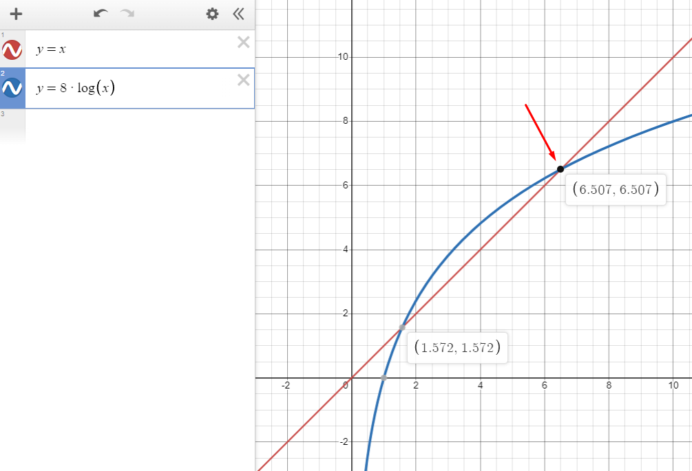
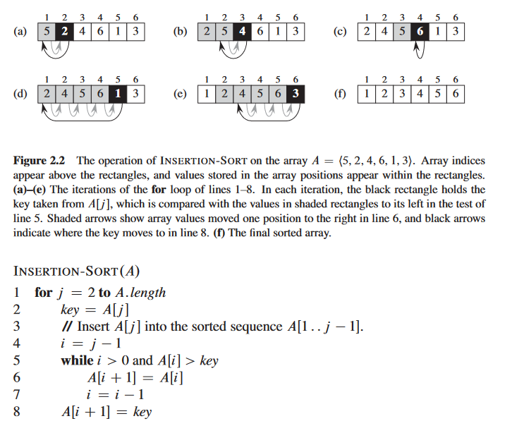

# Design and Analysis of Algorithms

---

<details>
  <summary style="font-size: 30px; font-weight: 500; cursor: pointer;">Lecture 1. | Introduction</summary>
  
## MIDTERM(s): 

**Midterm 1:**
October 6th 2023 | 15:40 - 17:00 *(Be there for 3:30 PM pretty much)*
**Midterm 2:**
November 10th 2023 | 15:40 - 17:00 *(Be there for 3:30 PM pretty much)*

Room: TBD

### Course in a Glance:

The main function of science and engineering is
“reduction", we need faster algos.

**Intelligence has been reduced to computation:**
- And computation to repetition
- Repetitive nature of computational methods is the source of difficulties and complexities

---
**Design:**
- Incremental approach
- Divide and conquer approach
    - Recursive methods
    - Dynamic programming
    - Greedy algorithms

**Analysis:**

The correctness and efficiency have to be analyzed on
the repetitive behavior of algorithms
- Correctness > Loop Invariant ?
- Efficiency *(Asymptotic notation)*
    - Substitution Method
    - Recursion Tree
    - Master method

**Additional Topics:**
- Space Problem (Data Structures)
---

Conclusion of lecture (todo):

    - LEARN ALL THE SORTING ALGORITHMS AGAIN

**Algorithms need to:**
1. You need to demonstrate that your solution
method terminates and the results are correct.
<br>
2. You need to satisfy software engineering
principles *(well-designed and documented,
easiest to implement, etc.)*


</details>

<details>
  <summary style="font-size: 30px; font-weight: 500; cursor: pointer;">Textbook | I Foundations </summary>
  
<br>

## Notes from reading textbook *(I Foundations Chapter)*

### I 1.


Basically CH.1 of the book explains the apps of algos...
**An algorithm is said to be correct if, for every input instance, it halts with the
correct output.**   

Interesting poke at hard problems: No one knows if there are efficient Algorithms for NP-Complete problems, but no one has proved it's impossible, so it might be possible...


Parallelism: Using more CORES, Algorithm can do more instructions in 1 "Clock Tick"

**Chapter 27 Presents a model for “multithreaded” algorithms, which take advantage of multiple cores.** 

**Chapter 34. goes more in depth to NP-completeness**

Delivery Truck Driving **NP-Complete** Problem Example, we'll never get the sollution perfect, but if we acknowledge a problem is NP-complete then we can produce an algorithm that yields very good *NOT PERFECT* results pretty quick

**Chapter 35 discusses such *“approximation algorithms.”***

**Bit about Efficiency:**

**Insertion sort** : C1 * N^2 
**Merge sort** : C2 * N * Log(N)

Where C1 < C2 , Merge Sort's constant is generally bigger (slower/more time complex)

So on small lists, Insertion Sort wins, but as you get to bigger Lists, Merge sort's N*Log(N) starts to carry

---
**1.2-2**
Suppose we are comparing implementations of insertion sort and merge sort on the
same machine. For inputs of size n, insertion sort runs in 8n^2 steps, while merge
sort runs in 64n lg n steps. For which values of n does insertion sort beat merge
sort?

Insertion: 8n^2
Merge Sort: 64n * Log(n)

**What's n**, when 8 n^2 > 64 (n * Log(n))

Divide both sides by 8, then n:

n^2 > 8 (n * Log(n))

n > 8 Log(n)

Insertion Sort beats Merge Sort until **n** goes past ~6.5

8 * log(6.7) = 6.60859842161

Here Merge Sort start's taking the lead with it's logarithmic advantage *(n = 6.7, means 6.7 complexity for Insertion, which is now worst than Merge)*




**1.2-3**
What is the smallest value of n such that an algorithm whose running time is 100n^2
runs faster than an algorithm whose running time is 2n on the same machine?

**Okay so Clock for both algorithms is the same, no need to worry about that then**

Smallest Value of N such that:

100n^2 < 2n

50n^2 < n

50n < 1

**n** needs to be less than 1/50

**So smallest value for `n` is:** 1/50.000001

Verification: *(with n = 1/100)*

100(1/100)^2 = 0.01 *(FASTER for this n!)*
2(1/(100)) = 0.02

---

### I 2. "Getting Started"

Nice Explanation of Pseudo Code I like:

*What separates pseudocode from “real” code is that in
pseudocode, we employ whatever expressive method is most clear and concise to specify a given algorithm.
Issues of data abstraction, modularity, and error handling are often ignored in order to convey the essence of the algorithm more concisely.*

#### Insertion Sort:

*Efficient algorithm for sorting a small number of elements.*

**Input:** Sequence of numbers (Unordered) {a1, a2, ... , an}
**Output:** A permutation (reordering) {a1', a2', ... , an'} where a1' < a2' < ... < an'



**Note: (Card Analogy from Text)**
`A[ 1 .. j-1 ]` constitutes the currently sorted hand of cards *(as the j iterator already passed thru it)*

Whereas `A[ j+1 .. n ]` constitutes the random pile of cards not yet touched.

#### We use loop Invariants to help us understand why an algorithm is correct.

TODO:

## Chapter 2. questions:

**2.1-2**
Rewrite the INSERTION -S ORT procedure to sort into nonincreasing instead of non-
decreasing order.

Implemented Reverse Insertion sort in C *(regular insertion sort & general program credits: Geeks4Geeks !)*

build cmd with gcc `gcc -Wall insertion_sort.c -o out`

run binary `./out`

```c
// C program for insertion sort
#include <math.h>
#include <stdio.h>

/* Function to sort an array using insertion sort*/
void insertionSort(int arr[], int n)
{
    int i, key, j;
    for (j = 1; j < n; j++) {
        key = arr[j];
        i = j - 1;

        /* Move elements of arr[0..i-1], that are
        greater than key, to one position ahead
        of their current position */
        while (i >= 0 && arr[i] > key) {
            arr[i + 1] = arr[i];
            i = i - 1;
        }
        arr[i + 1] = key;
    }
}


/* Reverse insertion sort by Jason*/
void reverseInsertionSort(int arr[], int n)
{
    int i, key, j;
    for (j = n-2; j >= 0; j--) { //Start from second last elm and goto front 
        key = arr[j];
        i = j + 1;

        while (i <= n && arr[i] > key) {
            arr[i - 1] = arr[i]; //Shift key to the right : (i-1) --> (1)
            i++; //Go deeper into the list until n is reached (I'm going forwards instead of backwards)
        }
        arr[i - 1] = key;
    }
}

// A utility function to print an array of size n
void printArray(int arr[], int n)
{
    int i;
    for (i = 0; i < n; i++)
        printf("%d ", arr[i]);
    printf("\n");
}

/* Driver program to test insertion sort */
int main()
{
    int arr[] = { 5, 2, 4, 6, 1, 3 };
    int n = sizeof(arr) / sizeof(arr[0]);

    reverseInsertionSort(arr, n);
    printArray(arr, n);

    return 0;
}
```

</details>

