# Microprocessors & Computer Architecture

---


<details>
  <summary style="font-size: 30px; font-weight: 500; cursor: pointer;">Recall: Digital Systems Concepts</summary>
  

  Multiplexer, Adders (Half & Full)
  Transistors, Flip Flops, Latches

  General information about registers

</details>


<details>
  <summary style="font-size: 30px; font-weight: 500; cursor: pointer;">Lecture 0. | Introduction</summary>
  
## Basic Info & Textbook :
**Computer Organization and Embedded Systems, 6th Edition**
- Authors: Carl Hamacher, Zvonko Vranesic, Safwat Zaky, Naraig
Manjikian,
- Publisher: McGraw‐Hill , 2011

| Category    | Weight   |
|-------------|----------|
| Quizzes     | 10%      |
| Assignments | 10%      |
| Labs        | 15%      |
| Midterm     | 20%      |
| Final       | 45%      |

#### Quizzes:
• Lockdown browser will be used in quizzes.
• Expect a quiz every week. *(I will drop the lowest quiz mark)*
#### Tutorial Assignments:
• There will be assignment in almost every tutorial
#### Midterm:
• will be on **Oct. 4th** during the class time.
• No midterm deferral, marks will be added to the final exam

---

#### ** Course Overview: **

- Introduction to Computer Architecture:
    - CPU, ALU, I/O devices, Busses and Memory – RAM and ROM;
    - RISC vs. CISC architecture;
    - Assembly language programming using a microprocessor and the Hardware/Software Development Tool;
    - Register block and associated registers;
- Microcontroller systems: Interrupt, timer, memory, clock and reset generation
- Analog to Digital conversion (A/D) and Serial Communication Interface Systems.


---

| Week of  | Topic                               | Other Info                |
|----------|-------------------------------------|---------------------------|
| Sep. 05  | Introduction                        |                           |
| Sep. 11  | Basic Structure of Computers        |                           |
| Sep. 18  | Introduction to Microcontrollers    |                           |
| Sep. 25  | Instruction Set Architecture        |                           |
| Oct. 02  | Instruction Set Architecture Midterm| Midterm **( October. 4th )**    |
| Oct. 09  | Fall Study Week                     |                           |
| Oct. 16  | Basic Input/output                  |                           |
| Oct. 23  | Software                            |                           |
| Oct. 30  | Pipelining                          |                           |
| Nov. 06  | Memory Hierarchy                    |                           |
| Nov. 13  | Computer Arithmetic                  |                           |
| Nov. 20  | Serial Communication Interface Systems|                       |
| Nov. 27  | A/D converters, Review              |                           |


</details>

---

<details>
  <summary style="font-size: 30px; font-weight: 500; cursor: pointer;">Lecture 1. | Basic Structure of Computers</summary>

**Computers just add numbers, most important circuit in any given Computer System**

| Computer Types                      | Description |
|-------------------------------------------|----------------------------------------------------------------------------------------------------------------------------------------------------------------------------|
| **Embedded Computers**             | - Integrated into a larger device or system for monitoring and control of physical processes.<br> - Used for specific purposes, e.g., industrial automation, appliances, telecommunication, and vehicles. |
| **Personal Computers (PCs)**       | - Widespread use in homes, education, and offices.<br> - Support various applications: computation, document preparation, design, entertainment, communication, and internet browsing.<br><br> **Classifications:** Desktop, Workstation, Portable/Notebook. |
| **Servers and Enterprise Systems** | - Large computers shared by many users over networks.<br> - Host large databases and provide information processing for organizations.                                                          |
| **Supercomputers and Grid Computers** | - Offer highest performance, used in demanding computations (e.g., weather forecasting, engineering, science).<br> - Expensive and large.<br> - Grid computers are cost-effective, using distributed networked PCs and storage. |
| **Cloud Computing**                | - Users access distributed computing and storage resources via the internet.<br> - Operated as a utility, charging on a pay-as-you-use basis.                                               |

<br>

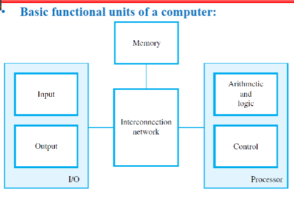

*Every Computer has a CPU *(Central Processing Unit)*

CPU's can have multiple cores.

### Functional Units
---
**Input:**

Computers accept coded information through input units.

*Example devices:* Keyboard, Trackpad, Mouse, Mic, Camera, Communication Lines (Network)

**Output:**

It's function is to send processed results, out to the world.


*Example devices:* Text & Graphical Displays, Printers, LCD Displays, LEDs

Some Devices provide Input & Ouput like *Touch Screen Displays*!

**Memory Unit:**

It's function is to storage programs and data

Stores data in flipflops **(1 flipflop = 1 bit)**

*Classes of Storage:*
- Primary Memory
- Cache Memory
- Secondary Memory

### Classes of Storage (explained):

**Interconnection Network**

The actual "Flow" of how data is working to preform operations.

**Primary (Main) memory**

Main Memory (RAM), after you turn it off, flipflops will loose their contents.


**Cache Memory**

It is an adjunct to main memory to facilitate high instruction execution rate.

It is a smaller faster RAM unit that is used to hold sections of a program that are currently being executed, along with any associated data.

Cache is tightly coupled with the processor and is usually contained on the
same integrated‐circuit chip

- *Speeds up Processing, Speeds up READ/WRITE*
- *Cache takes small amount of Data from RAM, and uses it for the CPU's current task*

**Secondary Memory**

External Storage (Hard-Disk) usually an SSD now.


**Arithmetic and Logic Unit (ALU):**

Does Additional, has `add`
Does Multiplication, has `mul`

Does Logic Other Operations *(bit-shift, jump)*

**Control Unit:**

ALU & Control Unit make up the processor

It's function is to "Control" everyone, Oh this needs an addition? Give it to the Adder!

**Relies on timing** heavily! Programs need to be ran in order to work properly.


**Processor is composed of:**
- Arithmetic and Logic circuits
- Timing and control circuits
- Registers

**NOTE:** Processors don't deal with the RAM Directly, they just interact with the *Cache Memory* which is constantly being pulled from RAM

Cache gets stored into Registers on CPU *(known as Processor Registers)*

---

### Basic Operational Concepts

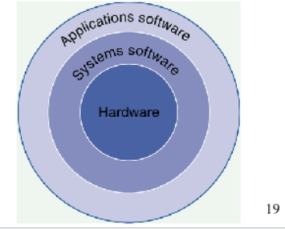

- Hardware, Lowest Level, can't operation without system Software

- Systems Software, Utilities that are really commonly used so the developper doesn't have to define every fn. *(Keyboard Inputs, STD IN, STD OUT, etc...)*

- Applications Software, the programs you write, to solve specific problems... *(Ontop of the Systems Software)*


#### Instructions and Programs:

An **instruction** specifies an operation & the location of it's data operands.

A **32-bit** word typically holds one encoded instruction.

---

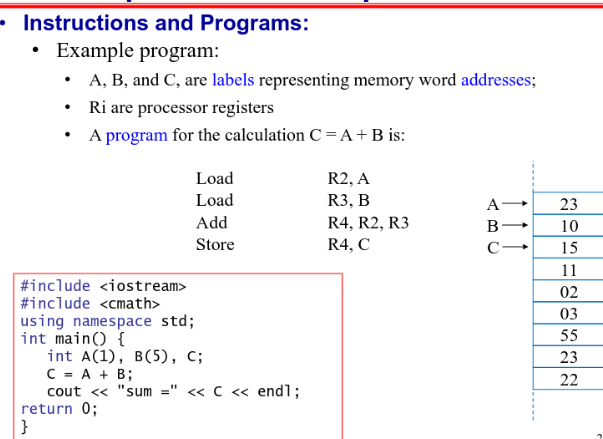

Just for `C = A + B`

Load R2 (Register 2), A *Loads in 32-bits from Address A, 4 bytes*
Load R3 (Register 3), B *Loads in 32-bits from Address B, 4 bytes*

ADD R4 (Register 4), than adds R2 & R3 *With Addition, you activate the "Adder" circuit, and you'll get a result in temporary Register*

STORE R4 (Register 4) *Store the actual memory to Address C*

**LOAD** > Load from Memory
**STORE** > Store to Memory

Here we assumed that **A** & **B** where already loaded in, that's why we are just "Loading" it in.

---

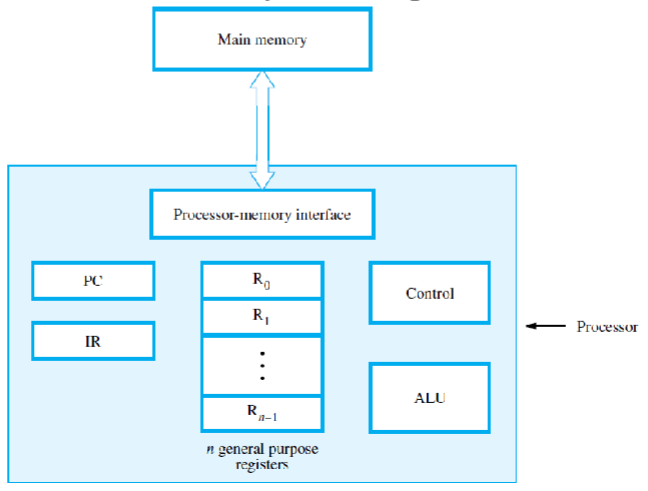

**Program Counter (PC)** : Has the Address of the Instruction to be ran Next. Since it's sequentially going down the list of Instructions.

**Instruction Register (IR)** : Holds the current Instruction(s), The IR is connected to all the Control Circuitry *(MUX, Adders, etc...)*

**Control circuits** and the arithmetic and logic unit (ALU) fetch and execute
instructions

**The processor-memory interface** is a circuit which manages the transfer of data between the main memory and the processor

**Registers** are Hyper-specific parts of the CPU, whereas the **Cache** Just takes in Memory from the RAM, for Quick Access.

---

#### I/O Devices with CPU

Alot of I/O Devices have specific **Interrupt-Service Routine**

It acts very similar as the essential *Read* / *Write* Operations, the different is Interrupts; When is stuff actually being pressed, or clicked.

These **Interrupt Service Routines** are usually proprietary systems, that's why we need Hardware Drivers for some I/O Devices 

---

#### Number Representation and Arithmetic Operations


</details>

---
## Lecture 2. 


<details>
<summary style="font-size: 30px; font-weight: 500; cursor: pointer;">Memory Locations and Addresses</summary>

- Memory consists of many **Millions** of cells
- Each cell holds **1 bit** of information. *(HI or LOW)*
- Memory size set by **k** (number of address bits)
- A "word" is a group of **n** bits
  - Word Length can be **16** to **64** bits.

**Memory** is a collection of consecutive words of the size specified by the Word Length.

Each Memory **byte** has distinct address

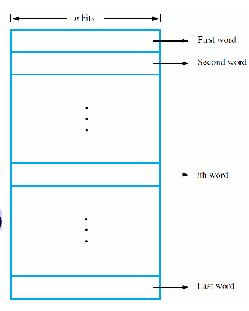

Numbers **0** to **2^k − 1** are used as addresses
for successive locations in the memory.

Data is sent to Memory via an **ADDRESS BUS** Which is a Multiplexer (MUX) with **n** inputs.

Some Processors are 32bit, meaning each **Word Length** is 32 bits

**BYTE** : 8 bit
**Word** : ranges from 16 to 64 bits

Address Assignments per byte *( byte-adressable )*

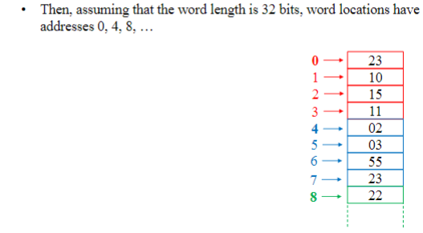

#### Big & Little Endian Addressing:

**Big Endian** addressing; assigns lower addresses to more significant *(leftmost)* bytes of word.

**Little Endian** addressing; assigns lower addresses to less significant *(right-most)* bytes of word.

`450` in Binary: `0b111000010` (Length: 9 bits)

HIGHER ORDER BYTE: `00000001`
LOWER ORDER BYTE: `11000010`

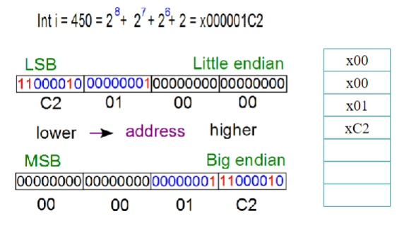

**NOTE** here `x000001C2` is stored in Big Endian in Memory

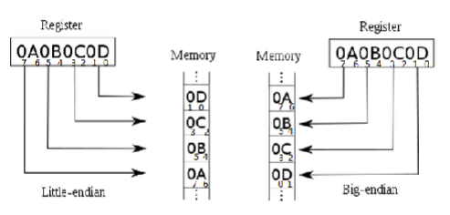

#### Word Alignment:
- Number of bytes per word is normally a power of 2
- Word locations have aligned addresses if they begin at byte addresses that are multiples of the number of bytes in a word
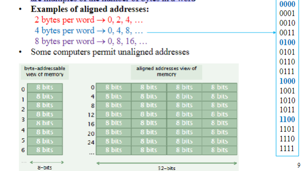

#### Memory Operations

- In a computer, both the instructions that tell the program what to do and the data that the program works with are stored in the memory.

- When the computer wants to carry out an instruction, it needs to bring the part of memory that holds that instruction into the processor.

- Similarly, if the computer needs to work with data or store results, it has to move that data between the memory and the processor.

There are two main operations that involve the memory:
  - **Read**: This is when the computer retrieves information from the memory.
  - **Write**: This is when the computer puts information into the memory.

---

**Read Operation: Three Steps (Using Specified Registers)**

1. Load the address into the Memory Address Register (MAR).
2. Issue a read control signal ("0") by the CPU.
3. After the memory delay, load the word into the Memory Data Register (MDR).

**Example:**

Suppose you have a computer program that needs to read a value from memory. Let's say you want to read the value at memory address 1000.

   - Load 1000 into the Memory Address Register (MAR).
   - CPU sends a read control signal ("0").
   - After a short delay, the value stored at memory address 1000 is loaded into the Memory Data Register (MDR).

**Write Operation: Three Steps (Using Specified Registers)**

1. Load the new word into the Memory Data Register (MDR) by the CPU, and also load the address where the word should be stored into the Memory Address Register (MAR).
2. Issue a write control signal ("1") by the CPU.
3. After the memory delay, store the word from the MDR into the desired location in memory.

**Example:**

Let's say you want to write the value 42 into memory address 2000 in your computer's memory.

   - Load 42 into the Memory Data Register (MDR) and load 2000 into the Memory Address Register (MAR).
   - CPU sends a write control signal ("1").
   - After a short delay, the value 42 is stored at memory address 2000 in the computer's memory.

</details>

<details>
  <summary style="font-size: 30px; font-weight: 500; cursor: pointer;">Instructions and Instruction Sequencing</summary>

- Tasks like Adding two numbers, Testing for conditionals, I/O (keyboard input, screen output)

- Computer must be able to do four types of operations; 
  - Data Transfer between memory and processor registers
  - Arithmetic and logic operations on data
  - Program sequencing and control
  - I/O transfers

### Register Transfer Notation (RTN)

* RTN is used to describe hardware-level data transfers and operations
* Possible locations that may be involved in such transfers are:
  * Memory locations
  * Processor registers
  * Registers in the I/O subsystem
* We identify such locations symbolically with convenient names such as:
  * Names that represent the addresses of memory location may be LOC, PLACE, A, or VAR2
  * Predefined names for the processor registers may be R0, R1, ...
  * Registers in the I/O subsystem may be identified by names such as DATAIN or OUTSTATUS

* Use [...] to denote contents of a location
* Use ← to denote transfer to a destination
  * Example: R2 ← [LOC]
    * Transfer from LOC in memory to register R2
* RTN can be extended to also show arithmetic operations involving locations
  * Example: R4 ← [R2] + [R3]
    * Add the contents of registers R2 and R3, place the sum in register R4
* Right-hand expression always denotes a value
* Left-hand side is the name of the location where the value to be placed.
* The words “transfer” and “move” mean “copy”
  * Transferring data from a source location A to a destination location B means that the contents of location A are read and then written into location B.
  * In this operation, only the contents of the destination will change.
Instructions and Instruction Sequencing

#### Assembly-Language Notation

  * It is needed to represent machine instructions and programs
  * It is called Assembly language
  * Example: the assembly-language instructions are:
    * Load R2, LOC → R2 ← [LOC]
    * Add R4, R2, R3 → R4 ← [R2] + [R3]
  * An instruction specifies the desired operation and the operands that are involved
  * Examples in this chapter will use English words for the operations (e.g., Load, Store, and Add). This helps emphasize fundamental concepts
  * Commercial processors use mnemonics, usually abbreviations (e.g., LD, ST, and ADD)
  * Mnemonics differ from processor to processor

---

Lec 2 ; Page. 16+ TODO
</details>


<details>
  <summary style="font-size: 30px; font-weight: 500; cursor: pointer;">Addressing Modes</summary>
  
  Processor Formats

  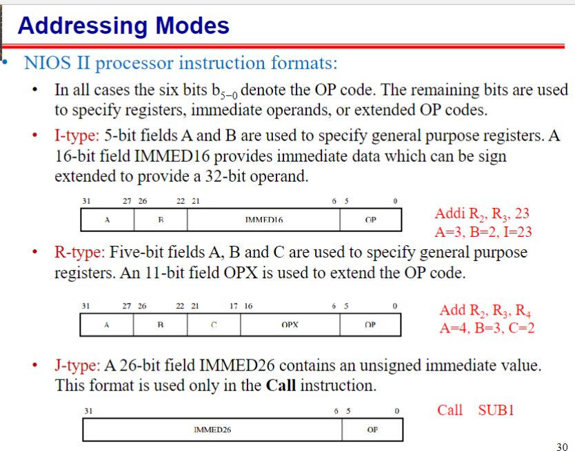


## Autoincrement Mode:

- This addressing mode is similar to the **register indirect addressing mode** in that the effective address of the operand is the content of a register, which we can term the _autoincrement register_.
- However, the content of the autoincrement register is automatically incremented after accessing the operand.
- **Example**: Load register `Ri` with the operand whose address is the content of register `Rauto`. After loading the operand into register `Ri`, the content of register `Rauto` is incremented (pointing to the next item in a list of items).
 
 **Pseudo-Instruction**
  `LOAD Ri, (Rauto)+`

**NIOS II Equivalent**
```assembly
    ldw   r3, 0(r4)       # Load word from address in r4 to r3
    addi  r4, r4, 4       # Increment r4 to point to the next word
```


  ---


</details>

<details>
  <summary style="font-size: 30px; font-weight: 500; cursor: pointer;">Assembler Directives & Examples</summary>


### The commands in brackets at NIOS II Specific

---

1. **ORIGIN (.org):** This directive defines where in the memory to place the instructions that follow.

2. **RESERVE (.skip):** This directive declares that a memory block of a certain size is reserved for data.

3. **DATAWORD (.byte, .hword, .word):** This informs the assembler to assign values to certain words.

4. **EQU (.equ):** This directive associates a name with a constant value.

5. **END (.end):** This tells the assembler that this is the end of the source program.


Example Directives in NIOS 2
```asm
.global _start

.org 0x100          ; Starting address in memory, for proceeding instructions to be stored at
_start:

.equ CONST_VALUE, 10 ; Associate the name CONST_VALUE with the value 10

load    r1, CONST_VALUE  ; Load the constant value into r1

.byte   'A', 'B'        ; Store bytes
.hword  0xABCD          ; Store half-word (2 bytes)
.word   0xDEADBEEF      ; Store word (4 bytes)

.skip   4               ; Reserve 4 bytes in memory

.end                   ; End of the source program
```

### General Assembler Directive Notes:

**_start: Label**
The _start: is a label. In assembly (and other programming contexts), labels are used to name locations in the code so that they can be referred to elsewhere, such as from branch or jump instructions.

In many assembly programs, especially those intended to be standalone (not part of a larger operating system or application), _start is a conventional name for the starting point of the program's execution. When the program is loaded into memory and executed, execution will start at this _start label. If you've worked with other systems or languages, it's analogous to the **main()** function in languages like C or C++.

</details>

<details>
  <summary style="font-size: 30px; font-weight: 500; cursor: pointer;">EX. 1, EX. 2, EX. 3</summary>

# Example 1

  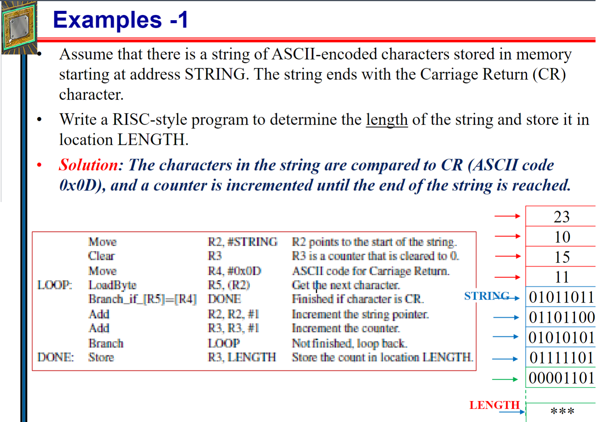
  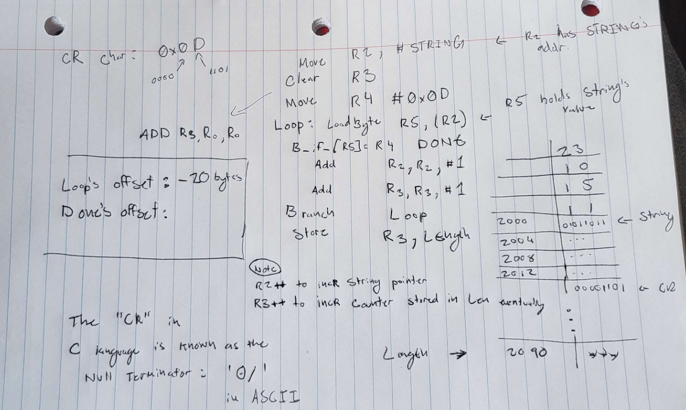
---
# Example 2
  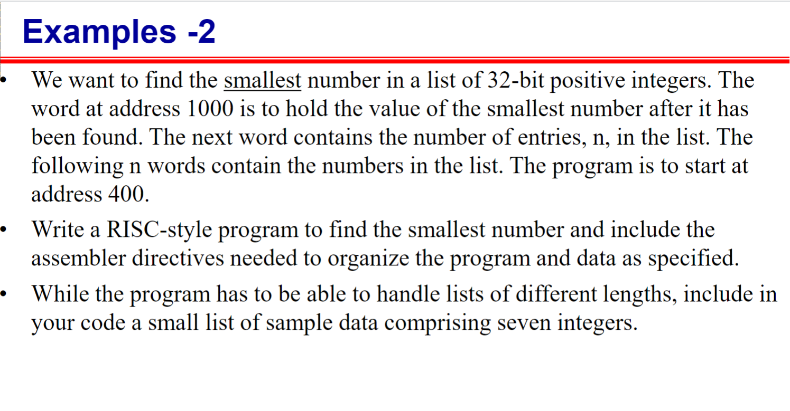
  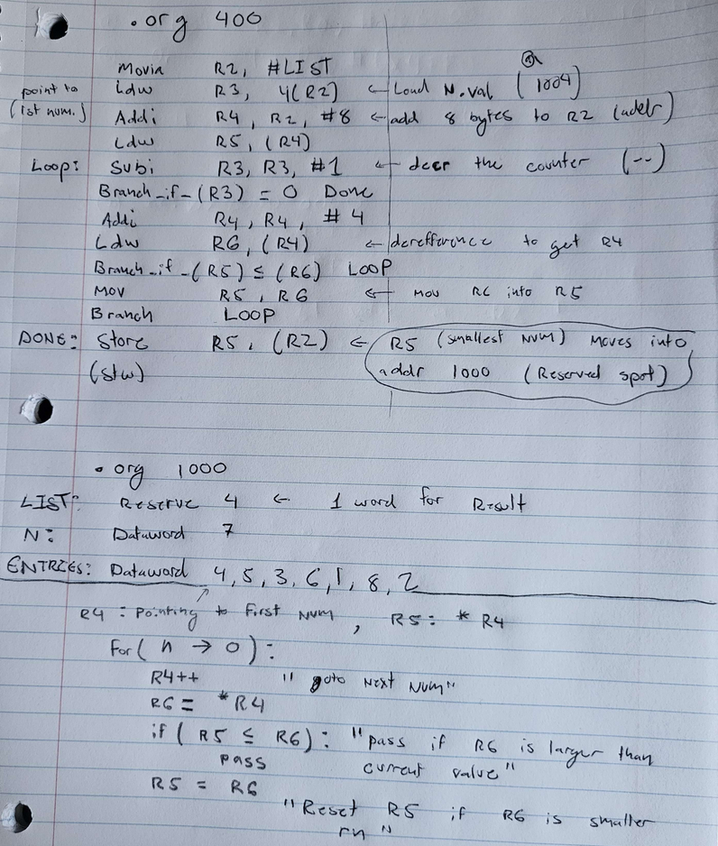

  **Under the line**, I wrote some basic Pseudo-code for this Example, it helped me understand the functionality
</details>


<details>
  <summary style="font-size: 30px; font-weight: 500; cursor: pointer;">EX. 4 && EX. 5 (Sub-routines & Stack)</summary>
 
# Example 4

  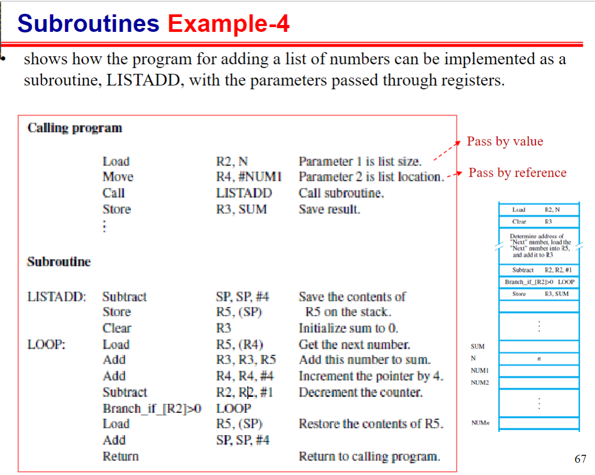
  
---
# Example 5

  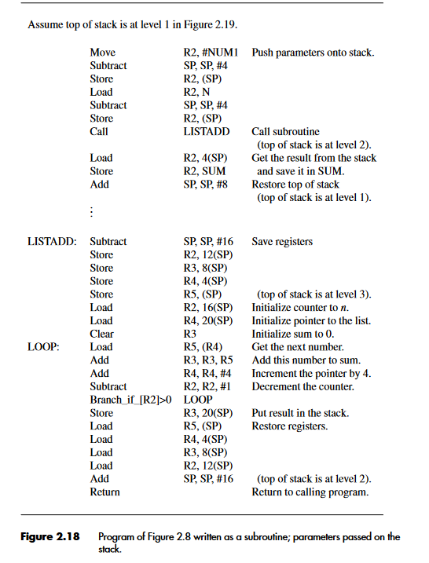
  


**Note | Link Register**

When a subroutine *(function)* is called, the address of the instruction immediately following the subroutine call instruction is pushed onto the ***call stack**, and the program counter **(PC)** is set to the address of the subroutine's entry point.

Inside the subroutine, the *Link Register* is often used to store the return address, which is the address of the instruction to resume execution after the subroutine finishes.

When the subroutine is ready to return, it loads the value from the *Link Register* into the PC, effectively jumping back to the instruction following the original subroutine call.

**Upon Multiple Sub-Routine Calls** The Link Register deals with the stack, to know the Callback Order *(First SUB1 was called, then SUB2, so return to Address `0x9A` for SUB2, now that SUB1 is done, return to `0x11`)*

</details>

<details>
  <summary style="font-size: 30px; font-weight: 500; cursor: pointer;">Shifting & Rotation</summary>


  ---
  ### Digit Packing Example (With Logical Shift Left)

  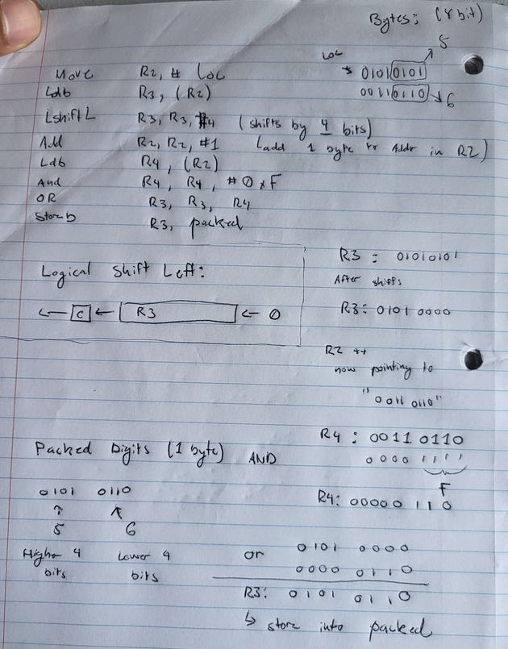

</details>

<details>
  <summary style="font-size: 30px; font-weight: 500; cursor: pointer;">Dealing with 32-bit Immediate Values</summary>

  **Immediate** and **Absolute** modes in RISC-style cpus restrict operand size to 16 bits.
  Therefore; 32-bit value can't be given explicitly in a single instruction, as it can't fit it...

  ### How do we do it then?
  To construct 32-bit immediate values or addresses, use two instructions in sequence:

  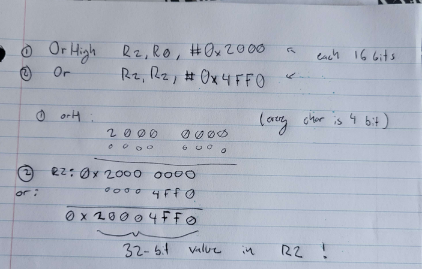

</details>


<details>
  <summary style="font-size: 30px; font-weight: 500; cursor: pointer;">Stacks & Stack Pointer</summary>
</details>

<details>
  <summary style="font-size: 30px; font-weight: 500; cursor: pointer;">Frame Pointer & More on SP</summary>

**Stack Pointer** Moves arround alot, you add an item to stack, SP is now -4 bytes above...
 - Always points to the top of the stack *(Lowest Address on Stack)*
 
**Frame Pointer** Is usually static within the context of a single procedure call
 -  Can access things with *Frame Pointer* that have a consistent offset.

</details>

---

<details>
  <summary style="font-size: 30px; font-weight: 500; cursor: pointer;">Lab 1 Pre-lab</summary>

  https://cpulator.01xz.net/

  **Your preparation should include the following:**
  Derive the machine code representation for the instruction `blt r7, r8, LOOP`:

  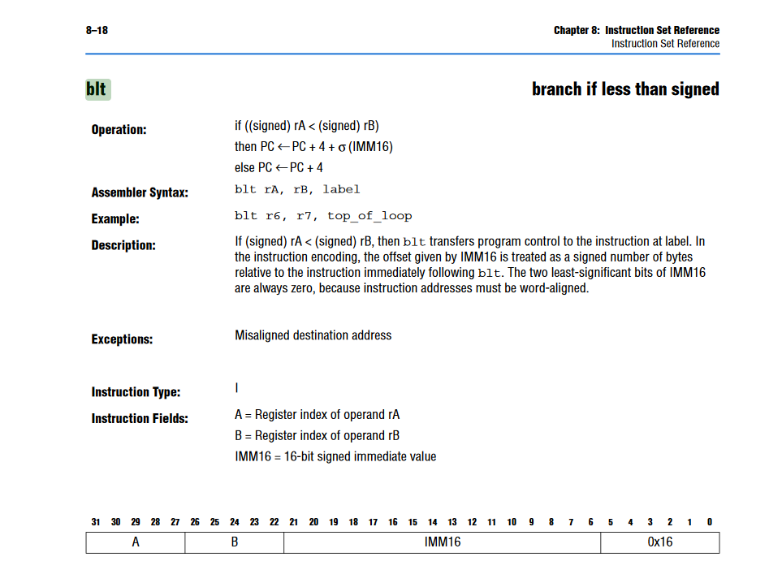

  Looks like a Branch Statement that checks **branch if less than (signed)** checks if a signed number is lesser than another signed number.

  If the value in `r7` is less than the value in `r8` *(signed comparison)*, then the program will branch to the label **LOOP**.
</details>

<details>
  <summary style="font-size: 30px; font-weight: 500; cursor: pointer;">ASM Self Study</summary>

NIOS II - First Program

```s
.global _start

.org 400
_start:
    movia r2, data     # Load the address of 'data' into r2
	ldb r3, 0(r2) # Load Length of Array (Byte) into r3
	addi r20, r0, 1 #Set some register to 1 so I can compare in the Loop XD
	
	muli r6, r3, 4
	
    add   r4, r2, r6   # Add the value in r6 to the address in r2
	add r5, r0, r0 #I'm kind of just tryna clear r5
	
	
loop:
	ldw  r10, 0(r4)   # Load the word value pointed by r4 into r10
	subi r3, r3, 1 #Decrement Immediate R3
	subi r4, r4, 4
    bge r3, r20, loop # If r3 is greater or equal, branch to 'loop'

.org 1000
data:   
.byte 7 
.skip 3
.word 4,5,3,6,1,8,2

.end
```

This program would just decrement r3 till it was Greater or Equal to r20 (value 1)
- Every iteration it also sets r10 to whatever's next in the list, it iterates backwards from n to 0, therefore 2 is set first, then 8, and so on...

---

</details>

---

## Lecture 3.

<details>
  <summary style="font-size: 30px; font-weight: 500; cursor: pointer;">
  IO Devices & Interrupts
  </summary>

## Accessing I/O Devices

Computers can exchange both digital and analog data with various devices.

### Input Sources:
- Sensor switch
- Digital camera
- Microphone
- Fire alarm
- Analog-to-Digital Converter

### Output Methods:
- Display on monitor
- Sound to speaker
- Digital commands (e.g., controlling motors or robots)
- Digital-to-Analog Converter

---

## Interconnection in Computer Systems

Computer components communicate via an **Interconnection network**:
- Enables transfer of data between processor, memory, and I/O devices.
- Concepts of memory access and address spaces are applicable here.

  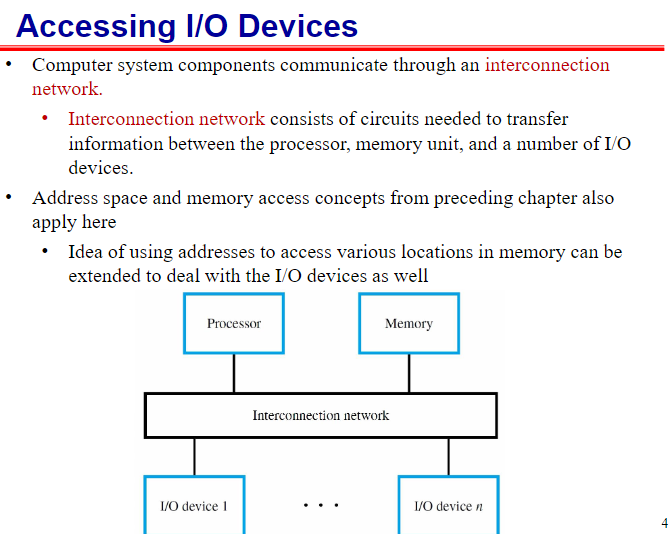

---

## Signaling Protocol for I/O Operations

### Output Process:
1. Processor sends the first character to the display.
2. Processor waits for a signal from the display to send the next character.
3. This process repeats for each character.

### Input Process:
1. Processor waits for a signal indicating a keypress.
2. Once signaled, the processor reads the binary code for the character from the I/O register associated with the keyboard.

### Keyboard Mechanics:
- Generates a binary code corresponding to the key pressed.
- Assumes use of ASCII code where each character code occupies one byte.
- **KBD_DATA**: Address label of 8-bit register holding the generated character.
- **KIN**: Flip-flop in the 8-bit status register (KBD_STATUS) indicates a keypress.
- Processor checks **KIN** to determine when a character code is in **KBD_DATA**.
- Checking **KIN** is referred to as the processor "polling" the I/O device.

### Display Mechanics:
- Contains an 8-bit register called **DISP_DATA** for receiving characters.
- Uses a status flag **DOUT** in **DISP_STATUS** to indicate readiness to receive the next character.


---
### Program-Controlled I/O
Program-controlled I/O is a method where the processor is actively involved in managing I/O operations. Two code examples, one in RISC-style and another in CISC-style, demonstrate how to read characters from the keyboard and display them on the screen.

### RISC-Style I/O Program:

In the RISC-style program, a loop continuously checks the status of the keyboard and display devices.
It uses instructions like LoadByte, And, and Branch to read and display characters.
The processor remains busy waiting for I/O devices, which can be inefficient.

### CISC-Style I/O Program:

The CISC-style program directly transfers characters from the keyboard to memory and from memory to the display.
Instructions like MoveByte and CompareByte are used.
The program is more efficient because it performs I/O operations directly with memory and uses a special instruction to check the state of I/O devices.
Interrupts
The text briefly mentions interrupts as an alternative to program-controlled I/O. Interrupts are a mechanism where the processor can be interrupted by external events, such as I/O device signals or timer events. When an interrupt occurs, the processor temporarily suspends its current task, saves its state, and jumps to an interrupt service routine to handle the event.

Interrupts can help avoid wasting processor time in wait loops, as seen in program-controlled I/O. Instead of actively polling devices, the processor can respond to events as they happen, making the system more efficient and responsive.

In summary, program-controlled I/O methods involve continuous processor involvement in I/O operations, which can be inefficient. Interrupts provide an alternative approach, allowing the processor to respond to events as they occur, making the system more efficient and responsive.

###polling 
refers to the process of checking the status or condition of a device or input source at regular intervals. In the context of I/O operations, polling involves actively and repeatedly checking the status of an input device, like the keyboard in the example you provided, to determine if there is data or an event to be processed. This is typically done using conditional checks, such as checking the state of flags or status registers, like the "KIN" flag in the "KBD_STATUS" register in your example, to see if they indicate that new data is available.

**Polling** can be resource-intensive because it requires the processor's constant attention, potentially wasting processing time when there's nothing to process.

Interrupts, as an alternative approach, provide a more efficient way of handling I/O. Instead of polling, interrupts allow the processor to be notified by the device when it has data or an event to process. This way, the processor is only active when there's actual work to be done, and it can efficiently respond to events as they occur, rather than repeatedly checking the device's status.
</details>